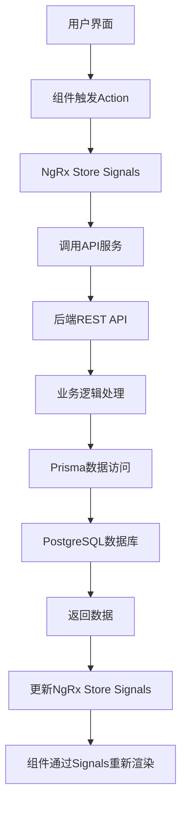
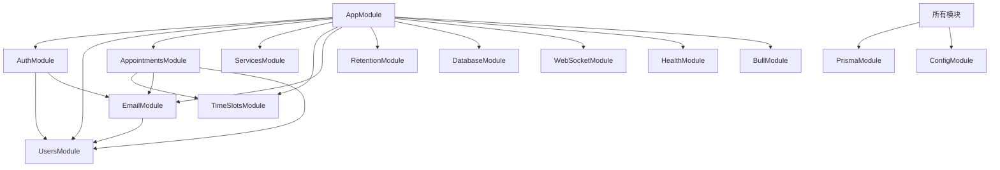

# 预约系统 - 系统架构设计文档（SAD） - Angular + NestJS 重构版

## 文档信息
- **文档版本**: 2.5.0
- **创建日期**: 2026-04-14
- **最后更新**: 2026-05-11
- **适用版本**: angular-booking-frontend v1.0.0, nestjs-booking-backend v1.0.0
- **文档状态**: 已基线化
- **作者**: 系统架构分析工具
- **重构技术栈**: Angular v21+ + NestJS v11+

## 1. 系统概述

### 1.1 系统定位
预约系统是一个基于CRM理念设计的现代化预约管理平台，提供完整的用户认证、服务管理、预约排期、实时通知和系统管理功能。

### 1.2 核心价值主张
- **对客户**：便捷的在线预约体验，实时可用时间查询，智能通知提醒
- **对管理员**：完整的预约管理视图，用户管理，服务配置，系统监控
- **对开发者**：模块化架构，完善的API文档，全面的测试覆盖

### 1.3 系统边界
- **包含范围**：用户认证、服务管理、预约排期、通知系统、系统管理
- **排除范围**：支付网关、第三方日历集成、多语言支持、移动端APP
- **集成边界**：支持WebSocket实时通知、SMTP邮件服务、Redis缓存

## 2. 逻辑架构设计

### 2.1 整体逻辑架构图
```
┌─────────────────────────────────────────────────────────────┐
│                    表现层 (Presentation Layer)                │
│  ┌───────────────────┐  ┌───────────────────┐               │
│  │   Angular前端     │  │    移动端H5       │               │
│  │   (v21+)          │  │   (Responsive)    │               │
│  └───────────────────┘  └───────────────────┘               │
│            │                           │                     │
│            └─────────────┬─────────────┘                     │
│                          │                                   │
│                ┌─────────▼─────────┐                         │
│                │    API网关层        │                         │
│                │   (NestJS REST)   │                         │
│                └─────────┬─────────┘                         │
│                          │                                   │
└──────────────────────────┼───────────────────────────────────┘
                           │
┌──────────────────────────┼───────────────────────────────────┐
│                    业务逻辑层 (Business Logic Layer)          │
│  ┌─────────────────────────────────────────────────────┐   │
│  │              业务模块 (Business Modules)            │   │
│  │  ┌─────┐ ┌─────┐ ┌─────┐ ┌─────┐ ┌─────┐ ┌─────┐   │   │
│  │  │认证 │ │用户 │ │预约 │ │服务 │ │时间 │ │通知 │   │   │
│  │  │模块 │ │管理 │ │管理 │ │管理 │ │槽位 │ │系统 │   │   │
│  │  └─────┘ └─────┘ └─────┘ └─────┘ └─────┘ └─────┘   │   │
│  └─────────────────────────────────────────────────────┘   │
│                          │                                   │
│                ┌─────────▼─────────┐                         │
│                │  数据访问层         │                         │
│                │  (Prisma ORM)     │                         │
│                └─────────┬─────────┘                         │
│                          │                                   │
└──────────────────────────┼───────────────────────────────────┘
                           │
┌──────────────────────────┼───────────────────────────────────┐
│                    数据存储层 (Data Storage Layer)           │
│  ┌─────────────────────────────────────────────────────┐   │
│  │ PostgreSQL   Redis       文件存储     日志存储        │   │
│  │  (主数据库)  (缓存)      (Uploads)   (Log Files)      │   │
│  └─────────────────────────────────────────────────────┘   │
└─────────────────────────────────────────────────────────────┘
```

### 2.2 后端模块化架构 (NestJS)

#### 2.2.1 核心业务模块
| 模块名称 | 模块路径 | 核心职责 | 关键组件 |
|---------|---------|----------|---------|
| **AuthModule** | `src/modules/auth/` | 用户认证和授权管理 | AuthController, AuthService, JwtStrategy |
| **UsersModule** | `src/modules/users/` | 用户信息管理 | UsersController, UsersService, UserEntity |
| **AppointmentsModule** | `src/modules/appointments/` | 预约业务处理 | AppointmentsController, AppointmentsService, AppointmentEntity |
| **ServicesModule** | `src/modules/services/` | 服务项目管理 | ServicesController, ServicesService, ServiceEntity |
| **TimeSlotsModule** | `src/modules/time-slots/` | 时间段管理 | TimeSlotsController, TimeSlotsService, TimeSlotEntity |
| **EmailModule** | `src/modules/email/` | 邮件通知服务 | EmailService, 邮件模板 |
| **RetentionModule** | `src/modules/retention/` | 数据保留策略 | RetentionScheduler, RetentionService |
| **TimezoneModule** | `src/modules/timezone/` | 时区解析与营业时间管理（新增加于 v2.6.0） | ClinicTimezoneProvider, BusinessHoursController, BusinessHoursService |
| **StatsModule** (Admin Dashboard) | `src/modules/stats/` | 管理员仪表盘统计（DASH-001~004），通过 Prisma 聚合查询计算 | StatsController, StatsService |

#### 2.2.1.1 AdminModule 子模块架构 (管理员后台)

管理员后台 (Admin Dashboard) 由以下子模块组成，统一挂载在 `/v1/admin` 路由前缀下，通过 JWT + RBAC 权限控制访问：

| 子模块 | 模块路径 | 核心职责 | 状态 |
|--------|---------|----------|------|
| **StatsModule** | `src/modules/stats/` | Dashboard 仪表盘统计卡片（DASH-001~004），包括预约总数、营收、预约趋势、服务分布、时间分布、通知列表、未读消息数 | ✅ 已实现 |
| **ReportModule** | `src/modules/reports/` | ~~报表生成与导出（PDF/CSV），预约报表、营收报表、服务统计报表~~ — ⚠️ **已弃用**，替换为 Analytics 仪表盘端点（AN-001 GET /v1/admin/stats + AN-002 GET /v1/admin/stats/booking-trends） | ⚠️ 已弃用 (v1.6.1) |
| **UserManagementModule** | `src/modules/admin/users/` | 管理员用户 CRUD（增删改查用户、状态管理、角色管理） | ✅ 已实现 |
| **ServiceManagementModule** | `src/modules/admin/services/` | 管理员服务 CRUD（服务增删改查、分类管理、上下架） | ✅ 已实现 |
| **AppointmentManagementModule** | `src/modules/admin/appointments/` | 管理员预约 CRUD（预约管理、状态流转、批量操作） | ✅ 已实现 |
| **AnalyticsModule** | `src/modules/admin/analytics/` | 业务分析仪表盘，趋势分析、同比环比、漏斗分析、客户画像 | 🔮 未来阶段 (FUTURE-PHASE) |
| **HistoryModule** | `src/modules/admin/history/` | 预约历史记录与操作日志查询，活动日志回溯，变更审计追踪 | 🔮 未来阶段 (FUTURE-PHASE) |
| **SettingsModule** | `src/modules/admin/settings/` | 系统配置管理，全局参数设置（营业时间、预约规则、通知配置） | 🔮 未来阶段 (FUTURE-PHASE) |

> **说明**: 标记为 🔮 的模块为规划中的未来阶段功能，尚未实现。标记为 ⚠️ 的模块已弃用。现有 StatsModule、UserManagementModule、ServiceManagementModule、AppointmentManagementModule 已实现并通过 contract.yaml v1.6.7 定义相应 API 端点。ReportModule（报表）已于 v1.6.1 弃用，其功能由 StatsModule 的复合统计数据（AN-001）和预约趋势（AN-002）端点替代。

#### 2.2.2 基础设施模块
| 模块名称 | 模块路径 | 核心职责 |
|---------|---------|----------|
| **DatabaseModule** | `src/common/database/` | 数据库连接和健康检查 |
| **WebSocketModule** | `src/common/websocket/` | 实时通信支持 |
| **HealthModule** | `src/common/health/` | 系统健康检查 |
| **FileUploadModule** | `src/common/file-upload/` | 文件上传处理 |
| **PrismaModule** | `src/modules/prisma/` | Prisma ORM服务 |
| **BullModule** | `src/modules/bull/` | BullMQ消息队列集成 |

### 2.3 前端架构设计 (Angular)

#### 2.3.1 组件架构（原子设计模式）
```
组件层次结构：
┌─────────────────────────────────────────────────────┐
│                 Pages (页面层)                       │
│  /login, /register, /appointments, /admin/appointments      │
└─────────────────────────────────────────────────────┘
                            │
┌─────────────────────────────────────────────────────┐
│              Templates (模板层)                      │
│  AppLayout - 应用主布局                              │
└─────────────────────────────────────────────────────┘
                            │
┌─────────────────────────────────────────────────────┐
│            Organisms (有机体组件层)                  │
│  AdminBookingList, BookingPage, LoginPage           │
└─────────────────────────────────────────────────────┘
                            │
┌─────────────────────────────────────────────────────┐
│            Molecules (分子组件层)                    │
│  LoginForm, BookingForm, TimeSlotGrid, DateSelector │
└─────────────────────────────────────────────────────┘
                            │
┌─────────────────────────────────────────────────────┐
│              Atoms (原子组件层)                      │
│  Button, Input, Card, Modal, Dropdown, Spinner      │
└─────────────────────────────────────────────────────┘
```

**Legal Module（法律页面模块）**：系统包含独立的 Legal 模块，提供两个公开可访问的静态法律页面：
- `/legal/terms` — 服务条款页
- `/legal/privacy` — 隐私政策页
- 该模块无需认证，属于纯展示性页面，不使用 NgRx 状态管理。

#### 2.3.2 前端技术栈
| 技术领域 | 技术选型 | 版本 | 选择理由 |
|---------|---------|------|---------|
| **前端框架** | Angular | v21+ | 企业级框架，完整的生态系统，TypeScript原生支持，独立组件模式提升开发体验 |
| **UI组件库** | PrimeNG + Tailwind CSS | 最新 + v4 | 企业级组件丰富，包含预约系统所需的所有组件；原子化CSS，设计一致性 |
| **状态管理** | NgRx Signals (@ngrx/signals) | 最新 | NgRx团队推荐的新默认方案，信号基础的状态管理，与Angular Signals完美集成，提供结构化状态管理 |
| **HTTP客户端** | Angular HttpClient | 内置 | 官方HTTP库，拦截器支持，TypeScript友好 |
| **表单管理** | Angular Reactive Forms (Signal Forms) | 内置 | 响应式表单，复杂验证支持，类型安全 |
| **路由管理** | Angular Router | 内置 | 官方路由方案，支持惰性加载、守卫、预加载 |
| **测试框架** | Jest + Angular Testing Library | 最新 | 更快的测试速度，更好的开发体验，支持快照测试 |

### 2.4 数据流架构

#### 2.4.1 前端数据流 (Angular + NgRx Signals)


#### 2.4.2 后端数据流 (NestJS)
```
请求流程：
1. HTTP请求 → 2. 全局中间件 (helmet/CORS) → 3. 路由分发 → 
4. 守卫验证 (JWT/Roles) → 5. 拦截器处理 → 6. 管道验证 → 
7. 控制器处理 → 8. 服务层业务逻辑 → 9. 数据访问层 → 
10. 数据库操作 → 11. 返回响应
```

## 3. 物理架构设计

### 3.1 开发环境部署拓扑
```
开发环境 (Local Development):
┌─────────────────────────────────────────────────────┐
│             开发者本地机器                           │
│  ┌─────────────────────────────────────────────┐   │
│  │  Docker Desktop / Docker Engine             │   │
│  │  ┌─────────┐ ┌─────────┐ ┌─────────┐       │   │
│  │  │PostgreSQL│ │  Redis  │ │ Backend │       │   │
│  │  │ :5432    │ │ :6379   │ │ :3001   │       │   │
│  │  └─────────┘ └─────────┘ └─────────┘       │   │
│  │                     │                       │   │
│  │            ┌────────▼─────────┐             │   │
│  │            │   Frontend       │             │   │
│  │            │   :4200          │             │   │
│  │            └──────────────────┘             │   │
│  └─────────────────────────────────────────────┘   │
└─────────────────────────────────────────────────────┘
```

### 3.2 生产环境部署拓扑
```
生产环境 (Production Deployment):
┌─────────────────────────────────────────────────────┐
│             云服务器 / Docker主机                    │
│  ┌─────────────────────────────────────────────┐   │
│  │  Docker Compose 编排                         │   │
│  │  ┌─────────┐ ┌─────────┐ ┌─────────┐       │   │
│  │  │PostgreSQL│ │  Redis  │ │ Backend │       │   │
│  │  │容器      │ │ 容器    │ │ 容器    │       │   │
│  │  └─────────┘ └─────────┘ └─────────┘       │   │
│  │         │           │           │           │   │
│  │         └─────┬─────┴─────┬─────┘           │   │
│  │               │           │                 │   │
│  │        ┌──────▼──────┐ ┌──▼────────────┐   │   │
│  │        │   Volume    │ │  Frontend     │   │   │
│  │        │ (数据持久化) │ │  容器 :80      │   │   │
│  │        └─────────────┘ └───────────────┘   │   │
│  └─────────────────────────────────────────────┘   │
└─────────────────────────────────────────────────────┘
```

### 3.3 容器化架构

#### 3.3.1 服务容器定义
| 服务名称 | 基础镜像 | 端口映射 | 数据卷 | 健康检查 |
|---------|---------|---------|--------|---------|
| **postgres** | `postgres:16` | 5432:5432 | `booking_postgres_data` | `pg_isready` |
| **redis** | `redis:7-alpine` | 6379:6379 | `booking_redis_data` | `redis-cli ping` |
| **backend** | `nestjs-booking-backend:tag` | 3001:3001 | - | `/v1/health` |
| **frontend** | `angular-booking-frontend:tag` | 80:80 | - | 前端页面检查 |
| **migration** | `nestjs-booking-backend-migration:tag` | - | - | 迁移命令执行 |

#### 3.3.2 Docker Compose配置
- **开发环境**: `docker-compose.dev.yml`
- **生产环境**: `docker-compose.prod.yml`
- **环境变量**: `compose/*.compose.env`
- **应用配置**: `env/*/backend.env`, `env/*/frontend.env`

### 3.4 网络架构

#### 3.4.1 内部网络通信
```
内部网络 (docker-compose默认网络):
┌─────────┐     ┌─────────┐     ┌─────────┐
│Frontend │────▶│ Backend │────▶│PostgreSQL│
│:80      │     │:3001    │     │:5432    │
└─────────┘     └─────────┘     └─────────┘
                       │
                  ┌────▼────┐
                  │  Redis  │
                  │ :6379   │
                  └─────────┘
```

#### 3.4.2 外部访问接口
| 服务 | 外部访问端口 | 内部端口 | 访问路径 | 用途 |
|------|-------------|---------|---------|------|
| **前端应用** | 80 | 80 | `http://localhost` | 用户界面 |
| **后端API** | 3001 | 3001 | `http://localhost:3001/v1/*` | API接口 |
| **Swagger文档** | 3001 | 3001 | `http://localhost:3001/api/docs` | API文档 |
| **健康检查** | 3001 | 3001 | `http://localhost:3001/v1/health` | 系统健康状态 |
| **数据库** | 5432 | 5432 | `postgresql://localhost:5432` | 数据库管理 |
| **Redis** | 6379 | 6379 | `redis://localhost:6379` | 缓存管理 |

## 4. 技术栈选型及理由

### 4.1 后端技术栈选型 (NestJS生态)

| 技术组件 | 选型版本 | 选择理由 | 替代方案评估 |
|---------|---------|---------|-------------|
| **Node.js运行时** | Node.js 22.x LTS | 长期支持版本，稳定性高，性能优秀，NestJS官方支持 | Deno（生态不成熟），Bun（生产验证不足） |
| **后端框架** | NestJS v11+ | 企业级Node.js框架，TypeScript优先，模块化架构，依赖注入完善 | Express（不够结构化），Fastify（生态相对较小） |
| **ORM工具** | Prisma 7.x | 类型安全，迁移工具完善，开发体验优秀，部分唯一索引支持，读写分离支持 | TypeORM（类型支持较弱），Sequelize（TS支持一般） |
| **数据库** | PostgreSQL 16 | 关系型数据库，事务支持，JSON类型，与现有架构一致 | MySQL（功能相对较少），SQLite（不适合生产） |
| **缓存系统** | Redis 7.x | 高性能，数据结构丰富，持久化支持，BullMQ依赖 | Memcached（功能较少），Redis Cluster（复杂度过高） |
| **认证方案** | JWT + Passport | 无状态认证，易于水平扩展，NestJS官方集成 | Session（有状态，扩展复杂），OAuth2（过度复杂） |
| **安全头部管理** | helmet | 最新 | Express/Connect中间件，设置HTTP安全头部（CSP、HSTS、X-Frame-Options等），防范常见Web漏洞 |
| **消息队列** | BullMQ | 最新 | 基于Redis的分布式队列，支持优先级、延迟、重试、死信队列，与NestJS官方集成 |

### 4.2 前端技术栈选型 (Angular生态)

| 技术组件 | 选型版本 | 选择理由 | 替代方案评估 |
|---------|---------|---------|-------------|
| **前端框架** | Angular v21+ | 企业级框架，完整的生态系统，TypeScript原生支持，独立组件模式 | React（不够结构化），Vue（企业生态相对较弱） |
| **UI组件库** | PrimeNG | 最新 | 企业级组件丰富，包含预约系统所需的所有组件（表格、日历、表单控件等） | Angular Material（功能相对较少），NG-ZORRO（国内生态） |
| **CSS框架** | Tailwind CSS v4 | 原子化CSS，设计一致性，开发效率高 | styled-components（运行时性能开销），CSS Modules（功能有限） |
| **状态管理** | NgRx Signals (@ngrx/signals) | 最新 | NgRx团队推荐的新默认方案，信号基础的状态管理，与Angular Signals完美集成 | Akita（相对较新），NGXS（生态相对较小） |
| **HTTP客户端** | Angular HttpClient | 内置 | 官方HTTP库，拦截器支持，TypeScript友好 | Axios（需要额外集成），Fetch API（功能有限） |
| **表单管理** | Angular Reactive Forms (Signal Forms) | 内置 | 响应式表单，复杂验证支持，类型安全 | Template-driven Forms（性能相对较差） |
| **测试框架** | Jest + Angular Testing Library | 最新 | 更快的测试速度，更好的开发体验，支持快照测试 | Karma + Jasmine（官方但较慢） |
| **E2E测试** | Playwright | 最新 | 跨浏览器测试，性能优秀，与现有测试策略一致 | Cypress（生态成熟但性能相对较差） |

### 4.3 部署运维技术栈

| 技术组件 | 选型版本 | 选择理由 | 替代方案评估 |
|---------|---------|---------|-------------|
| **容器运行时** | Docker 24.x | 行业标准，生态完善，跨平台支持 | Podman（兼容性问题），Containerd（过于底层） |
| **容器编排** | Docker Compose v2 | 开发友好，配置简单，多服务管理 | Kubernetes（过度复杂），Docker Swarm（生态较小） |
| **CI/CD平台** | GitHub Actions | 与GitHub集成紧密，免费额度充足 | GitLab CI（需要自托管），Jenkins（配置复杂） |
| **镜像仓库** | Docker Hub | 免费公开仓库，CI/CD集成简单 | GitHub Container Registry（功能相对较少），私有仓库（成本较高） |
| **监控方案** | 内置健康检查 + Winston日志 | 轻量级，满足基本需求，结构化日志记录 | Prometheus + Grafana（配置复杂），Datadog（成本高） |

### 4.4 高并发预约冲突处理策略

为满足预约系统的高并发需求，针对"增强并发安全性与稳定性"维度，采用以下数据库层优化策略：

#### 4.4.1 原子化抢占机制
采用 **PostgreSQL 部分唯一索引 (Partial Unique Index)** + `slot_sequence` 字段设计，将并发冲突检测从应用层的 `SELECT COUNT` 下推到数据库索引层，实现真正的原子化抢占。

**工作原理**：
- 每个预约槽位通过 `slot_sequence` 字段维护可用序号（从0开始递增）
- 通过部分唯一索引约束确保每个时间槽在同一时间点只能有一个特定序号的预约
- 客户端尝试插入时，数据库在索引层自动检测冲突，无需应用层手动检查

**性能优势**：
- 将并发控制从应用层转移到数据库索引层
- 消除竞态条件，确保抢占的原子性
- 大幅减少并发冲突导致的回滚风暴

#### 4.4.2 事务隔离级别降级策略
将现有 `SERIALIZABLE` 隔离级别降级为 **`READ COMMITTED`**，消除高并发场景下的回滚风暴。

**对比分析**：
| 隔离级别 | 并发性能 | 冲突处理 | 适用场景 |
|----------|----------|----------|----------|
| **SERIALIZABLE** | 低（~186 TPS） | 36.8%失败率，76.7%重试率 | 强一致性要求场景 |
| **READ COMMITTED** | 高（~1000+ TPS） | 基于唯一索引的乐观冲突检测 | 高并发预约系统 |

#### 4.4.3 Prisma Schema 具体实现
```prisma
model Appointment {
  id              String   @id @default(uuid())
  userId          String
  timeSlotId      String
  appointmentDate DateTime
  slotSequence    Int      @default(0)      // 槽位序号，用于原子化抢占
  durationMinutes Int      @default(30)     // 预约时长(分钟)
  price           Decimal?                  // 价格快照
  taxRate         Decimal?                  // 税率快照
  taxIncludedAmount Decimal?                // 含税总额
  status          AppointmentStatus @default(PENDING)
  createdAt       DateTime @default(now())
  updatedAt       DateTime @updatedAt

  timeSlot        TimeSlot @relation(fields: [timeSlotId], references: [id])
  user            User     @relation(fields: [userId], references: [id])

  // 核心：部分唯一索引约束 - 确保每个时间槽+日期+序号的唯一性
  @@unique([timeSlotId, appointmentDate, slotSequence], map: "appointment_slot_occupied")
  
  // 业务索引
  @@index([userId, appointmentDate])
  @@index([timeSlotId, appointmentDate, status])
}

model TimeSlot {
  id          String   @id @default(uuid())
  startTime   DateTime
  endTime     DateTime
  capacity    Int      @default(1)          // 槽位容量（支持多人预约场景）
  currentSequence Int  @default(0)          // 当前已分配的序号
  appointments Appointment[]
  
  // 业务索引
  @@index([startTime, endTime])
}
```

*注：此唯一索引需通过 Prisma 迁移文件手动定义为 PostgreSQL 部分唯一索引，仅对特定状态生效：*
*`CREATE UNIQUE INDEX ... WHERE status IN ('PENDING', 'CONFIRMED', 'COMPLETED');`*

#### 4.4.4 高并发进阶优化策略
为将系统吞吐量推向"数千QPS秒杀场景"级别，在原子化抢占机制基础上，从**应用层协作**、**基础设施层扩展**和**数据流削峰**三个维度进行进阶优化：

**应用层协作**：
- Redis计数器软限流（Soft Limiting）：利用Redis单线程特性建立实时剩余容量缓存
- 前端随机preferSeq散列（热点分片）：将`slot_sequence`从单纯序号进化为物理分桶
- 前端乐观UI更新（Optimistic UI）：用户点击后立即在前端标记为"处理中"

**基础设施层扩展**：
- PgBouncer连接池优化：在PostgreSQL前部署PgBouncer（事务池模式），复用数据库连接
- PostgreSQL读写分离架构：配置主从复制，使用`@prisma/extension-read-replicas`
- PostgreSQL包含索引优化：创建包含（Covering）部分索引，避免回表查询

**数据流削峰**：
- BullMQ异步消息处理：事务提交后发送Redis Stream / BullMQ消息，独立Worker消费
- 预约统计数据准实时更新：使用Redis HyperLogLog实时计数，每分钟刷入数据库

**优化效果预期**：
| 优化层级 | 具体措施 | 吞吐量提升 | 实施阶段 |
|----------|----------|------------|----------|
| **前端层** | 1. 提交按钮防抖<br>2. 随机preferSeq散列<br>3. 乐观UI更新 | +20% | 阶段1（立即） |
| **网关/业务层** | 1. Redis容量软限流<br>2. 业务层插槽轮询重试 | +50% | 阶段1（立即） |
| **数据层** | 1. PgBouncer连接池<br>2. 读写分离架构<br>3. 包含索引优化 | +400% | 阶段2（1个月内） |
| **异步处理** | 1. BullMQ消息队列<br>2. 统计数据准实时更新 | +100% | 阶段3（2个月内） |

## 5. 模块间依赖关系

### 5.1 后端模块依赖图 (NestJS)


### 5.2 前后端依赖关系
| 前端模块 (Angular) | 依赖的后端API (NestJS) | 数据流向 | 更新频率 |
|-------------------|-----------------------|---------|---------|
| **用户认证** | `/v1/auth/*` | 双向，高频 | 用户登录时 |
| **预约管理** | `/v1/appointments/*` | 前端→后端，中频 | 预约操作时 |
| **服务管理** | `/v1/services/*` | 前端→后端，低频 | 服务配置时 |
| **时间槽查询** | `/v1/time-slots/*` | 前端→后端，高频 | 页面加载时 |
| **用户管理** | `/v1/users/*` | 双向，中频 | 用户操作时 |
| **系统管理** | `/v1/system/*` | 前端→后端，低频 | 系统配置时 |

### 5.3 外部服务依赖
| 外部服务 | 依赖程度 | 失败处理策略 | 监控指标 |
|---------|---------|-------------|---------|
| **PostgreSQL数据库** | 关键依赖 | 健康检查失败时阻止应用启动 | 连接数，查询延迟，错误率 |
| **Redis缓存** | 重要依赖 | 降级到数据库直接查询 | 内存使用率，命中率，延迟 |
| **SMTP邮件服务** | 非关键依赖 | 异步队列重试，本地日志记录 | 发送成功率，队列长度 |
| **Docker Hub** | 部署依赖 | 使用本地缓存镜像，手动干预 | 镜像拉取成功率，延迟 |

## 6. 可扩展性设计

### 6.1 水平扩展策略
| 服务组件 | 扩展单元 | 扩展方法 | 数据一致性 |
|---------|---------|---------|-----------|
| **前端服务** | 无状态容器 | 增加副本数，负载均衡 | 无需同步 |
| **后端API服务** | 无状态容器 | 增加副本数，负载均衡 | Session需外部存储 |
| **数据库服务** | 主从复制 | 读写分离，从库扩展 | 异步复制延迟 |
| **Redis缓存** | Redis Cluster | 分片集群，增加节点 | 客户端分片或代理 |


**架构约束**：`RetentionScheduler` 等定时任务模块必须依赖外部协调者（Redis）实现分布式锁，以确保在多实例部署下的互斥执行。

### 6.2 垂直扩展策略
| 资源类型 | 扩展方法 | 监控指标 | 扩展阈值 |
|---------|---------|---------|---------|
| **CPU资源** | 增加CPU限制 | CPU使用率 > 70% 持续5分钟 | 容器配置更新 |
| **内存资源** | 增加内存限制 | 内存使用率 > 80% 持续5分钟 | 容器配置更新 |
| **存储资源** | 增加数据卷大小 | 磁盘使用率 > 85% | 数据卷扩容 |
| **网络带宽** | 增加网络限制 | 网络IO > 100MB/s 持续3分钟 | 主机配置更新 |

### 6.3 微服务演进路径
当前为单体模块化架构，可演进为：
1. **第一阶段**：数据库读写分离
2. **第二阶段**：认证服务独立部署
3. **第三阶段**：预约服务独立部署
4. **第四阶段**：通知服务独立部署
5. **第五阶段**：完全微服务架构

## 7. 兼容性设计

### 7.1 API版本兼容性
- **当前版本**：v1 API (`/v1/*`)
- **版本策略**：URI路径版本控制
- **向后兼容**：至少保留一个旧版本API
- **弃用策略**：提前6个月通知，提供迁移指南

### 7.2 数据库兼容性
- **迁移工具**：Prisma Migrate
- **回滚策略**：每个迁移可逆
- **兼容性保证**：应用版本N兼容数据库版本N-1
- **数据迁移**：单独的迁移脚本和验证

### 7.3 浏览器兼容性
| 浏览器 | 最低版本 | 测试状态 | 降级策略 |
|--------|---------|---------|---------|
| **Chrome** | 90+ | ✅ 完全支持 | - |
| **Firefox** | 88+ | ✅ 完全支持 | - |
| **Safari** | 14+ | ✅ 完全支持 | - |
| **Edge** | 90+ | ✅ 完全支持 | - |

## 8. 架构决策记录

### 8.1 关键架构决策
| 决策编号 | 决策内容 | 决策理由 | 影响范围 |
|---------|---------|---------|---------|
| ADR-001 | 选择Angular而非Next.js | 企业级框架，完整的生态系统，TypeScript原生支持，独立组件模式 | 前端开发体验和架构 |
| ADR-002 | 选择NestJS而非Express | 企业级Node.js框架，模块化架构，TypeScript优先 | 整个后端开发体验 |
| ADR-003 | 选择Prisma而非TypeORM | 更好的TypeScript支持，迁移工具完善，读写分离支持 | 数据访问层和开发流程 |
| ADR-004 | 选择Docker Compose而非Kubernetes | 简化部署，降低运维复杂度 | 生产环境部署方案 |
| ADR-005 | 选择JWT而非Session认证 | 无状态，易于水平扩展 | 认证和会话管理 |
| ADR-006 | 选择NgRx Signals而非Redux | 信号基础的状态管理，与Angular Signals完美集成，更简洁的API | 前端状态管理架构 |
| ADR-007 | 选择PostgreSQL部分唯一索引实现原子化抢占 | 高并发场景下的性能优化，消除竞态条件 | 预约冲突处理性能 |

### 8.2 技术债务识别
| 技术债务项 | 严重程度 | 解决计划 | 影响范围 |
|-----------|---------|---------|---------|
| API版本管理未实现 | 中等 | 计划在v2版本添加 | API兼容性 |
| 分布式缓存未实现 | 低 | 当前单Redis实例足够 | 缓存层扩展性 |
| 前端性能监控缺失 | 低 | 计划集成Sentry | 用户体验监控 |
| 数据库备份自动化不足 | 中等 | 计划添加定时备份 | 数据安全性 |

## 9. 架构验证与评审

### 9.1 架构评审标准
| 评审维度 | 评估标准 | 当前状态 | 改进建议 |
|---------|---------|---------|---------|
| **可维护性** | 代码结构清晰，文档完善 | ✅ 优秀 | 持续维护 |
| **可扩展性** | 支持水平扩展，模块解耦 | ✅ 良好 | 微服务演进准备 |
| **可靠性** | 故障恢复，数据一致性 | ✅ 良好 | 增加监控告警 |
| **性能** | 响应时间，资源利用率 | ✅ 良好 | 性能测试优化 |
| **安全性** | 认证授权，数据保护 | ✅ 良好 | 定期安全审计 |

### 9.2 架构验证方法
1. **代码评审**：模块接口定义，依赖关系清晰
2. **集成测试**：模块间通信正常，数据流转正确
3. **部署验证**：容器化部署成功，服务健康检查通过
4. **性能测试**：基准性能测试，压力测试验证
5. **安全扫描**：依赖漏洞扫描，代码安全审计

## 10. 安全架构适配

### 10.1 安全控制点映射
| 安全需求 | 技术栈实现方案 | 文档依据 |
|----------|----------------|----------|
| **认证安全** | JWT + Passport策略，Access Token + Refresh Token双令牌 | 安全架构设计文档3.1节 |
| **授权安全** | NestJS守卫(GUARD)，基于角色的访问控制(RBAC) | 安全架构设计文档3.2节 |
| **输入安全** | class-validator DTO验证，Prisma参数化查询 | 安全架构设计文档4.1节 |
| **输出安全** | 响应拦截器，敏感数据脱敏 | 安全架构设计文档4.2节 |
| **通信安全** | HTTPS强制，CORS配置，CSRF令牌，helmet安全头（CSP、HSTS、X-Frame-Options等） | 安全架构设计文档5.1节 |
| **会话安全** | JWT无状态会话，Redis黑名单管理 | 安全架构设计文档5.2节 |
| **审计日志** | Winston日志系统，结构化日志记录 | 安全架构设计文档6.1节 |

## 11. 测试策略适配

### 11.1 测试层级映射
| 测试类型 | 技术栈方案 | 覆盖率目标 | 适配要件 |
|----------|------------|------------|----------|
| **单元测试** | Jest + Angular Testing Library (前端)<br>Jest + NestJS测试工具 (后端) | ≥70% | 测试策略与计划文档4.1节 |
| **集成测试** | Supertest + Testcontainers (后端)<br>Angular TestBed (前端) | ≥80% | 测试策略与计划文档4.2节 |
| **端到端测试** | Playwright (全栈) | ≥90%业务流程覆盖 | 测试策略与计划文档5.2节 |
| **性能测试** | k6 (后端API)<br>Lighthouse (前端性能) | P95 < 500ms | 测试策略与计划文档4.3节 |

## 12. 部署架构适配

### 12.1 环境配置
| 环境 | 部署方案 | 配置管理 | 适配要件 |
|------|----------|----------|----------|
| **开发环境** | Docker Compose本地编排 | 环境变量文件(`.env.dev`) | 参见运维与部署设计文档 §3 开发环境部署 |
| **测试环境** | GitHub Actions自动部署 | GitHub Environments + Secrets | 参见运维与部署设计文档 §3 CI/CD 流水线 |
| **生产环境** | Docker Compose生产编排 | 环境变量文件(`.env.prod`) + Secrets | 参见运维与部署设计文档 §3 生产环境部署 |

### 12.2 部署流程
1. **镜像构建**：GitHub Actions构建Docker镜像，标签策略遵循不可变标签原则
2. **镜像验证**：验证镜像健康检查通过，API文档可访问
3. **数据库迁移**：独立迁移服务，确保数据一致性
4. **服务部署**：Docker Compose启动所有服务
5. **健康检查**：验证所有服务健康状态

## 13. 项目结构建议

```
angular_booking_system/
├── booking-frontend/          # Angular前端应用
│   ├── src/
│   │   ├── app/
│   │   │   ├── core/         # 核心模块(认证、拦截器、守卫)
│   │   │   ├── modules/      # 功能模块(预约、服务、用户)
│   │   │   ├── shared/       # 共享组件、服务、工具
│   │   │   └── layouts/      # 布局组件
│   │   ├── assets/           # 静态资源
│   │   └── environments/     # 环境配置
│   ├── angular.json          # Angular配置
│   └── package.json
│
├── booking-backend/           # NestJS后端应用
│   ├── src/
│   │   ├── modules/          # 业务模块(同前端)
│   │   ├── common/           # 通用模块(数据库、配置、过滤器)
│   │   ├── prisma/           # Prisma配置和数据模型
│   │   └── main.ts           # 应用入口
│   ├── prisma/schema.prisma  # 数据库模型定义
│   └── package.json
│
└── booking-deploy/            # 部署配置
    ├── compose/              # Docker Compose文件
    ├── env/                  # 环境变量文件
    ├── scripts/              # 部署脚本
    └── README.md             # 部署文档
```

## 14. 风险评估与缓解

| 风险 | 影响 | 缓解措施 |
|------|------|----------|
| **Angular学习曲线** | 团队可能需要时间适应Angular框架 | 提供培训资源，采用渐进式迁移，先实现核心功能 |
| **状态管理复杂度** | 复杂的预约状态可能难以管理 | 采用NgRx Signals提供结构化状态管理，使用Store模式分离业务逻辑，提供开发者工具调试支持 |
| **前后端分离通信** | API接口定义和版本管理 | 使用OpenAPI/Swagger规范接口，建立接口契约测试 |
| **安全配置遗漏** | 安全措施配置复杂易遗漏（如helmet安全头、CSP策略等） | 建立安全配置检查清单，自动化安全扫描，使用helmet默认配置作为基础，逐步细化CSP策略 |
| **部署复杂性** | 多服务容器化部署运维复杂 | 完善的部署文档，自动化部署脚本，监控告警 |
| **新组件集成复杂度** | BullMQ、PgBouncer、读写分离等新组件增加系统复杂度 | 分阶段实施，先核心后扩展；详细的技术文档和部署指南；建立组件健康检查和回滚机制 |

## 15. 关键非功能需求 (NFR) 补充

为保障系统在多实例部署下的可靠性与数据一致性，本次重构明确以下架构级约束：

| NFR-ID | 需求名称 | 描述 | 验收标准 |
| :--- | :--- | :--- | :--- |
| **NFR-01** | **定时任务互斥** | 所有定时任务必须支持分布式环境下的互斥执行。 | 启动 3 个后端实例，观察定时任务日志，同一时刻只有一个实例执行。 |
| **NFR-02** | **预约并发安全** | 预约创建必须依赖数据库部分唯一索引实现原子化抢占，杜绝超卖。超时场景（overtimeMinutes）由应用层验证不会与相邻时段预约重叠。 | 并发压测下，有效预约数 ≤ 时段容量。Overtime 扩展不超过相邻时段边界。 |
| **NFR-03** | **无状态服务** | 后端服务实例不得在本地内存存储会话或缓存状态。 | 任意实例宕机不影响其他实例处理请求。 |

## 16. 实施路线图建议

1. **第一阶段 (2-3周)**：环境搭建与基础架构
   - 初始化Angular + NestJS项目结构
   - 配置Docker开发环境
   - 实现基础认证模块(JWT)
   - 设置CI/CD流水线

2. **第二阶段 (3-4周)**：核心功能实现
   - 用户管理模块
   - 服务管理模块
   - 时间槽管理模块
   - 基础预约流程

3. **第三阶段 (2-3周)**：高级功能与优化
   - 通知系统集成
   - 数据保留策略
   - 性能优化
   - 安全加固

4. **第四阶段 (1-2周)**：测试与部署
   - 全面测试覆盖
   - 生产环境部署
   - 监控告警设置
   - 文档完善

## 17. 附录

### 17.1 参考架构文档
- [Angular官方架构指南](https://angular.dev/guide/architecture)
- [NestJS官方架构指南](https://docs.nestjs.com/)
- [Prisma数据模型设计](https://www.prisma.io/docs)
- [Docker生产最佳实践](https://docs.docker.com/develop/develop-images/dockerfile_best-practices/)

### 17.2 关键配置文件位置
| 配置文件 | 路径 | 用途 |
|---------|------|------|
| 后端主模块 | `booking-backend/src/app.module.ts` | 模块注册和配置 |
| 前端Angular配置 | `booking-frontend/angular.json` | 前端构建配置 |
| Docker Compose开发配置 | `booking-deploy/compose/docker-compose.dev.yml` | 开发环境编排 |
| Docker Compose生产配置 | `booking-deploy/compose/docker-compose.prod.yml` | 生产环境编排 |
| 数据库Schema | `booking-backend/prisma/schema.prisma` | 数据模型定义 |


---

**文档批准记录**
- **架构师**：系统分析工具
- **技术负责人**：待指定
- **项目经理**：待指定
- **批准日期**：2026-04-14

**文档变更记录**
| 版本 | 变更内容 | 变更人 | 日期 |
|------|---------|--------|------|
| 2.4.0 | 新增 Appointment 模型字段 (durationMinutes/price/taxRate/taxIncludedAmount)；NFR-02 补充并发安全说明 | @Architect | 2026-05-11 |
| 2.6.0 | 移除 BookingGroup 模型和 bookingGroupId 字段；改为 overtime-only 扩展机制；新增 overtime-overlap 应用层验证 | @Architect | 2026-05-11 |
| 2.3.0 | 移除 ScheduleModule 子模块（Staff 模型已移除，SCH-001 端点已移除），AdminModule 子模块数 9→8 | @Architect | 2026-05-06 |
| 2.2.0 | 新增 §2.2.1.1 AdminModule 子模块架构章节，完整定义管理员后台 9 个子模块（含 Schedule、Analytics、History、Settings 未来阶段模块） | @Architect | 2026-05-05 |
| 2.1.0 | 新增 StatsModule (Admin Dashboard) 核心业务模块，支持 DASH-001~004 统计接口 | @Architect | 2026-05-04 |
| 2.0.0 | Angular + NestJS重构版创建，技术栈全面更新，保持业务模块对齐 | 系统架构分析工具 | 2026-04-14 |
| 1.0.0 | 初始版本创建 (Next.js + NestJS) | 系统分析工具 | 2026-04-13 |