# OpenCode 框架函数签名与调用链拓扑

> 自动生成于 2026-07-22，基于 `.opencode/` 目录全量 TypeScript 源码分析。
> 覆盖范围：plugins(5) + plugin-handlers(43) + tools(39) + lib(49) + service(~85) + scripts(~30) + hooks(3)

---

## 目录

1. [架构总览与调用链拓扑](#1-架构总览与调用链拓扑)
2. [plugins/ — 插件入口](#2-plugins--插件入口)
3. [plugin-handlers/ — 处理器](#3-plugin-handlers--处理器)
4. [tools/ — 自定义工具](#4-tools--自定义工具)
5. [lib/ — 核心库](#5-lib--核心库)
6. [service/ — 服务层](#6-service--服务层)
7. [scripts/ — 脚本](#7-scripts--脚本)
8. [hooks/ — Git Hooks](#8-hooks--git-hooks)

---

## 1. 架构总览与调用链拓扑

### 1.1 分层架构

```
┌─────────────────────────────────────────────────────────────────┐
│                    OpenCode Plugin Framework                     │
│              (tool.execute.before / after / system)              │
└──────────────┬──────────────────────────────┬───────────────────┘
               │                              │
    ┌──────────▼──────────┐       ┌───────────▼───────────┐
    │  plugins/ (5 入口)   │       │  tools/ (39 工具)      │
    │  before-dispatcher   │       │  safe_edit, safe_shell │
    │  after-dispatcher    │       │  dispatch_subagent ... │
    │  system-dispatcher   │       └───────────┬───────────┘
    │  session             │                   │
    │  tool-def-trimmer    │                   │
    └──────────┬──────────┘                   │
               │                              │
    ┌──────────▼──────────────────────────────▼───────────┐
    │           plugin-handlers/ (43 处理器)                │
    │  before/ (20)  │  after/ (18)  │  system/ (2)       │
    │  shared/ (1)                                        │
    └──────────────────────┬──────────────────────────────┘
                           │
    ┌──────────────────────▼──────────────────────────────┐
    │              service/ (~85 文件, 11 子域)             │
    │  dispatch/ │ gate/ │ file-guard/ │ knowledge/       │
    │  session/  │ tdd/  │ tool-governance/ │ enforcement/│
    │  repo/     │ permission/ │ notification/ │ context/ │
    │  state/                                           │
    └──────────────────────┬──────────────────────────────┘
                           │
    ┌──────────────────────▼──────────────────────────────┐
    │                lib/ (49 文件)                        │
    │  db-manager │ db-state-manager │ log-manager        │
    │  substate-manager │ agent-resolver │ agent-identity │
    │  interrupt-guard │ hook-lifecycle │ jsonl-writer    │
    │  state-utils │ state-manager │ tolerant-json ...    │
    └──────────────────────┬──────────────────────────────┘
                           │
    ┌──────────────────────▼──────────────────────────────┐
    │           基础设施 (SQLite / node:fs / node:crypto)  │
    │           framework-state.db (schema v37)           │
    └─────────────────────────────────────────────────────┘
```

### 1.2 核心调用链拓扑图 (Mermaid)

```mermaid
graph TD
    subgraph "OpenCode Runtime"
        OC[OpenCode Plugin Framework]
    end

    subgraph "plugins/ 入口层"
        BD[before-dispatcher.ts]
        AD[after-dispatcher.ts]
        SD[system-dispatcher.ts]
        SE[session.ts]
        TT[tool-def-trimmer.ts]
    end

    subgraph "plugin-handlers/before/ 前置链"
        B_GCC[gate-call-context]
        B_GB[guidance-bridge]
        B_AB[anti-bypass]
        B_TASK[task]
        B_PS[permission-safety]
        B_CG[config-guard]
        B_GG[git-guard]
        B_BPG[behavioral-path-guard]
        B_SCOPE[scope]
        B_PV[path-validate]
        B_CG2[codegraph]
        B_SP[skill-policy]
        B_DS[dispatch-signal]
        B_TG[tool-governance]
    end

    subgraph "plugin-handlers/after/ 后置链"
        A_GCC[gate-call-context]
        A_UA[unified-audit]
        A_RT[read-track]
        A_SC[scope]
        A_CG[codegraph]
        A_SA[skill-audit]
        A_QC[quality-contract]
        A_FMT[format]
        A_TDD[tdd]
        A_DT[dispatch-trace]
        A_DISP[dispatch]
        A_DH[db-health]
        A_GR[guidance-recovery]
        A_AB[anti-bypass]
    end

    subgraph "plugin-handlers/system/ 系统注入"
        S_AB[anti-bypass]
        S_SS[skill-summary]
    end

    subgraph "tools/ 工具层"
        T_SE[safe_edit]
        T_SS[safe_shell]
        T_DS[dispatch_subagent]
        T_SFE[safe_framework_edit]
        T_GATE[compliance_gate_*]
        T_REPO[safe_repo_*]
        T_GH[safe_gh_*]
        T_KC[knowledge_*]
        T_OTHER[其他 30+ 工具]
    end

    subgraph "service/ 服务层"
        SVC_GATE[gate/]
        SVC_DISP[dispatch/]
        SVC_FG[file-guard/]
        SVC_KNOW[knowledge/]
        SVC_SESS[session/]
        SVC_TDD[tdd/]
        SVC_TG[tool-governance/]
        SVC_ENF[enforcement/]
        SVC_REPO[repo/]
        SVC_PERM[permission/]
        SVC_NOTIF[notification/]
        SVC_CTX[context/]
    end

    subgraph "lib/ 核心库"
        L_DB[db-manager]
        L_DBS[db-state-manager]
        L_LOG[log-manager]
        L_SUB[substate-manager]
        L_AR[agent-resolver]
        L_AI[agent-identity]
        L_IG[interrupt-guard]
        L_HL[hook-lifecycle]
        L_JW[jsonl-writer]
        L_SU[state-utils]
        L_SM[state-manager]
    end

    subgraph "基础设施"
        DB[(framework-state.db)]
        FS[node:fs]
        CRYPTO[node:crypto]
    end

    OC -->|"tool.execute.before"| BD
    OC -->|"tool.execute.after"| AD
    OC -->|"experimental.chat.system.transform"| SD
    OC -->|"chat.message / session.*"| SE
    OC -->|"tool.definition"| TT

    BD --> B_GCC --> B_GB --> B_AB
    B_GB -.->|"delegate"| B_AB
    BD --> B_TASK --> B_PS --> B_BPG --> B_SCOPE --> B_PV --> B_CG2 --> B_SP --> B_DS --> B_TG
    B_PS -.->|"delegate"| B_CG
    B_PS -.->|"delegate"| B_GG

    AD --> A_GCC --> A_UA --> A_SA --> A_QC --> A_DT --> A_DH --> A_GR
    A_UA -.->|"delegate"| A_RT
    A_UA -.->|"delegate"| A_SC
    A_UA -.->|"delegate"| A_CG
    A_QC -.->|"delegate"| A_FMT
    A_QC -.->|"delegate"| A_TDD
    A_DT -.->|"delegate"| A_DISP
    A_GR -.->|"delegate"| A_AB

    SD --> S_AB --> S_SS

    SE --> SVC_SESS
    SE --> SVC_GATE
    SE --> L_DB
    SE --> S_SS

    TT --> SVC_CTX

    T_SE --> SVC_FG
    T_SS --> SVC_FG
    T_DS --> SVC_DISP
    T_SFE --> SVC_FG
    T_SFE --> SVC_DISP
    T_GATE --> SVC_GATE
    T_REPO --> SVC_REPO
    T_GH --> SVC_REPO
    T_KC --> SVC_KNOW

    B_SCOPE --> SVC_GATE
    B_CG2 --> SVC_ENF
    B_CG2 --> SVC_FG
    B_SP --> SVC_SESS
    B_TG --> SVC_TG
    B_TG --> SVC_REPO
    A_DH --> L_DBS
    A_UA --> SVC_FG

    SVC_GATE --> L_DB
    SVC_GATE --> L_DBS
    SVC_GATE --> L_LOG
    SVC_GATE --> L_SUB
    SVC_DISP --> L_DB
    SVC_DISP --> L_LOG
    SVC_FG --> L_DB
    SVC_FG --> L_LOG
    SVC_FG --> L_SU
    SVC_KNOW --> L_DB
    SVC_KNOW --> L_LOG
    SVC_KNOW --> L_SUB
    SVC_SESS --> L_DBS
    SVC_SESS --> L_LOG
    SVC_TDD --> L_SUB
    SVC_TDD --> L_SU
    SVC_TG --> SVC_FG
    SVC_TG --> SVC_ENF
    SVC_TG --> SVC_PERM
    SVC_TG --> SVC_REPO
    SVC_ENF --> L_LOG
    SVC_REPO --> L_DB
    SVC_REPO --> L_LOG
    SVC_PERM --> L_LOG

    L_DB --> DB
    L_DBS --> DB
    L_LOG --> FS
    L_SUB --> L_DBS
    L_SU --> FS
    L_SM --> FS
    L_JW --> FS
```



### 1.3 关键调用链路径

#### 路径 A：工具执行前置检查链 (before)
```
OpenCode → before-dispatcher.handle()
  → gate-call-context.handle()     # 记录 gate 调用上下文
  → guidance-bridge.handle()       # 委托 anti-bypass
    → anti-bypass.handle()         # guidance gate + 阈值强制
  → task.handle()                  # DISPATCH-INTEGRITY 验证
  → permission-safety.handle()     # 委托 config-guard + git-guard
    → config-guard.handle()        # git hook 绕过防护
    → git-guard.handle()           # git bypass 防护
  → behavioral-path-guard.handle() # 框架路径写保护
  → scope.handle()                 # 写作用域验证 → service/gate
  → path-validate.handle()         # 路径结构验证
  → codegraph.handle()             # CodeGraph 影响分析强制
  → skill-policy.handle()          # Skill 读取硬门禁
  → dispatch-signal.handle()       # 派遣信号审计
  → tool-governance.handle()       # 统一工具治理 → service/tool-governance
```

#### 路径 B：工具执行后置审计链 (after)
```
OpenCode → after-dispatcher.handle()
  → gate-call-context.handle()     # 回填 gate_session_id
  → unified-audit.handle()         # 统一审计
    → read-track.handle()          # READ-BEFORE-APPROVE 追踪
    → scope.handle()               # 脏模块追踪
    → codegraph.handle()           # CodeGraph 状态追踪
  → skill-audit.handle()           # Skill 加载审计
  → quality-contract.handle()      # 质量信号 (audit only)
    → format.handle()              # Prettier 自动格式化
    → tdd.handle()                 # TDD 写后验证
  → dispatch-trace.handle()        # 派遣追踪
    → dispatch.handle()            # 派遣生命周期 + 自动清理
  → db-health.handle()             # DB 健康监控
  → guidance-recovery.handle()     # guidance 状态恢复
    → anti-bypass.handle()         # 失败检测 + 奖励报告
```

#### 路径 C：系统提示注入链 (system)
```
OpenCode → system-dispatcher.handle()
  → anti-bypass.handle()           # 动态提示注入 (guidance gate)
  → skill-summary.handle()         # Skill 推荐注入 (≤8 个)
```

#### 路径 D：会话生命周期链 (session)
```
OpenCode → session.ts
  → chat.message:
    → captureUserMessage()         # skill-summary 桥接
    → runStartupCleanup()          # 启动清理
    → resetConfigReadPerRound()    # 配置读取重置
    → runComplianceAudit()         # 合规审计
    → bindGrant() / bindRepoGrant()# grant 绑定
    → writeSessionMapWithConstraint() # session_map 写入
    → runPreflightAutoMark()       # preflight 自动标记
  → session.created:
    → upsertSessionMap()
    → bindGrant() / bindRepoGrant()
    → integrityCheck() + runAuditCleanup()
  → session.idle:
    → handleSessionIdle()
    → runAuditCleanup() + safeCheckpoint() + runDbVacuum()
  → session.compacted:
    → handleSessionCompacted()
  → experimental.session.compacting:
    → getGateReminderText()        # gate 提醒注入
```

#### 路径 E：工具 → 服务 → 库 典型链
```
safe_edit.execute()
  → withInterruptGuard()           # lib/interrupt-guard
  → safeEdit() / writeSafeFull()   # service/file-guard/execute
    → acquireLock()                # service/file-guard/lock
    → captureStat() / statsEqual() # service/file-guard/baseline
    → createBackup()               # service/file-guard/backup
    → writeLog()                   # lib/log-manager
    → writeJsonl()                 # lib/jsonl-writer

dispatch_subagent.execute()
  → withInterruptGuard()
  → resolveCallerIdentity()        # service/session
  → dispatch()                     # service/dispatch/router
    → readDispatchPolicy()         # service/dispatch/dag-policy
    → findTaskInDag()              # service/gate/checks
    → resolveDispatchTarget()      # service/dispatch/agent-target
    → buildDispatchPrompt()        # service/dispatch/prompt-builder
    → dbEnqueueDispatch()          # service/dispatch/queue
    → writeAuditLogEntry()         # service/file-guard/audit

compliance_gate_check (MCP)
  → checkGateCompliance()          # service/gate/mcp-check
    → validateDispatchTaskIntegrity() # service/gate/dispatch-integrity
    → shouldBlock()                # service/enforcement/rule-disposition
    → drainStaleSessions()         # service/gate/drain
    → createGateSession()          # service/gate/session-mgmt
    → loadGateStore() / saveGateStore() # service/gate/store-crud
```

---

## 2. plugins/ — 插件入口

### plugins/before-dispatcher.ts
| 函数 | 签名 | 作用 | 调用 |
|------|------|------|------|
| default export | withPluginLifecycle("before-dispatcher", { "tool.execute.before": async (input, output) => void }) | 统一前置调度器；按配置顺序串行执行 before-handlers，首个 throw 阻断 | withPluginLifecycle, writeLog, writeJsonl, resolveAgent, getExecutionOrder, 11 个 handler |
| shouldRun | (handlerName: string, toolName: string) => boolean | 检查 TOOL_FILTER 决定 handler 是否对当前工具生效 | 纯查找 |

### plugins/after-dispatcher.ts
| 函数 | 签名 | 作用 | 调用 |
|------|------|------|------|
| default export | withPluginLifecycle("after-dispatcher", { "tool.execute.after": async (input, output) => void }) | 统一后置调度器；串行执行 after-handlers，fire-and-forget（错误捕获不抛出） | withPluginLifecycle, writeLog, writeJsonl, resolveAgent, getExecutionOrder, 7 个 handler |
| shouldRun | (handlerName: string, toolName: string) => boolean | 检查 TOOL_FILTER | 纯查找 |

### plugins/system-dispatcher.ts
| 函数 | 签名 | 作用 | 调用 |
|------|------|------|------|
| default export | withPluginLifecycle("system-dispatcher", { "experimental.chat.system.transform": async (input, output) => void }) | 统一系统提示转换调度器；按序执行 anti-bypass + skill-summary | withPluginLifecycle, writeLog, getExecutionOrder, antiBypassSystem.handle, skillSummarySystem.handle |

### plugins/session.ts
| 函数 | 签名 | 作用 | 调用 |
|------|------|------|------|
| default export | withPluginLifecycle("session", { "chat.message", "session.created", "session.error", "session.compacted", "session.idle", "experimental.session.compacting" }) | 会话生命周期管理 | 见下方私有函数 |
| resolveChildDispatchKey | (parentId: string, sid: string, agent: string) => string or undefined | 从 dispatch_queue 解析子会话 dispatch_key | getDb, writeLog |
| onSessionCreated | (input: any) => void | session.created 处理：写 session_map、绑定 grant、DB 健康检查 | upsertSessionMap, resolveChildDispatchKey, bindGrant, bindRepoGrant, integrityCheck |
| chatMessageHook | (input: any, _output: any) => Promise<void> | chat.message 处理：捕获用户消息、启动清理、合规审计、grant 绑定 | captureUserMessage, runStartupCleanup, resetConfigReadPerRound, runComplianceAudit, bindGrant, writeSessionMapWithConstraint |
| onSessionIdle | (input: any, output: any) => Promise<void> | session.idle 处理：DB 维护（audit cleanup、checkpoint、vacuum） | handleSessionIdle, dbAuditHistoryRowCount, runAuditCleanup, safeCheckpoint, runDbVacuum |
| onSessionCompacted | (input: any, output: any) => Promise<void> | session.compacted 处理 | handleSessionCompacted |
| onCompacting | (input: any, output: any) => Promise<void> | compacting 处理：注入 gate 提醒文本 | getGateReminderText |
| getTableSizes | () => Record<string, number> | 返回各表大小 (MB) | getDb |
| getDbSizeMB | () => number | 返回 DB 文件大小 (MB) | node:fs |
| reportHealthStats | () => void | 记录 top-5 表大小和 DB 大小（5 分钟节流） | getTableSizes, getDbSizeMB, writeLog |

### plugins/tool-def-trimmer.ts
| 函数 | 签名 | 作用 | 调用 |
|------|------|------|------|
| default export | withPluginLifecycle("tool-def-trimmer", { "tool.definition": async (input, output) => void }) | MCP 工具 schema 精简：替换 description、清空 parameters | writeLog, withPluginLifecycle, getToolSummary, isCriticalTool |
| isMcpTool | (toolID: string) => boolean | 检查是否为 MCP 工具 | 纯查找 |
| maybeLog | () => void | 节流日志（120s） | writeLog |

---

## 3. plugin-handlers/ — 处理器

### 3.1 shared/config-loader.ts
| 函数 | 签名 | 作用 |
|------|------|------|
| readProjectConfig | () => ProjectConfig or null | 读取 project.config.json（mtime 缓存） |
| getExecutionOrder | (phase: "before" or "after" or "system", defaultOrder: string[]) => string[] | 返回配置的插件执行顺序 |

### 3.2 before/ 前置处理器 (active 11 个)

| 文件 | 函数 | 签名 | 作用 | 调用 |
|------|------|------|------|------|
| gate-call-context.ts | handle | (input, output) => Promise<void> | 记录 gate_call_context，传播 call_id | resolveAgent, writeLog, recordGateCallContext, computeGateArgsHash, getParentSessionId |
| guidance-bridge.ts | handle | (input, output) => Promise<void> | 合并 guidance gate + question policy；委托 anti-bypass | writeLog, require("./anti-bypass").handle |
| anti-bypass.ts | handle | (input, _output) => Promise<void> | Guidance gate + 阈值强制 + 累计失败 anti-bypass | writeLog, isGuidanceGateExempt, isPhase0FailureExempt, resolveAgent, buildStopMessage, recordAttempt, checkThreshold, recordBlock, getAwaitingPhase, getSoftRejectionCount, getConfig, createChecklistRun |
| task.ts | handle | (input, output) => Promise<void> | DISPATCH-INTEGRITY 验证：消费 dispatch marker、验证 DISPATCH_TOKEN | writeLog, resolveAgent, consumeDispatchMarker |
| permission-safety.ts | handle | (input, output) => Promise<void> | 合并 config-guard + git-guard | writeLog, require("./config-guard").handle, require("./git-guard").handle |
| config-guard.ts | handle | (input, _output) => Promise<void> | 阻断绕过 git hooks 的 shell 命令 | writeLog, resolveAgent, isApprovedScriptCmd, shouldBlock |
| config-guard.ts | validatePluginFiles | (root?: string) => Array<{file, pattern, line}> | 扫描 plugins/ 中禁止的 output.parts 变更 | node:fs, node:path |
| git-guard.ts | handle | (input, output) => Promise<void> | Git hook 绕过防护 | writeLog, resolveAgent, isBreakGlassAuthorized |
| behavioral-path-guard.ts | handle | (input, _output) => Promise<void> | 阻断写工具访问受保护框架路径 | writeLog, writeJsonl |
| scope.ts | handle | (input, output) => Promise<void> | 写作用域强制 | validateWriteScope |
| path-validate.ts | handle | (input, _output) => Promise<void> | 路径结构验证（null bytes、路径遍历、控制字符） | writeLog, writeJsonl, extractShellLocalPaths |
| codegraph.ts | handle | (input, output) => Promise<void> | CodeGraph 影响分析强制 | writeLog, resolveAgent, isCodeGraphExemptAgent, getCodeGraphExemptPatterns, shouldBlock, readImpactState, extractShellEvidenceTarget |
| skill-policy.ts | handle | (input, _output) => Promise<void> | Skill 读取硬门禁 (PT-WM-00R) | writeLog, getRuleDisposition, resolveAgent, resolveTaskId, validateSkillAttestation |
| dispatch-signal.ts | handle | (input, output) => Promise<void> | 派遣信号审计日志（从不阻断） | writeLog |
| tool-governance-handler.ts | handle | (input, output) => Promise<void> | 统一工具治理 MVC 委托 | writeLog, evaluate, classifyRepoShellCommand, classifyGithubMcpTool, getEffectivePathScopePaths, resolveAgent |

已退役 (RETIRED-ROLLBACK)：checklist.ts, dispatch.ts, json-validate.ts, phase0-enforce.ts, question-policy.ts, tdd.ts, uc7ks.ts

### 3.3 after/ 后置处理器 (active 7 个)

| 文件 | 函数 | 签名 | 作用 | 调用 |
|------|------|------|------|------|
| gate-call-context.ts | handle | (input, output) => Promise<void> | 回填 gate_session_id，标记完成 | writeLog, backfillGateSessionIdForPendingCall, completeGateCallContext |
| unified-audit.ts | handle | (input, output) => Promise<void> | 统一审计：TOOL-COMPLETE 日志 + 委托 read-track/scope/codegraph | writeLog, writeJsonl, require("./read-track").handle, require("./scope").handle, require("./codegraph").handle |
| read-track.ts | handle | (input, output) => Promise<void> | READ-BEFORE-APPROVE 追踪 | trackReadEvent |
| scope.ts | handle | (input, _output) => Promise<void> | 写后脏模块追踪 | trackDirtyModule |
| codegraph.ts | handle | (input, output) => Promise<void> | CodeGraph explore 调用追踪 | writeLog, resolveAgent, readImpactState, writeImpactState |
| skill-audit.ts | handle | (input, output) => Promise<void> | Skill 加载审计 | writeLog, writeJsonl |
| quality-contract.ts | handle | (input, output) => Promise<void> | 质量信号（audit only）：TodoWrite 追踪、知识新鲜度 | writeLog, writeJsonl, resolveAgent, require("./format").handle, require("./tdd").handle |
| format.ts | handle | (input, _output) => Promise<void> | Prettier 自动格式化 | writeLog, isModifyTool, getModifyPath, runPrettierCheck |
| tdd.ts | handle | (input, _output) => Promise<void> | TDD 写后验证 | verifyTddWrite |
| dispatch-trace.ts | handle | (input, output) => Promise<void> | 派遣审计：DISPATCH-COMPLETE 日志 | writeLog, require("./dispatch").handle |
| dispatch.ts | handle | (input, _output) => Promise<void> | 派遣生命周期 + 自动清理 | cleanupDispatch, reclaimAutoDispatch, writeLog |
| dispatch.ts | checkUnpairedDispatch | (sessionID: string) => boolean | 检测未配对 dispatch_subagent 调用 | writeLog |
| db-health.ts | handle | (input, _output) => Promise<void> | DB 健康写放大监控 | writeLog, dbAuditHistoryRowCount, runAuditCleanup |
| guidance-recovery.ts | handle | (input, output) => Promise<void> | Guidance 状态恢复 | writeLog, require("./anti-bypass").handle |
| anti-bypass.ts | handle | (input, output) => Promise<void> | 失败检测 + 奖励报告 | writeLog, resolveAgent, rewardReport, recordResult, isReadOnlyTool, recordSoftRejection, getGuidanceStatus, getFailureSummary, clearGuidance |

已退役：audit.ts, cache.ts, task.ts, uc7ks.ts

### 3.4 system/ 系统处理器

| 文件 | 函数 | 签名 | 作用 | 调用 |
|------|------|------|------|------|
| anti-bypass.ts | handle | (input, output) => Promise<void> | 两阶段动态提示注入：Phase 1 report+wait、Phase 2 guidance 文本 | writeLog, resolveAgent, getGuidanceStatus, checkThreshold, writeJsonl |
| skill-summary.ts | captureUserMessage | (sessionID: string, text: string) => void | 跨 hook 用户消息桥接（LRU 256、TTL 30min） | 纯内存 |
| skill-summary.ts | consumeUserMessage | (sessionID: string) => string | 消费桥接的用户消息 | 纯内存 |
| skill-summary.ts | handle | (input, output) => Promise<void> | Skill 摘要注入：解析 agent 基础 skill、关键词匹配、风险评估 | writeLog, resolveAgent, consumeUserMessage |

---

## 4. tools/ — 自定义工具

> 所有工具文件（除 tool-context.ts）导出 default tool({...}) 对象，含 execute(args, context) 方法。

| 工具文件 | execute 签名 | 作用 | 主要调用 |
|----------|-------------|------|----------|
| advance_checklist_phase.ts | (args: {task_id?}, ctx) => Promise<string> | 推进 P0 checklist 到下一阶段 | detectAndAdvancePhase |
| checklist_status.ts | (args: {task_id?}, ctx) => Promise<string> | 查询 checklist 执行状态 | createChecklistRun, getChecklistSummary |
| config_read_attest.ts | (args: {task_id?}, ctx) => Promise<string> | 验证 agent 已读取 3 个必选配置文件 | attestConfigRead |
| confirm_repo_grant.ts | (args: {privilege, agent_type?, remote?, approval_note}, ctx) => Promise<string> | 确认最新 pending repo grant | withInterruptGuard, resolveCallerIdentity, confirmLatestRepoGrantForParent |
| dispatch_subagent.ts | (args: {agent_type, task_description, dag_task_id?, session_namespace, ...}, ctx) => Promise<string> | 生成合规包装的 sub-agent 派遣提示 | withInterruptGuard, resolveCallerIdentity, dispatch |
| framework_maintenance_complete.ts | (args: {summary?}, ctx) => Promise<string> | 标记框架维护完成 | withInterruptGuard, hasGrant, completeGrant, completeFrameworkMaintenancePlan |
| framework_maintenance_plan.ts | (args: {planned_paths, codegraph_targets, rationale, risk_level?}, ctx) => Promise<string> | 声明框架维护计划 | withInterruptGuard, hasGrant, createFrameworkMaintenancePlan, normalizeFrameworkPath |
| janitor.ts | (args: {dry_run?, remove_orphans?, max_ttl_days?}, ctx) => Promise<{output}> | UC7KS 知识缓存清理 | withInterruptGuard, runJanitor |
| knowledge_cache_attest.ts | (args: {domain, task_id, reason, files_read, content_summary}, ctx) => Promise<{output}> | Agent 读取证据认证 | withInterruptGuard, attestCache |
| knowledge_cache_search.ts | (args: {domain, task_id}, ctx) => Promise<{output}> | 本地知识缓存搜索 | withInterruptGuard, searchCache |
| knowledge_gap_report.ts | (args: {}, ctx) => Promise<string> | 知识缓存覆盖差距分析 | withInterruptGuard, gapReport |
| module_scope_declare.ts | (args: {module, task_id}, ctx) => Promise<string> | 声明目标模块作用域 | withInterruptGuard, declareModuleScope |
| nightly-compaction.ts | (args: {compact_index?, prune_sessions?, max_session_age_days?}, ctx) => Promise<{output}> | UC7KS 夜间压缩 | withInterruptGuard, nightlyCompaction |
| resolve_domain_id.ts | (args: {sessionId?, dag_task_id?}, ctx) => Promise<string> | 解析派遣分配的知识域 ID | resolveDomainIdForTool, checklistWirePassed, writeLog |
| rule_read_attest.ts | (args: {task_id?}, ctx) => Promise<string> | 验证 agent 已读取必选规则文件 | attestRuleRead |
| safe_delete.ts | (args: {filePath, dryRun?}, ctx) => Promise<string> | 安全删除（TOCTOU 防护、备份、回滚） | safeDelete, withInterruptGuard |
| safe_diff.ts | (args: {backupPath?, targetPath?, fileA?, content?}, ctx) => Promise<string> | 生成 unified diff | generateDiff, withInterruptGuard |
| safe_edit.ts | (args: {filePath, mode?, oldString?, newString?, content?, dryRun?, breakGlass?}, ctx) => Promise<string> | 安全原子文件编辑 | safeEdit, writeSafeFull, withInterruptGuard, writeLog, writeJsonl |
| safe_framework_edit.ts | (args: {filePath, content, reason?, dryRun?}, ctx) => Promise<string> | 受控框架维护写入 | writeSafeFull, withInterruptGuard, hasGrant, recordGrantWrite, assertPathInActivePlan, getFrameworkMaintenancePolicy, isFrameworkPathAllowed, normalizeFrameworkPath |
| safe_gh_issue_comment.ts | (args: {issue, body}, ctx) => Promise<string> | GitHub issue 评论 | withInterruptGuard, ghIssueComment, hasRepoGrant, consumeRepoGrant, auditRepoRemoteWriteBlocked, classifyGhArgv |
| safe_gh_pr_comment.ts | (args: {pr, body}, ctx) => Promise<string> | GitHub PR 评论 | 同上模式 |
| safe_gh_pr_create.ts | (args: {title, body?, base?, head?, dryRun?}, ctx) => Promise<string> | 创建 GitHub PR | 同上模式 |
| safe_hash.ts | (args: {filePath}, ctx) => Promise<string> | 计算文件 SHA-256 | node:crypto, node:fs |
| safe_mkdir.ts | (args: {dirPath, recursive?, dryRun?}, ctx) => Promise<string> | 安全创建目录 | safeMkdir, withInterruptGuard |
| safe_repo_branch.ts | (args: {mode}, ctx) => Promise<string> | 获取/列出分支 | withInterruptGuard, repoBranch, auditRepoRead, classifyGitArgv |
| safe_repo_commit.ts | (args: {message, expectedPaths, reason?, dryRun?}, ctx) => Promise<string> | 创建 git commit | withInterruptGuard, repoCommit, getStagedFiles, assertStagedFilesAllowed, hasRepoGrant, consumeRepoGrant, auditRepoCommitSuccess |
| safe_repo_diff.ts | (args: {paths?, cached?, stat?}, ctx) => Promise<string> | git diff | withInterruptGuard, repoDiff, auditRepoRead |
| safe_repo_log.ts | (args: {maxCount?, paths?}, ctx) => Promise<string> | git log | withInterruptGuard, repoLog, auditRepoRead |
| safe_repo_push.ts | (args: {remote, branch, dryRun?}, ctx) => Promise<string> | git push | withInterruptGuard, execGit, hasRepoGrant, consumeRepoGrant |
| safe_repo_show.ts | (args: {ref, paths?}, ctx) => Promise<string> | git show | withInterruptGuard, repoShow, auditRepoRead |
| safe_repo_stage.ts | (args: {paths, reason?, dryRun?}, ctx) => Promise<string> | git stage | withInterruptGuard, repoStage, hasRepoGrant, toRepoRelativePath |
| safe_repo_status.ts | (args: {porcelain?}, ctx) => Promise<string> | git status | withInterruptGuard, repoStatus, auditRepoRead |
| safe_repo_unstage.ts | (args: {paths, reason?, dryRun?}, ctx) => Promise<string> | git unstage | withInterruptGuard, repoUnstage, hasRepoGrant |
| safe_restore.ts | (args: {uuid}, ctx) => Promise<string> | 从备份恢复文件 | restoreBackup, getBackup, withInterruptGuard |
| safe_shell.ts | (args: {command, timeout?, dryRun?, breakGlass?, __verified_command_plan?}, ctx) => Promise<string> | 白名单 shell 命令执行 | safeBashTool, withInterruptGuard, writeLog, writeJsonl |
| safe_test.ts | (args: {taskId, phase, dryRun?}, ctx) => Promise<string> | 验证 test_report.json | validateTestReport, withInterruptGuard |
| skill_read_attest.ts | (args: {task_id?}, ctx) => Promise<string> | 验证 agent 已读取必选 skill 文件 | attestSkillRead |
| tsc-gate-reset.ts | (args: {force?}, ctx) => Promise<string> | 紧急 TSC gate 锁重置 | resetAllTscGateLocks |
| tool-context.ts | type FrameworkToolContext = ToolContext & {callID?} | 工具上下文类型扩展 | — |

---

## 5. lib/ — 核心库

### 5.1 实现文件 (16 个)

#### lib/db-manager.ts
| 函数 | 签名 | 作用 |
|------|------|------|
| getDbPath | (root?: string) => string | 解析 framework-state.db 路径 |
| getDb | (opts?: DbInitOptions) => Database | 获取/创建单例 SQLite 连接（WAL 模式 + schema 初始化） |
| closeDb | () => void | 关闭单例 DB 连接 |
| getActiveDbPath | () => string or null | 返回已打开的 DB 文件路径 |
| initializeSchema | (db: Database) => void | 创建所有 schema 表 (v1-v37)，幂等 |
| backfillKnowledgeFromManifest | (root?: string) => {entriesInserted, filesInserted, tagsInserted} | 从 index.json 填充知识表 |
| getDbHealth | (root?: string) => DbHealthReport | DB 健康诊断 |
| dbVacuum | (root?: string) => boolean | VACUUM 回收空闲页 |
| dbCleanStaleEntries | (cutoffMs?, root?) => number | 删除过期审计行 |
| dbExportTable | (table: string, root?) => unknown[] | 导出表为 JSON 数组 |
| dbListTables | (root?) => string[] | 列出所有用户表 |
| dbQuery | (sql: string, params?, root?) => unknown[] | 原始 SELECT 查询 |

#### lib/db-state-manager.ts
| 函数 | 签名 | 作用 |
|------|------|------|
| dbReadSubState | <K extends SubStateKey>(key: K) => SubStateMap[K] or null | 从 substate_kv 读取子状态 |
| dbWriteSubState | <K extends SubStateKey>(key: K, value, expectedUpdatedAt?) => boolean | 写入子状态（可选乐观并发） |
| dbAtomicWriteSubState | <K extends SubStateKey>(key: K, modifyFn, maxRetries?) => boolean | 原子读-改-写子状态 |
| dbReadFileBaseline | (pathHash: string) => FileBaselineSnapshot or null | 读取文件基线快照 |
| dbWriteFileBaseline | (pathHash: string, snapshot) => boolean | 写入文件基线快照 |
| dbDeleteFileBaseline | (pathHash: string) => boolean | 删除文件基线条目 |
| dbReadMachineMeta | () => any | 读取 machine.json |
| dbWriteMachineMeta | (value: any) => boolean | 写入 machine.json |
| dbLoadGateStore | () => any | 从 DB 加载 GateStore |
| dbSaveGateStore | (store: any) => boolean | 保存 GateStore 到 DB |
| dbAtomicUpdateGateSession | (sessionId, modifier) => {ok, newVersion, staleRetries} | 原子更新 gate session |
| dbWriteAuditLogEntry | (entry) => void | 追加审计日志 |
| dbFlushAuditTrail | (sessionID, trailData) => void | 刷新会话审计轨迹 |
| dbSyncCompactorHot | (hotState) => boolean | 同步 compactor hot 状态 |
| dbMarkSessionArchived | (sessionId) => boolean | 标记会话已归档 |
| dbMarkSessionDrained | (sessionId) => boolean | 标记会话已排空 |
| dbArchiveDrainedSession | (sessionId, ...) => boolean | 归档排空的 gate session |
| dbCountDrainedSessions | () => number | 统计已归档排空会话 |
| dbReadCompactorHot | () => any | 读取 compactor hot 视图 |
| dbQueryAuditHistory | (opts) => any[] | 按需审计历史查询 |
| dbAuditHistoryRowCount | () => number | gate_audit_history 行数 |
| dbWriteCompactorHistory | (entry) => boolean | 写入 compactor 历史 |
| dbUpsertCompactorIndex | (entry) => boolean | UPSERT compactor 索引 |
| dbReadCompactorIndex | () => Record<string, any> | 读取 compactor 索引 |
| dbReadCompactorHotFull | () => any | 读取完整 compactor hot 状态 |
| dbRegenerateGateFiles | (root?) => {hot, index, historiesWritten, errors} | 从 DB 重新生成 gate 状态文件 |
| migrateJsonToDb | (root?) => MigrationResult | 迁移 JSON 子状态到 DB |
| dbAppendSessionLog | (sessionId, dagTaskId, agentType, runId?) => boolean | 追加 session_log |
| dbQueryLatestSessionByDagTaskId | (dagTaskId) => string or null | 查询最新 session_id |
| dbQueryAllSessionsByDagTaskId | (dagTaskId) => Array<...> | 查询所有 session_log |
| dbAppendDispatchFailed | (entry) => boolean | 追加派遣失败记录 |
| dbReadSessionMap | (sessionId) => {...} or null | 读取 session_map |
| dbWriteSessionMap | (sessionId, agent, dagTaskId?, domainId?, parentId?) => boolean | 写入 session_map |
| dbUpdateSessionModel | (sessionId, model) => boolean | 更新 session model |
| dbUpdateSessionTaskFields | (sessionId, dagTaskId?, domainId?) => boolean | TOCTOU 安全更新 task 字段 |
| dbQuerySessionByDagTaskId | (dagTaskId) => string[] | 按 dagTaskId 查询 session |
| dbQuerySessionByDomain | (domainId) => string[] | 按 domainId 查询 session |
| dbCapSessionLog | (maxEntries?) => number | 限制 session_log 条目数 |

#### lib/db-maintenance.ts
| 函数 | 签名 | 作用 |
|------|------|------|
| safeCheckpoint | () => CheckpointResult | WAL checkpoint (TRUNCATE) |
| safeBackup | (targetPath: string) => void | VACUUM INTO 备份 |
| integrityCheck | () => IntegrityCheckResult | PRAGMA integrity_check |
| runMaintenance | (backupTargetPath?) => {...} | 完整维护周期 |
| runAuditCleanup | (retentionDays?, maxAuditRows?) => number | 删除过期审计行 |
| runDbVacuum | (freeListThreshold?) => number | 条件 VACUUM |

#### lib/log-manager.ts
| 函数 | 签名 | 作用 |
|------|------|------|
| normalizeCategory | (cat: LogCategory) => "loaded" or "hooks" or "runtime" | 规范化日志类别 |
| getLogDir | () => string | 获取今日日志目录 |
| getLogRoot | () => string | 获取日志根目录 |
| ensureLogDir | () => void | 确保日志目录存在 |
| shouldLog | (entryLevel: LogLevel) => boolean | 级别过滤 |
| flushBuffer | (plugin: string, category: LogCategory) => void | 刷新缓冲区到磁盘 |
| flushAll | () => void | 刷新所有缓冲区 |
| writeLog | (plugin: string, category: LogCategory, fields: LogFields) => void | 核心日志写入（内存缓冲 + 级别过滤） |
| updateIndex | (plugin: string, event: string) => void | 更新全局 index.json |
| archiveCheck | () => void | 检查过期日志目录 |
| triggerArchiveCheck | () => void | 异步触发归档检查 |
| readIndex | () => LogIndex or null | 读取 index.json |
| getPluginLogPath | (plugin, category) => string | 获取日志文件路径 |

#### lib/agent-identity.ts
| 函数 | 签名 | 作用 |
|------|------|------|
| normalize | (input: string or undefined or null) => string | 规范化 agent 名称 |
| toDisplayName | (input) => string | 转 PascalCase |
| isPrivileged | (input) => boolean | 是否 Orchestrator/Super-Admin |
| isDagExempt | (input) => boolean | 是否 DAG 豁免 |
| isSuperAdmin | (input) => boolean | 是否 Super-Admin |
| isKnowledgeCurator | (input) => boolean | 是否 Knowledge-Curator |

#### lib/interrupt-guard.ts
| 函数 | 签名 | 作用 |
|------|------|------|
| isInterruptError | (value: unknown) => {matched, kind, reason} | 检测协作中断 |
| withInterruptGuard | <T>(label: string, fn: () => Promise<T> or T) => Promise<T or string> | 包装异步工具处理器；中断时返回结构化 JSON |
| installSigintCleanup | (cleanup: () => void or Promise<void>) => void | 安装一次性 SIGINT 清理 |

#### lib/hook-lifecycle.ts
| 函数 | 签名 | 作用 |
|------|------|------|
| withPluginLifecycle | (name: string, hooks: PluginHooks) => any | 折叠插件初始化样板代码 |

#### lib/jsonl-writer.ts
| 函数 | 签名 | 作用 |
|------|------|------|
| writeJsonl | (channel: string, record: Record<string, any>, meta?) => void | 写入 JSONL 记录 |
| writeJsonlBatch | (channel: string, records: Array<...>, meta?) => void | 批量写入 |

#### lib/substate-manager.ts
| 函数 | 签名 | 作用 |
|------|------|------|
| readSubState | <K extends SubStateKey>(key: K) => SubStateMap[K] | 读取子状态 (DB-only) |
| writeSubState | <K extends SubStateKey>(key: K, value, expectedUpdatedAt?) => boolean | 写入子状态 |
| readMachineMeta | () => any | 读取 machine.json |
| writeMachineMeta | (value: any) => boolean | 写入 machine.json |

#### lib/enforce-stop-message.ts
| 函数 | 签名 | 作用 |
|------|------|------|
| buildStopMessage | (opts: StopMessageOptions) => string | 构建标准化 STOP 错误消息 |
| wrapWithStop | (originalMessage: string, ruleId: string) => string | 包装 STOP 指令 |

#### lib/tolerant-json.ts
| 函数 | 签名 | 作用 |
|------|------|------|
| tolerantParse | (raw: string) => any | 容错 JSON 解析（尾逗号容忍） |

#### lib/state-cache.ts
| 函数 | 签名 | 作用 |
|------|------|------|
| StateCache.get | <T>(filePath: string) => T or null | mtime 失效缓存读取 |
| StateCache.set | (filePath: string, data: unknown) => void | 缓存写入 |
| StateCache.invalidate | (filePath?: string) => void | 失效缓存 |

#### lib/state-manager.ts
| 函数 | 签名 | 作用 |
|------|------|------|
| getDateKey | (date?: Date) => string | 日期键 (YYYY-MM-DD) |
| getTimestampKey | (date?: Date) => string | 时间戳键 |
| findOldSessions | (sessions, cutoffDate) => string[] | 查找过期会话 |
| buildArchiveRef | (dateKey, entryIndex) => string | 构建归档引用 |
| parseArchiveRef | (ref) => {filename, lineIndex} or null | 解析归档引用 |
| countJsonlLines | (filePath) => number | 统计 JSONL 行数 |
| getFileSize | (filePath) => number | 获取文件大小 |
| formatFileSize | (bytes) => string | 人类可读文件大小 |

#### lib/log-rotator.ts
| 函数 | 签名 | 作用 |
|------|------|------|
| LogRotator.rotateIfNeeded | (logPath) => Promise<RotationResult> | 按需轮转 |
| LogRotator.dailyRotation | (logPaths) => Promise<RotationResult> | 每日轮转 |
| LogRotator.getStatus | (logPath) => LogStatus | 日志文件状态 |

#### lib/shared-infra.ts
| 函数 | 签名 | 作用 |
|------|------|------|
| getDemoLogPath | () => string | demo 日志路径 |
| demoLog | (level, message) => void | 结构化日志 |

### 5.2 桥接/重导出文件 (33 个)

以下文件为纯重导出桥接，逻辑已迁移至 service/ 层：

| 桥接文件 | 重导出来源 |
|----------|-----------|
| agent-resolver.ts | service/session |
| approval-read-context.ts | service/gate/approval-context |
| audit-log.ts | service/file-guard/audit |
| backup-manager.ts | service/file-guard/backup |
| baseline-diagnostic.ts | service/file-guard/diagnostic-baseline |
| checklist-hooks.ts | service/gate/checklist-hooks |
| critical-files.ts | service/file-guard/critical-files |
| dag-policy.ts | service/dispatch/dag-policy |
| dag-version-manager.ts | service/dispatch/dag-version-manager |
| deliverables-templates.ts | service/gate/deliverables |
| dispatch-db.ts | service/dispatch/queue + session-log |
| execution-checklist.ts | service/gate/checklist-* |
| gate-checks.ts | service/gate/checks |
| gate-core.ts | service/gate/* + service/enforcement/* |
| gate-stale.ts | service/gate/stale |
| index.ts | 多个 lib 模块桶导出 |
| knowledge-audit.ts | service/knowledge/audit |
| knowledge-store.ts | service/knowledge/* |
| permission-reader.ts | service/permission/reader |
| read-audit.ts | service/file-guard/read-audit-* |
| route-validator.ts | service/dispatch/route-validator-* |
| safe-bash-core.ts | service/file-guard |
| safe-edit-core.ts | service/file-guard/* |
| safe-test-core.ts | service/tdd/test-report |
| state-compactor.ts | service/gate/compactor-* |
| state-utils.ts | service/gate/state-utils |
| substate-types.ts | service/state/substate-types |
| tool-scope.ts | service/dispatch/tool-scope-* |
| tsc-diagnostic.ts | service/file-guard/tsc-diagnostic |
| tsc-gate-config.ts | service/file-guard/tsc-gate-config |
| tsc-gate-db.ts | service/file-guard/tsc-gate-locks |
| uc7ks-pipeline-db.ts | service/knowledge/pipeline-db |
| uc7ks-schema.ts | service/knowledge/schema + prune-attest |
| uc7ks-utils.ts | service/knowledge/cache-check + enforcement |

---

## 6. service/ — 服务层

> 由于 service 层函数数量极多（~400+），此处按子域列出关键函数。完整签名见各子域表格。

### 6.1 service/gate/ (合规门禁) — 核心函数

| 文件 | 函数 | 签名 | 作用 |
|------|------|------|------|
| mcp-check.ts | checkGateCompliance | (taskDescription, taskId?) => GateCheckResult | 主门禁合规检查 |
| mcp-confirm.ts | confirmGateSession | (gateSessionId, planSummary, agent?, taskId?, ...) => ConfirmResult | 确认（arm）gate session |
| mcp-complete.ts | completeGateWithRetry | (gateSessionId, executionSummary?, rawArgs?) => CompleteResult | 完成 gate session（含 ESLint/TSC 检查） |
| mcp-deliverables.ts | submitDeliverablesWithCrossCheck | (gateSessionId, deliverablesEvidence, rawArgs?) => SubmitResult | 交付物提交（含证据交叉检查） |
| mcp-deliverables.ts | approveDeliverablesWithAudit | (gateSessionId, approvalDecision, ...) => ApproveResult | 交付物审批（含多源审计） |
| mcp-retry.ts | retryConfirmGateSession | (gateSessionId, planSummary, taskId?, agentId?) => RetryConfirmResult | 从 recoverable 状态重试确认 |
| mcp-bulk.ts | bulkReviewDeliverables | (sessionIds, decision, ...) => BulkReviewResult | 批量审批（≤50） |
| session-mgmt.ts | createGateSession | (taskDescription, failedItems, ruleStatus, mode?, root?) => {session, store} | 创建 gate session |
| session-mgmt.ts | armGateSession | (gateSessionId, planSummary, agent?, taskId?, root?, ...) => GateConfirmResult | Arm gate session |
| session-complete.ts | completeGateSession | (gateSessionId, executionSummary, root?) => GateCompleteResult | 完成 gate session |
| session-complete.ts | validateTaskArtifacts | (taskId, root?, gateSessionId?) => string[] | 验证 HANDOVER.md/TASK_LOG.md |
| session-context-service.ts | computeGateArgsHash | (args) => string | 计算 gate 参数 SHA-256 |
| session-context-service.ts | recordGateCallContext | (params) => number or null | 记录 gate 调用上下文 |
| session-context-service.ts | resolveGateCallContextStrict | (params) => GateCallContext or null | 严格解析（fail-closed） |
| session-context-service.ts | bindGateParentChildSessions | (params) => boolean | 绑定父子会话 |
| session-context-service.ts | assertSubmitCallerMatchesChild | (params) => {valid, reason?} | 断言提交者匹配子会话 |
| session-context-service.ts | assertApproveCallerMatchesParent | (params) => {valid, reason?} | 断言审批者匹配父会话 |
| store-crud.ts | loadGateStore | (root?) => GateStore | 加载 gate store（DB 优先） |
| store-crud.ts | saveGateStore | (store, root?) => GateStoreSaveResult | 保存 gate store |
| store-crud.ts | findArmedSession | (root?) => {found, gateSessionId} | 查找 armed session |
| store-crud.ts | pathMatchesGlob | (filePath, pattern) => boolean | glob 匹配 |
| checklist-lifecycle-crud.ts | createChecklistRun | (input) => {run_id, phase, items_created} | 创建 checklist run |
| checklist-lifecycle-crud.ts | markChecklistPassed | (input) => boolean | 标记通过 |
| checklist-lifecycle-crud.ts | markChecklistFailed | (input) => boolean | 标记失败 |
| checklist-lifecycle-advance.ts | advanceChecklistPhase | (input) => AdvanceChecklistPhaseResult | 推进阶段 |
| checklist-query.ts | requireChecklistPassed | (input) => RequireChecklistPassedResult | 检查必选项通过 |
| checklist-query.ts | getChecklistSummary | (runId) => ChecklistSummary or null | 获取摘要 |
| checklist-query.ts | detectAndAdvancePhase | (input) => DetectAndAdvancePhaseResult | 检测并自动推进 |
| checklist-hooks.ts | checklistWirePassed | (sessionID, agent, taskId, itemKey, evidence?) => void | 连线通过 |
| checklist-hooks.ts | checklistWireFailed | (sessionID, agent, taskId, itemKey, reason, remediation?) => void | 连线失败 |
| checklist-payload.ts | recordDispatchPayloadIntegrity | (input) => boolean | 记录载荷完整性 |
| checklist-payload.ts | validateDispatchPayload | (input) => ValidatePayloadResult | 验证载荷 |
| approval-context.ts | recordApprovalContext | (...) => boolean | 记录审批上下文 |
| approval-context.ts | getApprovalContext | (gate_session_id, args_hash) => ApprovalReadContext or null | 获取审批上下文 |
| checks.ts | findTaskInDag | (taskId) => {found, status, source, task?} | 在 DAG 中查找任务 |
| checks.ts | checkPluginIntegrity | () => {valid, detail} | 验证插件完整性 |
| checks.ts | autoDrainStaleSessions | (paths) => number | 自动排空过期会话 |
| drain.ts | drainStaleSessions | (armedHours?, checkedHours?, root?) => {...} | 排空过期会话 |
| drain.ts | purgeStaleSessions | (root?) => {...} | 清除极旧会话 |
| dispatch-integrity.ts | validateDispatchTaskIntegrity | (taskId?) => DispatchIntegrityResult | 验证 task_id 一致性 |
| deliverables.ts | getDeliverablesTemplate | (agentType) => DeliverableTemplate[] | 获取交付物模板 |
| deliverables.ts | deliverablesTemplateMarkdown | (agentType) => string | 渲染模板 Markdown |
| compactor-core.ts | StateCompactorBase.onGateComplete | (gateSessionId, session) => Promise<void> | 归档完成的 gate session |
| compactor-schedule.ts | StateCompactor.nightlyCompaction | () => Promise<{archivedCount}> | 夜间压缩 |
| gate-validate.ts | validateGateBefore | (input, output) => {blocked, message?} | 主 gate 前置钩子 |
| scope-validate.ts | validateWriteScope | (input, output) => {blocked, message?} | 写作用域前置钩子 |
| state-machine.ts | isValidTransition | (from, to) => boolean | 检查状态转换有效性 |
| state-utils.ts | atomicWriteJson | (filePath, data) => void | 原子写 JSON |
| state-utils.ts | atomicWriteSubState | <K>(subStateKey, modifyFn, maxRetries?) => boolean | 原子写子状态 |
| task-tracker.ts | trackTaskComplete | (params) => void | 追踪任务完成 |
| task-tracker.ts | getGateReminderText | () => string or null | 获取 gate 提醒文本 |

### 6.2 service/dispatch/ (派遣) — 核心函数

| 文件 | 函数 | 签名 | 作用 |
|------|------|------|------|
| router.ts | dispatch | (input: DispatchInput) => Promise<DispatchResult> | 主派遣函数 |
| agent-target.ts | resolveDispatchTarget | (agentType, root) => DispatchTarget | 解析派遣目标 |
| dag-policy.ts | readDispatchPolicy | () => DispatchPolicy | 读取派遣策略 |
| dag-policy.ts | autoPlan | (opts) => Promise<boolean> | 自愈 auto-plan |
| framework-maintenance-plan.ts | createFrameworkMaintenancePlan | (input) => {id, grantId, plannedPaths} or null | 创建维护计划 |
| framework-maintenance-plan.ts | assertPathInActivePlan | (sessionId, grantId, path) => void | 断言路径在计划内 |
| framework-maintenance-plan.ts | completeFrameworkMaintenancePlan | (sessionId, grantId) => void | 完成计划 |
| framework-maintenance-policy.ts | getFrameworkMaintenancePolicy | () => FrameworkMaintenancePolicy | 读取维护策略 |
| framework-maintenance-policy.ts | normalizeFrameworkPath | (inputPath, root?) => string | 规范化路径 |
| framework-maintenance-policy.ts | isFrameworkPathAllowed | (filePath, allowed, blocked) => boolean | 检查路径允许 |
| marker-consume.ts | consumeDispatchMarker | (params) => MarkerConsumeResult | 消费派遣 marker（SHA-256 验证） |
| privilege.ts | createGrant | (input) => PrivilegeGrant or null | 创建权限 grant |
| privilege.ts | bindGrant | (dispatchKey, childSessionId) => PrivilegeGrant or null | 绑定 grant |
| privilege.ts | hasGrant | (childSessionId, privilege, filePath?) => PrivilegeGrant or null | 检查 grant |
| privilege.ts | recordGrantWrite | (grantId) => void | 记录 grant 写入 |
| privilege.ts | completeGrant | (grantId) => void | 完成 grant |
| prompt-builder.ts | buildDispatchPrompt | (input) => PromptBuildResult | 组装完整派遣提示 |
| queue.ts | dbEnqueueDispatch | (...) => number or null | 入队派遣 |
| queue.ts | dbDequeueWithLease | (...) => DispatchQueueEntry or null | 租约出队 |
| queue.ts | dbConsumeDispatch | (queueId, opencodeSessionId) => boolean | 消费派遣 |
| queue.ts | dbCleanStaleLeases | () => number | 清理过期租约 |
| route-validator-l0-l2.ts | l1_verbCandidates | (taskDescription, verbRules) => string[] | L1 动词候选 |
| route-validator-l0-l2.ts | l0_purposeFilter | (l1Candidates, purpose, purposeRules) => {candidates, overridden} | L0 目的过滤 |
| route-validator-l0-l2.ts | l2_scopeFilter | (candidates, targetFiles, scopeConfig) => string[] | L2 作用域过滤 |
| route-validator-l3-l4.ts | l3_permissionFilter | (candidates, targetFiles, opencodeConfig) => string[] | L3 权限过滤 |
| route-validator-l3-l4.ts | l4_heuristicSelect | (candidates, targetFiles, domainId) => string | L4 启发式选择 |
| tool-scope-match.ts | isModifyTool | (tool) => boolean | 是否修改工具 |
| tool-scope-match.ts | getModifyPath | (args) => string | 提取目标路径 |
| tool-scope-match.ts | classifyShellCommand | (command) => ShellClassification | 分类 shell 命令 |
| tool-scope-paths.ts | getEffectivePathScopePaths | (tool, args) => ScopePathResult | 解析有效路径作用域 |

### 6.3 service/file-guard/ (文件防护) — 核心函数

| 文件 | 函数 | 签名 | 作用 |
|------|------|------|------|
| execute.ts | writeSafe / writeSafeFull | (filePath, content, options?) => WriteResult | 安全写入 |
| execute.ts | safeDelete | (filePath, options?) => WriteResult | 安全删除 |
| execute.ts | safeMkdir | (dirPath, options?) => {success, error?, path?} | 安全创建目录 |
| execute.ts | generateDiff | (original, updated) => DiffResult | 生成 unified diff |
| execute.ts | restore | (backupPathStr, targetPath) => RestoreResult | 从备份恢复 |
| lock.ts | acquireLock | (filePath, maxRetries?, baseDelay?) => () => void | 获取文件锁 |
| baseline.ts | captureStat | (filePath) => StatSnapshot | 捕获 stat 快照 |
| baseline.ts | statsEqual | (a, b) => boolean | 比较 stat 快照 |
| backup.ts | createBackup | (input) => BackupRecord or null | 创建备份 |
| backup.ts | restoreBackup | (uuid) => {success, error?} | 恢复备份 |
| backup.ts | cleanupStaleBackups | (ttlMs?) => {scanned, deleted} | 清理过期备份 |
| codegraph-state.ts | readImpactState | () => ImpactState | 读取 CodeGraph 影响状态 |
| codegraph-state.ts | writeImpactState | (state) => void | 写入影响状态 |
| shell-guard.ts | safeBashTool | (options) => Promise<SafeBashResult> | 主安全 bash 执行入口 |
| shell-guard.ts | isAllowed | (command, allowlist) => boolean | 检查命令允许 |
| shell-guard.ts | isDangerous | (command) => boolean | 检查命令危险 |
| shell-config.ts | getAllowlist | (agent) => string[] or "ALL_ALLOWED" | 获取 shell 白名单 |
| shell-plan.ts | buildVerifiedCommandPlan | (command, options?) => ShellPlanResult | 构建已验证命令计划 |
| command-executor.ts | executeVerifiedCommandPlan | (plan, signal?) => Promise<CommandExecutionResult> | 执行已验证命令计划 |
| quality-batch.ts | runAllChecks | (filePath, projectRoot, agentType, taskId, options?) => RunAllChecksResult | 运行所有质量检查 |
| quality-batch.ts | runFullScan | (projectRoot, backendDir, frontendDir) => FullScanResult | 全量质量扫描 |
| read-audit-verify.ts | verifyRead | (agent, filePath, sessionId?) => ReadVerifyResult | 验证读取 |
| read-audit-write.ts | trackReadEvent | (params) => void | 追踪读取事件 |
| dirty-tracker.ts | trackDirtyModule | (params) => boolean | 追踪脏模块 |
| tsc-gate-locks.ts | acquireFileLock | (filePath, sessionId, lockTimeoutMs?) => boolean | 获取文件锁 |
| tsc-gate-locks.ts | acquireTscMutex | (sessionId, lockTimeoutMs?) => boolean | 获取 TSC 互斥锁 |
| tsc-gate.ts | resetAllTscGateLocks | () => {cleaned, released} | 重置所有 TSC gate 锁 |
| critical-files.ts | getStagedCriticalFiles | () => string[] | 获取暂存关键文件 |
| critical-files.ts | isInfrastructureFile | (filePath) => boolean | 是否基础设施文件 |
| diagnostic-baseline.ts | captureBaseline | (opts) => boolean | 捕获 TSC 诊断基线 |
| diagnostic-baseline.ts | compareWithBaseline | (targetAbsPath, currentErrors) => {verdict, ...} | 与基线比较 |
| tsc-diagnostic.ts | runTscDiagnostic | (absPath, projectRoot) => TscDiagnosticResult | 运行 TSC 诊断 |

### 6.4 service/knowledge/ (知识管理) — 核心函数

| 文件 | 函数 | 签名 | 作用 |
|------|------|------|------|
| cache-search.ts | searchCache | (input) => SearchCacheResult | 知识缓存搜索 |
| cache-attest.ts | attestCache | (input) => AttestCacheResult | 读取证据认证（10+ 步验证） |
| cache-check.ts | checkUC7KS | (tool, agent) => string or null | UC7KS 管道检查 |
| declare-scope.ts | declareModuleScope | (input) => DeclareModuleScopeResult | 声明模块作用域 |
| enforcement.ts | checkUC7KSWrite | (agent, sessionId?, taskId?, domainId?) => string or null | UC7KS 写时合规 |
| gap-report.ts | gapReport | () => GapReportResult | 知识覆盖差距分析 |
| maintenance.ts | runJanitor | (options) => JanitorReport | 知识缓存清理 |
| maintenance.ts | nightlyCompaction | (options) => CompactionReport | 夜间压缩 |
| manifest-db.ts | readManifestFromDb | () => KnowledgeManifest or null | 从 DB 读取 manifest |
| manifest-db.ts | upsertEntryInDb | (data) => AddEntryResult or null | UPSERT 知识条目 |
| manifest-materialize.ts | materializeManifestFromDb | () => boolean | 物化 DB 到 index.json |
| pipeline-db.ts | resolvePipelineId | (args, sessionID?) => string | 解析管道 ID |
| pipeline-db.ts | atomicUpsertDiscovery | (params) => boolean | 原子 UPSERT 发现 |
| pipeline-db.ts | atomicUpsertAttestation | (params) => boolean | 原子 UPSERT 认证 |
| pipeline-db.ts | queryAttestationForWriteGate | (params) => {...} or null | 查询写门禁认证 |
| search-add-read.ts | readManifest | () => KnowledgeManifest | 读取 manifest（DB 优先） |
| search-add-read.ts | searchByDomain | (domain) => KnowledgeEntry[] | 按域搜索 |
| search-add-read.ts | searchByTags | (tags) => KnowledgeEntry[] | 按标签搜索 |
| search-add-write.ts | addEntry | (data) => AddEntryResult | 添加条目 |
| audit.ts | incrementAuditCounter | (field, delta?) => void | 递增审计计数器 |
| audit.ts | atomicUpdateKnowledgeAudit | (mutator) => boolean | 原子更新审计 |
| schema.ts | normalizeAgentKey | (agent) => string | 规范化 agent key |
| schema.ts | readCacheSufficiency | (sessionAccess, agentKey, taskId, domainId) => CacheSufficiency | 读取缓存充分性 |
| prune-attest.ts | pruneSessionAccessFromDB | (options) => PruneResult | 修剪会话访问（DB） |

### 6.5 service/session/ (会话) — 核心函数

| 文件 | 函数 | 签名 | 作用 |
|------|------|------|------|
| resolver.ts | resolveAgent | (sessionID?) => string | 解析 agent（多源回退） |
| resolver.ts | resolveTaskId | (sessionId?) => string | 解析 DAG task ID |
| resolver.ts | resolveDomainId | (sessionId?) => string or null | 解析 domain ID |
| resolver.ts | resolveCallerIdentity | (sessionID?, contextAgent?) => string | 统一调用者身份解析 |
| resolver.ts | resolveDomainIdForTool | (sessionId, dagTaskId, agentKey) => {domain_id, resolved_from, confidence} | 工具域解析 |
| session-map.ts | upsertSessionMap | (sessionID, agent, dagTaskId?, domainId?, parentId?) => void | UPSERT session map |
| session-map.ts | readSessionMapEntry | (sessionID) => any or null | 读取 session map |
| lifecycle.ts | runStartupCleanup | (sessionID, agent) => void | 启动清理 |
| lifecycle.ts | handleSessionIdle | (input) => void | 处理会话空闲 |
| compliance-audit.ts | runComplianceAudit | (sessionID, agent) => void | 合规审计 |
| config-attest.ts | attestConfigRead | (input) => AttestConfigReadResult | 配置读取认证 |
| rule-attest.ts | attestRuleRead | (input) => AttestRuleReadResult | 规则读取认证 |
| skill-attest.ts | attestSkillRead | (input) => AttestSkillReadResult | skill 读取认证 |
| skill-attest.ts | validateSkillAttestation | (input) => ValidateSkillAttestationResult | 验证 skill 认证 |

### 6.6 service/tdd/ (TDD) — 核心函数

| 文件 | 函数 | 签名 | 作用 |
|------|------|------|------|
| enforcement.ts | checkTddEnforcement | (agent, tool, filePath) => {allowed, message?} | TDD 顺序检查 |
| enforcement.ts | updateTddState | (filePath, isTest, diffResult, agent) => void | 更新 TDD 状态 |
| diff-verify.ts | isTestFile | (fp) => boolean | 是否测试文件 |
| diff-verify.ts | verifyTddWrite | (sessionID, callID, tool, args) => void | 验证 TDD 写入 |
| test-report.ts | validateTestReport | (taskId, phase) => SafeTestResult | 验证测试报告 |

### 6.7 service/tool-governance/ (工具治理) — 核心函数

| 文件 | 函数 | 签名 | 作用 |
|------|------|------|------|
| controller.ts | evaluate | (ctx: ToolGovernanceContext) => void | 评估所有治理策略 |
| presenter.ts | presentBlock | (ctx, decision) => Error | 呈现阻断决策 |
| presenter.ts | presentAllow | (ctx, ruleId) => void | 呈现允许决策 |
| shell-targets.ts | extractShellLocalPaths | (command) => string[] | 提取 shell 本地路径 |
| shell-targets.ts | parseShellWriteTargets | (command) => ScopePathResult | 解析 shell 写目标 |
| policies/evidence-policy.ts | evaluate | (ctx) => ToolGovernanceDecision or null | CODEGRAPH-ENFORCE |
| policies/path-policy.ts | evaluate | (ctx) => ToolGovernanceDecision or null | BEHAVIORAL-PATH-GUARD |
| policies/permission-policy.ts | evaluate | (ctx) => ToolGovernanceDecision or null | SHELL-TOOL-DENIED/CMD-DENIED/ASK |
| policies/repo-policy.ts | evaluate | (ctx) => ToolGovernanceDecision or null | REPO-OP |
| policies/shell-policy.ts | evaluate | (ctx) => ToolGovernanceDecision or null | 最终 shell 防护 |

### 6.8 service/enforcement/ (强制) — 核心函数

| 文件 | 函数 | 签名 | 作用 |
|------|------|------|------|
| exemptions.ts | isPrivilegedAgent | (agent) => boolean | 是否特权 agent |
| exemptions.ts | isDagExemptAgent | (agent) => boolean | 是否 DAG 豁免 |
| exemptions.ts | isCodeGraphExemptAgent | (agent) => boolean | CodeGraph 豁免 |
| exemptions.ts | isBreakGlassAuthorized | (agent) => boolean | break-glass 授权 |
| exemptions.ts | isEnforcementPassthrough | (tool) => boolean | 强制直通 |
| rule-disposition.ts | getRuleDisposition | (ruleId) => RuleDisposition | 获取规则处置 |
| rule-disposition.ts | shouldBlock | (ruleId) => boolean | 是否硬阻断 |
| rule-disposition.ts | isAuditOnly | (ruleId) => boolean | 是否仅审计 |
| tool-tracker.ts | recordAttempt | (sessionId, agent, tool) => AttemptResult | 记录尝试（before） |
| tool-tracker.ts | recordResult | (sessionId, agent, tool, output) => RecordResult | 记录结果（after） |
| tool-tracker.ts | checkThreshold | (sessionId) => ThresholdCheck | 检查阈值 |
| tool-tracker.ts | rewardReport | (sessionId, agent) => RewardResult | 奖励报告 |
| tool-tracker.ts | getGuidanceStatus | (sessionId) => GuidanceStatus | 获取 guidance 状态 |
| tool-tracker.ts | clearGuidance | (sessionId, agent, token) => ClearResult | 清除 guidance |

### 6.9 service/repo/ (仓库操作) — 核心函数

| 文件 | 函数 | 签名 | 作用 |
|------|------|------|------|
| classify.ts | classifyGitArgv | (argv) => RepoOperation | 分类 git 命令 |
| classify.ts | classifyGhArgv | (argv) => RepoOperation | 分类 gh 命令 |
| classify.ts | classifyRepoShellCommand | (command) => RepoOperation | 分类 shell 命令 |
| classify.ts | isRepoReadOperation | (op) => boolean | 是否读操作 |
| git.ts | execGit | (argv, timeoutMs?) => GitExecResult | 执行 git 命令 |
| git.ts | repoCommit | (message) => GitExecResult & {commitSha?} | git commit |
| git.ts | getStagedFiles | () => string[] | 获取暂存文件 |
| gh.ts | ghPrCreate | (input) => GhExecResult | 创建 PR |
| gh.ts | ghIssueComment | (input) => GhExecResult | issue 评论 |
| grants.ts | createRepoGrant | (input) => RepoGrant or null | 创建 repo grant |
| grants.ts | hasRepoGrant | (childSessionId, privilege, toolName, paths?, remotes?) => RepoGrant or null | 检查 grant |
| grants.ts | consumeRepoGrant | (grantId) => void | 消费 grant |
| grants.ts | confirmLatestRepoGrantForParent | (input, confirmerSessionId, confirmationNote?) => RepoGrant or null | 确认最新 grant |
| audit.ts | auditRepoRead | (session_id, agent, tool, op, result) => void | 审计读操作 |
| audit.ts | auditRepoRemoteWriteBlocked | (session_id, agent, tool, reason) => void | 审计远程写阻断 |

### 6.10 service/permission/ (权限)

| 文件 | 函数 | 签名 | 作用 |
|------|------|------|------|
| reader.ts | readOpencodeConfig | () => any | 读取 opencode.json |
| reader.ts | getAgentShellAllowlist | (agentName) => ShellAllowlistResult | 获取 shell 白名单 |

### 6.11 service/notification/ (通知)

| 文件 | 函数 | 签名 | 作用 |
|------|------|------|------|
| mcp-notify.ts | writeNotification | (params) => WriteNotificationResult | 写通知 |
| mcp-notify.ts | readNotifications | (params) => ReadNotificationsResult | 读通知 |
| mcp-notify.ts | resolveSession | (agent, taskId?) => ResolveResult | 解析通知会话 |

### 6.12 service/context/ (上下文)

| 文件 | 函数 | 签名 | 作用 |
|------|------|------|------|
| tool-summaries.ts | getToolSummary | (toolName) => string or undefined | 获取工具摘要 |
| tool-summaries.ts | isCriticalTool | (toolName) => boolean | 是否关键工具 |
| mcp-role-filter.ts | isToolVisibleForAgent | (toolName, agentName) => boolean | 工具对 agent 可见 |

---

## 7. scripts/ — 脚本

### 7.1 MCP 服务器脚本

| 文件 | 暴露工具 | 主要调用 |
|------|----------|----------|
| mcp-tools/compliance-gate.ts | check, confirm, complete, submit_deliverables, approve_deliverables, purge, drain_stale, retry_confirm, bulk_review | checkGateCompliance, confirmGateSession, completeGateWithRetry, submitDeliverablesWithCrossCheck, approveDeliverablesWithAudit, retryConfirmGateSession, bulkReviewDeliverables, purgeStaleSessions, drainStaleSessions |
| mcp-tools/notify-server.ts | acp_notify, clear_guidance | writeNotification, closeDb, clearGuidance, resolveSession |
| mcp-tools/code-quality-check.ts | run_depcruise_check, run_full_scan | runDepCruiserCheck, runFullScan |
| mcp-tools/eslint-audit.ts | run_audit | getProjectRoot, generateTierRules, runESLint, extractModule, updateEslintState |
| mcp-tools/keystone-validate.ts | keystone_validate | 独立（node:crypto, node:child_process） |

### 7.2 维护/诊断脚本

| 文件 | 主要函数 | 作用 | 主要调用 |
|------|----------|------|----------|
| framework-doctor.ts | main(), 14+ check 函数 | 框架健康检查 | readSubState, writeLog, dbLoadGateStore, getModifiedCriticalFiles |
| framework-self-test.ts | main(), 77+ check 函数 | 框架绑定力完整性检查 | writeLog, getDb, dbReadSubState, readSubState, atomicWriteSubState, validatePluginFiles, validateDispatchPayload, searchByDomain |
| framework-compliance-check.ts | main() | 合规报告 | readJsonFile, resolveFrameworkPaths, readSubState, dbLoadGateStore |
| gate-lifecycle-audit.ts | main() | gate 生命周期审计 | readJsonFile, resolveFrameworkPaths, dbLoadGateStore, dbSaveGateStore, dbArchiveDrainedSession |
| state-integrity-scan.ts | main() | 状态完整性扫描 | readJsonFile, fileExists, resolveFrameworkPaths, readSubState, readMachineMeta, dbLoadGateStore, dbSaveGateStore |
| state-reconciliation.ts | reconcile(), validateWriteAuditIntegrity(), checkHierarchicalStateIntegrity(), checkKnowledgeStateIntegrity() | 状态协调 | atomicWriteSubState, atomicWriteJson, readSubState, getDb, dbLoadGateStore, writeLog |
| state-canonicalize.ts | canonicalizeStateFile(), isPathInWorkspace(), makePathRelativeToWorkspace() | 路径规范化 | atomicWriteSubState, readSubState |
| state-transaction.ts | beginTransaction(), runRecoveryScan(), verifyTransactionLog() | 状态事务 | readSubState, writeSubState, readMachineMeta, writeMachineMeta |
| nightly-compaction.ts | main() | 夜间维护 | atomicWriteSubState, dbCleanStaleEntries, getDb, dbVacuum, writeLog, pruneSessionAccess, StateCompactor, DAGVersionManager, cleanupStaleBackups |

### 7.3 迁移脚本

| 文件 | 作用 | 主要调用 |
|------|------|----------|
| migrate-dag-v2.ts | DAG v2 迁移 | 独立 |
| migrate-gate-state-v2-to-v3.ts | gate-state v2→v3 | 独立 |
| migrate-machine-to-substates.ts | machine.json → 子状态 | writeMachineMeta, writeSubState, SUBSTATE_FILES, writeLog |
| migrate-read-audit.ts | read_audit.jsonl → SQLite | getDb, normalizeAgent, normalizeReadAuditPath, makeEventKey |
| backfill-session-map.ts | session_map 回填 | bun:sqlite |
| archive-dag-tasks.ts | DAG 任务归档 | DAGVersionManager |

### 7.4 CI 脚本

| 文件 | 作用 | 主要调用 |
|------|------|----------|
| ci/check-no-stray-backups.ts | 检查杂散备份 | 独立 |
| ci/run-quality-gates.ts | 质量门禁运行器 | writeLog, checkGateCompliance, runFullScan |
| ci-critical-files-check.ts | 关键文件 CI 检查 | CRITICAL_FILES |
| ci-semantic-validator.ts | 语义验证（5 项检查） | CRITICAL_FILES |

### 7.5 知识管理脚本

| 文件 | 作用 | 主要调用 |
|------|------|----------|
| knowledge/indexer.ts | 知识索引 CLI | knowledge-store (via createRequire) |
| knowledge/integrity-check.ts | 完整性检查 | knowledge-store, writeLog |
| knowledge/janitor.ts | 知识缓存清理 | atomicWriteSubState, knowledge-store, writeLog, readSubState, writeSubState, incrementAuditCounter, checkForOrphans |
| knowledge/archiver.ts | 归档旧条目 | writeLog |
| knowledge/compressor.ts | 压缩知识文件 | readManifest, writeManifest, writeLog |
| knowledge/deduplicator.ts | 去重 | readManifest |
| knowledge/size-reporter.ts | 大小报告 | knowledge-store, writeLog |
| knowledge/capture-config-snapshot.ts | 配置快照 | bun:sqlite |
| knowledge/backfill-session-access.ts | session_access 回填 | getDb, writeLog |

### 7.6 其他脚本

| 文件 | 作用 | 主要调用 |
|------|------|----------|
| command-tools/dispatch-subagent.ts | 子 agent 派遣 | writeLog, checklistWirePassed, generatePayloadId, recordDispatchPayloadIntegrity, buildDispatchPrompt, dbCheckDuplicateDispatch, dbEnqueueDispatch, createRepoGrant, createGrant |
| generate-agent-manifests.ts | 生成 agent manifest | 独立 |
| install-hooks.ts | 安装 git hooks | 独立 |
| e2e/lsp-diagnostic-baseline-e2e.ts | LSP 诊断基线 E2E | withPluginLifecycle, captureBaseline, compareWithBaseline, recordBaselineDrift, hashTscOutput, atomicWriteSubState, readSubState |
| e2e/lsp-diagnostic-gate-e2e.ts | LSP 诊断 gate E2E | runTscDiagnostic, getDb, dbReadSubState, atomicWriteSubState, readSubState, isModifyTool |

---

## 8. hooks/ — Git Hooks

| 文件 | 作用 | 主要调用 |
|------|------|----------|
| hooks/lib/hook-layers.ts | pre-commit 分层检查（合规 gate、关键文件、lint-staged、TDD、UC7KS、JSON、keystone） | getProjectRoot, writeLog, getStagedCriticalFiles, isInfraOnlyCommit, tolerantParse, dbLoadGateStore |
| hooks/lib/hook-commit-msg.ts | commit-msg 钩子（TDD 阶段排序、[INFRA] 标记、混合提交阻断） | getProjectRoot, getStagedCriticalFiles, getStagedInfraFiles, getStagedChangedFiles, hasMixedBusinessAndInfra, isInfrastructureFile, writeLog |
| hooks/lib/hook-critical-files.ts | 纯重导出 | ../../lib/critical-files |

---

## 附录：统计摘要

| 维度 | 数量 |
|------|------|
| 总 TS 文件（排除测试） | ~200+ |
| 导出函数总数 | ~600+ |
| plugins 入口 | 5 |
| plugin-handlers (active) | before 11 / after 7 / system 2 = 20 |
| plugin-handlers (retired) | 11 |
| tools | 39 (38 工具 + 1 类型) |
| lib 实现文件 | 16 |
| lib 桥接文件 | 33 |
| service 子域 | 11 |
| scripts | ~30 |
| hooks | 3 |
| 最核心依赖 | writeLog (lib/log-manager), getDb (lib/db-manager), resolveAgent (lib/agent-resolver) |
