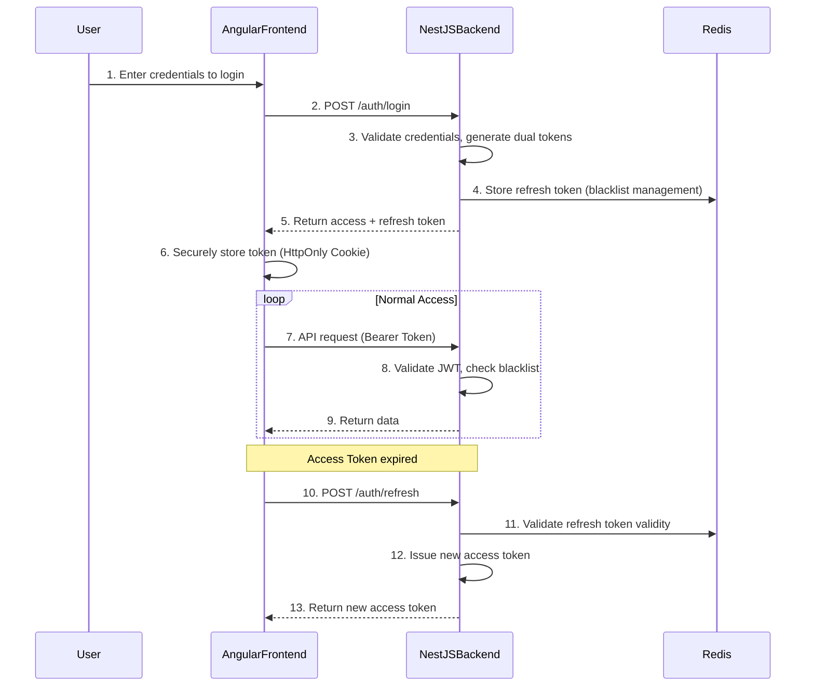

# Booking System - Security Architecture Design Document (Angular + NestJS Refactored Version)

## Document Information

* **Document Version**: 2.4.0
* **Created Date**: 2026-04-14
* **Last Updated**: 2026-05-04
* **Applicable Versions**: Angular v21+, NestJS v11+, PostgreSQL 16, Redis 7.x
* **Document Status**: Baselined
* **Author**: System Architecture Analysis Tool

## 1. Security Architecture Overview

### 1.1 Security Design Principles

* **Principle of Least Privilege**: Users and system components are granted only the minimum permissions required to complete their tasks
* **Defense in Depth**: Multiple layers of security controls; failure of a single defense does not compromise overall security
* **Secure by Default**: Default configurations are secure configurations
* **Zero Trust Architecture**: No internal or external request is trusted; always verify
* **Shift-Left Security**: Consider and implement security measures in early development stages

### 1.2 Security Objectives

| Security Objective | Specific Metrics | Tech Stack Implementation | Status |
|----------|----------|----------------|----------|
| **Confidentiality** | Sensitive data encrypted in transit and at rest | HTTPS + TLS 1.3, AES-256-GCM field-level encryption, bcrypt password hashing | ✅ Implemented |
| **Integrity** | Data not tampered with during transmission and storage | JWT HMAC-SHA256 signature, database constraints, input validation | ✅ Implemented |
| **Availability** | System remains available under attack | Redis soft rate limiting, fine-grained throttling strategies, DDoS protection | 🟡 Partially Implemented |
| **Auditability** | All security events trackable and auditable | Winston structured logging, security event audit tables | ✅ Implemented |
| **Authentication** | Ensure authenticity of user identity | JWT + Passport strategy, Access Token + Refresh Token dual-token | ✅ Implemented |
| **Authorization Control** | Ensure users can only access authorized resources | NestJS guards + RBAC, resource-based permission control | ✅ Implemented |

### 1.3 Security Architecture Layers

```
┌─────────────────────────────────────────┐
│       Application Security Layer        │
│  Angular security, NestJS guards,       │
│  business logic security, auth,         │
│  input validation, session mgmt,        │
│  rate limiting                          │
└─────────────────────────────────────────┘
                     │
┌─────────────────────────────────────────┐
│           API Security Layer            │
│  API gateway, throttling, WAF,          │
│  request validation, response filtering │
│  helmet headers, CORS config, CSRF      │
└─────────────────────────────────────────┘
                     │
┌─────────────────────────────────────────┐
│          Data Security Layer            │
│  Database encryption, field-level       │
│  masking, audit logs, backup/recovery   │
│  PostgreSQL RLS, Redis ACL config       │
└─────────────────────────────────────────┘
                     │
┌─────────────────────────────────────────┐
│     Infrastructure Security Layer       │
│  Container security, network isolation, │
│  key management, vulnerability scanning │
│  Docker security config, K8s policies   │
└─────────────────────────────────────────┘
```

### 1.4 Tech Stack Security Components

| Security Component | Technology | Version | Security Function |
|----------|----------|------|----------|
| **Frontend Security Framework** | Angular v21+ | Latest | CSP support, XSS protection, secure DOM operations |
| **Backend Security Framework** | NestJS v11+ | Latest | Auth guards, rate limiting, input validation |
| **Authentication Scheme** | JWT + Passport | @nestjs/jwt + @nestjs/passport | Stateless authentication, token management |
| **Security Headers** | helmet | Latest | CSP, HSTS, X-Frame-Options, etc. |
| **Rate Limiting** | @nestjs/throttler | Latest | API throttling, brute-force prevention |
| **Input Validation** | class-validator + class-transformer | Latest | DTO validation, data transformation |
| **Data Encryption** | bcrypt, crypto | Built-in | Password hashing, sensitive data encryption |
| **Network Protection** | CORS, CSRF | NestJS built-in | Cross-origin security, CSRF prevention |
| **Audit Logging** | Winston + Pino | Latest | Structured logging, security event recording |

## 2. Authentication and Authorization System

### 2.1 Authentication Mechanism

#### 2.1.1 JWT Token Design

**Token Structure**:
```typescript
// Access Token Structure (JWT Payload)
// [M-2 Change Note v2.2.0] Removed email field.
// JWT is signed (HMAC-SHA256) not encrypted; Payload is Base64 encoded, any token holder can decode and read.
// Basis: NIST SP 800-63B § 6.2 minimization principle; GDPR Art.5(1)(c) data minimization principle.
// If business layer needs email, query database via sub (userId); carrying PII in tokens is prohibited.
interface AccessTokenPayload {
  sub: string;           // User ID (subject)
  roles: string[];       // User roles array
  permissions: string[]; // Fine-grained permissions
  iat: number;           // Issued time (issued at)
  exp: number;           // Expiration time (expiration)
  jti: string;           // Unique token identifier (JWT ID)
}

// Refresh Token Structure
interface RefreshTokenPayload {
  sub: string;          // User ID
  tokenFamily: string;  // Token family (replay attack prevention)
  iat: number;
  exp: number;          // Longer duration (7-30 days)
}
```

**Token Configuration**:
```typescript
// JWT Configuration (NestJS)
export const jwtConfig = {
  accessToken: {
    secret: process.env.JWT_ACCESS_SECRET,
    expiresIn: '15m',  // 15-minute short-lived token
    algorithm: 'HS256',
  },
  refreshToken: {
    secret: process.env.JWT_REFRESH_SECRET,
    expiresIn: '7d',   // 7-day refresh token
    algorithm: 'HS256',
  },
};
```

#### 2.1.2 Dual-Token Flow



#### 2.1.3 Authentication Implementation

**NestJS Authentication Guard**:
```typescript
// auth.guard.ts
import { Injectable, CanActivate, ExecutionContext, UnauthorizedException } from '@nestjs/common';
import { JwtService } from '@nestjs/jwt';
import { Request } from 'express';

@Injectable()
export class AuthGuard implements CanActivate {
  constructor(private jwtService: JwtService) {}

  async canActivate(context: ExecutionContext): Promise<boolean> {
    const request = context.switchToHttp().getRequest();
    const token = this.extractTokenFromHeader(request);
    
    if (!token) {
      throw new UnauthorizedException('Authentication token not provided');
    }
    
    try {
      const payload = await this.jwtService.verifyAsync(token, {
        secret: process.env.JWT_ACCESS_SECRET,
      });
      
      // Check if token is blacklisted
      const isBlacklisted = await this.redisService.get(`token:blacklist:${payload.jti}`);
      if (isBlacklisted) {
        throw new UnauthorizedException('Token has been invalidated');
      }
      
      // Attach user information to request object
      request['user'] = payload;
      return true;
    } catch {
      throw new UnauthorizedException('Invalid authentication token');
    }
  }

  private extractTokenFromHeader(request: Request): string | undefined {
    const [type, token] = request.headers.authorization?.split(' ') ?? [];
    return type === 'Bearer' ? token : undefined;
  }
}
```

**Angular Authentication Interceptor**:
```typescript
// auth.interceptor.ts
import { Injectable } from '@angular/core';
import { HttpInterceptor, HttpRequest, HttpHandler, HttpEvent, HttpErrorResponse } from '@angular/common/http';
import { Observable, throwError, BehaviorSubject } from 'rxjs';
import { catchError, filter, take, switchMap } from 'rxjs/operators';
import { AuthService } from './auth.service';

@Injectable()
export class AuthInterceptor implements HttpInterceptor {
  private isRefreshing = false;
  private refreshTokenSubject: BehaviorSubject<any> = new BehaviorSubject<any>(null);

  constructor(private authService: AuthService) {}

  intercept(req: HttpRequest<any>, next: HttpHandler): Observable<HttpEvent<any>> {
    // Add authentication header
    const authReq = this.addAuthenticationToken(req);
    
    return next.handle(authReq).pipe(
      catchError((error) => {
        if (error instanceof HttpErrorResponse && error.status === 401) {
          return this.handle401Error(authReq, next);
        }
        return throwError(() => error);
      }),
    );
  }

  private addAuthenticationToken(request: HttpRequest<any>): HttpRequest<any> {
    const token = this.authService.getAccessToken();
    
    if (!token || this.authService.isTokenExpired(token)) {
      return request;
    }
    
    return request.clone({
      setHeaders: {
        Authorization: `Bearer ${token}`,
      },
    });
  }

  private handle401Error(request: HttpRequest<any>, next: HttpHandler): Observable<HttpEvent<any>> {
    if (!this.isRefreshing) {
      this.isRefreshing = true;
      this.refreshTokenSubject.next(null);

      return this.authService.refreshToken().pipe(
        switchMap((token) => {
          this.isRefreshing = false;
          this.refreshTokenSubject.next(token.accessToken);
          return next.handle(this.addAuthenticationToken(request));
        }),
        catchError((err) => {
          this.isRefreshing = false;
          this.authService.logout();
          return throwError(() => err);
        }),
      );
    } else {
      return this.refreshTokenSubject.pipe(
        filter((token) => token != null),
        take(1),
        switchMap((token) => {
          return next.handle(this.addAuthenticationToken(request));
        }),
      );
    }
  }
}
```

### 2.2 Authorization Mechanism

#### 2.2.1 RBAC Permission Model

**Role Definitions**:
```typescript
// System role enum
export enum SystemRole {
  SUPER_ADMIN = 'SUPER_ADMIN',    // Super administrator
  ADMIN = 'ADMIN',                // Administrator
  CUSTOMER = 'CUSTOMER',          // Regular customer
}

// Permission enum
export enum Permission {
  // User management permissions
  USER_READ = 'user:read',
  USER_CREATE = 'user:create',
  USER_UPDATE = 'user:update',
  USER_DELETE = 'user:delete',
  
  // Appointment management permissions
  APPOINTMENT_READ = 'appointment:read',
  APPOINTMENT_CREATE = 'appointment:create',
  APPOINTMENT_UPDATE = 'appointment:update',
  APPOINTMENT_DELETE = 'appointment:delete',
  APPOINTMENT_CANCEL = 'appointment:cancel',
  
  // Service management permissions
  SERVICE_READ = 'service:read',
  SERVICE_CREATE = 'service:create',
  SERVICE_UPDATE = 'service:update',
  SERVICE_DELETE = 'service:delete',
  
  // Time slot management permissions
  TIMESLOT_READ = 'timeslot:read',
  TIMESLOT_CREATE = 'timeslot:create',
  TIMESLOT_UPDATE = 'timeslot:update',
  TIMESLOT_DELETE = 'timeslot:delete',
}

// Role-permission mapping
export const ROLE_PERMISSIONS: Record<SystemRole, Permission[]> = {
  [SystemRole.SUPER_ADMIN]: Object.values(Permission),
  [SystemRole.ADMIN]: [
    // User management permissions
    Permission.USER_READ, Permission.USER_CREATE, Permission.USER_UPDATE,
    // Appointment management permissions (limited to /admin/appointments endpoint, not customer-side /v1/appointments)
    Permission.APPOINTMENT_READ, Permission.APPOINTMENT_UPDATE, Permission.APPOINTMENT_DELETE,
    // Service management permissions
    Permission.SERVICE_READ, Permission.SERVICE_CREATE, Permission.SERVICE_UPDATE, Permission.SERVICE_DELETE,
    // Time slot management permissions
    Permission.TIMESLOT_READ, Permission.TIMESLOT_CREATE, Permission.TIMESLOT_UPDATE, Permission.TIMESLOT_DELETE,
  ],
  [SystemRole.CUSTOMER]: [
    Permission.APPOINTMENT_READ, Permission.APPOINTMENT_CREATE, Permission.APPOINTMENT_UPDATE, Permission.APPOINTMENT_CANCEL,
  ],
};
```

> **Role Enum Specification** [v2.3.0]
> 
> The **canonical values** for system roles are defined below. All security components (JWT Token, authorization guards, API permission decorators, contract.yaml) must use these uniformly:
> 
> | Canonical Role | Value | Description |
> |----------|-----|------|
> | `CUSTOMER` | `'CUSTOMER'` | End user — creates and manages personal appointments |
> | `ADMIN` | `'ADMIN'` | System administrator — manages appointments, services, schedules, views dashboard stats |
> | `SUPER_ADMIN` | `'SUPER_ADMIN'` | Super administrator — full system access |
> 
> **Deprecated Values**:
> - `USER` — Deprecated, maps to `CUSTOMER`, retained for backward compatibility, but new code must not use it.
> 
> These values are consistent across `contract.yaml` (role enum), the JWT Payload `roles` field, and all `@Roles()` and `@Permissions()` decorators.

#### 2.2.2 NestJS Authorization Guard

```typescript
// roles.guard.ts - Role guard
import { Injectable, CanActivate, ExecutionContext } from '@nestjs/common';
import { Reflector } from '@nestjs/core';
import { SystemRole } from '../enums/system-role.enum';

@Injectable()
export class RolesGuard implements CanActivate {
  constructor(private reflector: Reflector) {}

  canActivate(context: ExecutionContext): boolean {
    const requiredRoles = this.reflector.getAllAndOverride<SystemRole[]>('roles', [
      context.getHandler(),
      context.getClass(),
    ]);
    
    if (!requiredRoles) {
      return true;
    }
    
    const { user } = context.switchToHttp().getRequest();
    return requiredRoles.some((role) => user.roles?.includes(role));
  }
}

// permissions.guard.ts - Permission guard
@Injectable()
export class PermissionsGuard implements CanActivate {
  constructor(private reflector: Reflector) {}

  canActivate(context: ExecutionContext): boolean {
    const requiredPermissions = this.reflector.getAllAndOverride<Permission[]>('permissions', [
      context.getHandler(),
      context.getClass(),
    ]);
    
    if (!requiredPermissions) {
      return true;
    }
    
    const { user } = context.switchToHttp().getRequest();
    const userPermissions = this.getUserPermissions(user.roles);
    
    return requiredPermissions.every((permission) => 
      userPermissions.includes(permission)
    );
  }

  private getUserPermissions(roles: SystemRole[]): Permission[] {
    return roles.flatMap((role) => ROLE_PERMISSIONS[role] || []);
  }
}
```

#### 2.2.3 Controller Authorization Decorators

```typescript
// appointment.controller.ts
import { Controller, Get, Post, Body, Param, UseGuards } from '@nestjs/common';
import { AuthGuard } from '../guards/auth.guard';
import { RolesGuard } from '../guards/roles.guard';
import { PermissionsGuard } from '../guards/permissions.guard';
import { Roles } from '../decorators/roles.decorator';
import { Permissions } from '../decorators/permissions.decorator';
import { SystemRole } from '../enums/system-role.enum';
import { Permission } from '../enums/permission.enum';

@Controller('v1/appointments')
@UseGuards(AuthGuard) // All endpoints require authentication
export class AppointmentController {
  
  @Get()
  @UseGuards(RolesGuard)
  @Roles(SystemRole.CUSTOMER)
  @UseGuards(PermissionsGuard)
  @Permissions(Permission.APPOINTMENT_READ)
  async findAll() {
    // Get appointment list (CUSTOMER only; admins manage appointments via /admin/appointments)
  }

  @Post()
  @UseGuards(RolesGuard)
  @Roles(SystemRole.CUSTOMER)
  @UseGuards(PermissionsGuard)
  @Permissions(Permission.APPOINTMENT_CREATE)
  @Throttle(10, 60) // Additional rate limiting
  async create(@Body() createAppointmentDto: CreateAppointmentDto) {
    // Create appointment (CUSTOMER only)
  }

  @Get(':id')
  @UseGuards(RolesGuard)
  @Roles(SystemRole.CUSTOMER)
  @UseGuards(PermissionsGuard)
  @Permissions(Permission.APPOINTMENT_READ)
  async findOne(@Param('id') id: string) {
    // Get appointment details (CUSTOMER only)
  }
}

// Note: Appointment deletion/cancellation is performed via /v1/admin/appointments/:id/status endpoint (ADMIN permission).
//       CUSTOMER cancels appointments using POST /v1/appointments/:id/cancel (CUSTOMER permission).
```

### 2.3 Session Security

#### 2.3.1 JWT Token Security

**Token Security Strategy**:
```typescript
// token-security.service.ts
@Injectable()
export class TokenSecurityService {
  constructor(private redisService: RedisService) {}
  
  // 1. Token blacklist management
  async addToBlacklist(tokenId: string, expiresIn: number): Promise<void> {
    await this.redisService.setex(
      `token:blacklist:${tokenId}`,
      expiresIn,
      'revoked',
    );
  }
  
  // 2. Token family management (replay attack prevention)
  async validateTokenFamily(userId: string, tokenFamily: string): Promise<boolean> {
    const currentFamily = await this.redisService.get(`user:${userId}:token-family`);
    return currentFamily === tokenFamily;
  }

  async rotateTokenFamily(userId: string): Promise<string> {
    const newFamily = crypto.randomBytes(32).toString('hex');
    await this.redisService.setex(
      `user:${userId}:token-family`,
      60 * 60 * 24 * 30, // 30 days
      newFamily,
    );
    return newFamily;
  }
  
  // 3. Concurrent session control
  async checkConcurrentSessions(userId: string, maxSessions: number = 5): Promise<boolean> {
    const sessionCount = await this.redisService.scard(`user:${userId}:sessions`);
    return sessionCount < maxSessions;
  }

  async addSession(userId: string, sessionId: string): Promise<void> {
    await this.redisService.sadd(`user:${userId}:sessions`, sessionId);
    await this.redisService.expire(`user:${userId}:sessions`, 60 * 60 * 24 * 7); // 7 days
  }

  async removeSession(userId: string, sessionId: string): Promise<void> {
    await this.redisService.srem(`user:${userId}:sessions`, sessionId);
  }
}
```

#### 2.3.2 Login Security Enhancement

**Multi-Factor Authentication (MFA)**:
```typescript
// mfa.service.ts
@Injectable()
export class MfaService {
  constructor(
    private redisService: RedisService,
    private emailService: EmailService,
    private smsService: SmsService,
  ) {}

  async requireMfa(userId: string, context: LoginContext): Promise<boolean> {
    // Risk assessment rules
    const riskFactors = await this.calculateRiskFactors(userId, context);

    // High-risk scenarios require MFA
    return riskFactors.includes('NEW_DEVICE') ||
           riskFactors.includes('UNUSUAL_LOCATION') ||
           riskFactors.includes('SENSITIVE_OPERATION');
  }

  async sendMfaCode(userId: string, method: 'EMAIL' | 'SMS'): Promise<string> {
    const code = this.generateRandomCode(6); // 6-digit numeric verification code
    const ttl = 300; // Valid for 5 minutes

    await this.redisService.setex(
      `mfa:${userId}:${method}`,
      ttl,
      JSON.stringify({ code, attempts: 0 }),
    );

    if (method === 'EMAIL') {
      await this.emailService.sendMfaCode(userId, code);
    } else {
      await this.smsService.sendMfaCode(userId, code);
    }

    return code;
  }

  async verifyMfaCode(userId: string, method: 'EMAIL' | 'SMS', code: string): Promise<boolean> {
    const key = `mfa:${userId}:${method}`;
    const data = await this.redisService.get(key);

    if (!data) {
      return false;
    }

    const { code: storedCode, attempts } = JSON.parse(data);

    // Check attempt count
    if (attempts >= 3) {
      await this.redisService.del(key);
      throw new BadRequestException('Verification code attempts exceeded');
    }

    // Code matching
    if (storedCode === code) {
      await this.redisService.del(key);
      return true;
    }

    // Record failed attempt
    await this.redisService.setex(
      key,
      300,
      JSON.stringify({ code: storedCode, attempts: attempts + 1 }),
    );

    return false;
  }
}
```

#### 2.3.3 Email Verification Code Storage Security Strategy

Email verification codes use Redis cache storage, supporting three scenarios: registration, login, and password reset, with enterprise-grade security protection.

##### Verification Code Storage Security Design
```typescript
// email-verification.service.ts
@Injectable()
export class EmailVerificationService {
  constructor(
    private redisService: RedisService,
    private emailService: EmailService,
  ) {}

  // Verification code type enum
  enum VerificationCodeType {
    REGISTER = 'REGISTER',  // Registration verification code
    LOGIN = 'LOGIN',        // Login verification code
    RESET = 'RESET',       // Password reset verification code
  }

  /**
   * Send email verification code
   * Redis storage format: verification:email:{email}:{type}
   * TTL: 300s (5 minutes)
   */
  async sendCode(email: string, type: VerificationCodeType): Promise<void> {
    // 1. Generate 6-digit numeric verification code
    const code = this.generateSecureCode();

    // 2. Redis key format: verification:email:{email}:{type}
    const key = `verification:email:${email}:${type}`;

    // 3. Store verification code in Redis, TTL 5 minutes
    await this.redisService.setex(key, 300, code);

    // 4. Send email
    await this.emailService.sendVerificationCode(email, code, type);
  }

  /**
   * Verify email verification code
   * Automatically deletes the code from Redis after successful verification
   */
  async verifyCode(
    email: string,
    code: string,
    type: VerificationCodeType,
  ): Promise<boolean> {
    const key = `verification:email:${email}:${type}`;

    // 1. Get stored verification code
    const storedCode = await this.redisService.get(key);

    // 2. Code does not exist or has expired
    if (!storedCode) {
      throw new BadRequestException('Verification code has expired, please resend');
    }

    // 3. Code does not match
    if (storedCode !== code) {
      throw new BadRequestException('Incorrect verification code');
    }

    // 4. Delete code after successful verification (single-use)
    await this.redisService.del(key);

    return true;
  }

  private generateSecureCode(): string {
    // Generate 6-digit random numeric verification code
    return Math.floor(100000 + Math.random() * 900000).toString();
  }
}
```

##### Verification Code Security Protection Strategies
| Protection Measure | Implementation | Security Objective |
|---------|---------|----------|
| **Redis Cache Storage** | TTL 300s auto-expiry | Prevent long-lived verification codes |
| **Single-Use** | Immediately deleted after successful verification | Prevent replay attacks |
| **Type Isolation** | Separate storage for different business types | Prevent type confusion attacks |
| **Rate Limiting** | 5 times/minute/email | Prevent brute-force enumeration |
| **Email Format Validation** | class-validator @IsEmail() | Prevent injection attacks |

##### Verification Code Storage Key Design
```
Redis key format: verification:email:{email}:{type}
Examples:
  - Registration code: verification:email:user@example.com:REGISTER
  - Login code: verification:email:user@example.com:LOGIN
  - Password reset code: verification:email:user@example.com:RESET

TTL: 300 seconds (5 minutes)
```

##### Verification Flow Security Sequence
```
1. User requests verification code
   ↓
2. Server validates email format
   ↓
3. Check sending rate limit (5 times/minute)
   ↓
4. Generate 6-digit secure random code
   ↓
5. Store in Redis (TTL: 300s)
   ↓
6. Send email to user's mailbox
   ↓
7. User submits verification code
   ↓
8. Server queries Redis for stored code
   ↓
9. Compare verification codes (case-insensitive)
   ↓
10. Delete code from Redis after successful verification
    ↓
11. Return verification result
```

## 3. Network Security Design

### 3.1 Transport Layer Security (TLS/HTTPS)

**HTTPS Enforcement Configuration**:
```typescript
// main.ts - NestJS HTTPS configuration
import { NestFactory } from '@nestjs/core';
import { AppModule } from './app.module';
import * as fs from 'fs';
import * as https from 'https';

async function bootstrap() {
  const httpsOptions = {
    key: fs.readFileSync('./secrets/private-key.pem'),
    cert: fs.readFileSync('./secrets/public-certificate.pem'),
    minVersion: 'TLSv1.3', // Enforce TLS 1.3
    ciphers: [
      'TLS_AES_256_GCM_SHA384',
      'TLS_CHACHA20_POLY1305_SHA256',
      'TLS_AES_128_GCM_SHA256',
    ].join(':'),
    honorCipherOrder: true,
  };
  
  const app = await NestFactory.create(AppModule, {
    httpsOptions,
    cors: true,
  });
  
  // HSTS header (HTTP Strict Transport Security)
  app.use((req, res, next) => {
    res.setHeader(
      'Strict-Transport-Security',
      'max-age=31536000; includeSubDomains; preload',
    );
    next();
  });
  
  await app.listen(443);
}
bootstrap();
```

**Angular Production Environment Configuration**:
```typescript
// environment.prod.ts
export const environment = {
  production: true,
  apiUrl: 'https://api.booking.example.com', // Enforce HTTPS
  wsUrl: 'wss://ws.booking.example.com',     // Enforce WSS
  enableSecurityHeaders: true,
};
```

### 3.2 Security Header Management (helmet)

**NestJS helmet Configuration**:
```typescript
// security.config.ts
import helmet from 'helmet';

export const securityMiddleware = [
  helmet({
    // Content Security Policy
    contentSecurityPolicy: {
      directives: {
        defaultSrc: ["'self'"],
        styleSrc: ["'self'", "'unsafe-inline'", 'https://fonts.googleapis.com'],
        fontSrc: ["'self'", 'https://fonts.gstatic.com'],
        imgSrc: ["'self'", 'data:', 'https:'],
        scriptSrc: ["'self'", "'unsafe-inline'", "'unsafe-eval'"],
        connectSrc: ["'self'", 'https://api.booking.example.com', 'wss://ws.booking.example.com'],
        frameSrc: ["'none'"],
        objectSrc: ["'none'"],
      },
    },
    // Other security headers
    hsts: {
      maxAge: 31536000,
      includeSubDomains: true,
      preload: true,
    },
    xFrameOptions: { action: 'deny' },
    xContentTypeOptions: true,
    xPoweredBy: false,
    referrerPolicy: { policy: 'strict-origin-when-cross-origin' },
    crossOriginEmbedderPolicy: true,
    crossOriginOpenerPolicy: { policy: 'same-origin' },
    crossOriginResourcePolicy: { policy: 'same-site' },
  }),
  
  // Custom security headers
  (req, res, next) => {
    res.setHeader('X-XSS-Protection', '1; mode=block');
    res.setHeader('X-DNS-Prefetch-Control', 'off');
    res.setHeader('X-Download-Options', 'noopen');
    res.setHeader('X-Permitted-Cross-Domain-Policies', 'none');
    next();
  },
];
```

### 3.3 CORS Configuration

**Fine-Grained CORS Policy**:
```typescript
// cors.config.ts
export const corsOptions = {
  origin: (origin, callback) => {
    // Allowed domain whitelist
    const allowedOrigins = [
      'https://booking.example.com',
      'https://admin.booking.example.com',
      'https://staging.booking.example.com',
      process.env.NODE_ENV === 'development' && 'http://localhost:4200',
    ].filter(Boolean);
    
    // Allow requests without origin (mobile apps, curl, etc.)
    if (!origin || allowedOrigins.indexOf(origin) !== -1) {
      callback(null, true);
    } else {
      callback(new Error('Not allowed by CORS'));
    }
  },
  credentials: true, // Allow credentials (Cookie, Authorization header)
  methods: ['GET', 'POST', 'PUT', 'DELETE', 'PATCH', 'OPTIONS'],
  allowedHeaders: [
    'Content-Type',
    'Authorization',
    'X-Requested-With',
    'X-API-Version',
    'X-Request-ID',
  ],
  exposedHeaders: [
    'X-RateLimit-Limit',
    'X-RateLimit-Remaining',
    'X-RateLimit-Reset',
    'X-API-Version',
  ],
  maxAge: 86400, // 24-hour preflight request cache
  preflightContinue: false,
  optionsSuccessStatus: 204,
};
```

### 3.4 CSRF Protection

**Angular + NestJS CSRF Protection**:
```typescript
// Angular CSRF service
@Injectable({ providedIn: 'root' })
export class CsrfService {
  private csrfToken = signal<string | null>(null);
  
  constructor(private http: HttpClient) {
    this.fetchCsrfToken();
  }
  
  private fetchCsrfToken(): void {
    // Fetch CSRF token from server
    this.http.get('/csrf-token', { withCredentials: true })
      .subscribe((response: any) => {
        this.csrfToken.set(response.token);
      });
  }
  
  getToken(): string | null {
    return this.csrfToken();
  }
  
  // CSRF interceptor
  intercept(req: HttpRequest<any>, next: HttpHandler): Observable<HttpEvent<any>> {
    const token = this.getToken();
    
    if (token && this.requiresCsrfProtection(req)) {
      const cloned = req.clone({
        headers: req.headers.set('X-CSRF-Token', token),
      });
      return next.handle(cloned);
    }
    
    return next.handle(req);
  }
  
  private requiresCsrfProtection(req: HttpRequest<any>): boolean {
    // Only state-changing requests require CSRF protection
    const unsafeMethods = ['POST', 'PUT', 'DELETE', 'PATCH'];
    return unsafeMethods.includes(req.method);
  }
}
```

**NestJS CSRF Middleware**:
```typescript
// csrf.middleware.ts
import { Injectable, NestMiddleware } from '@nestjs/common';
import { Request, Response, NextFunction } from 'express';
import * as csurf from 'csurf';

@Injectable()
export class CsrfMiddleware implements NestMiddleware {
  private csrfProtection = csurf({
    cookie: {
      httpOnly: true,
      secure: process.env.NODE_ENV === 'production',
      sameSite: 'strict',
    },
    value: (req) => {
      // Get CSRF token from request header
      return req.headers['x-csrf-token'] as string;
    },
  });
  
  use(req: Request, res: Response, next: NextFunction) {
    // Skip APIs that don't need CSRF protection
    if (this.shouldSkipCsrf(req)) {
      return next();
    }
    
    return this.csrfProtection(req, res, next);
  }
  
  private shouldSkipCsrf(req: Request): boolean {
    const skipPaths = [
      '/health',
      '/metrics',
      '/api-docs',
      '/auth/login',
      '/auth/refresh',
    ];
    
    return skipPaths.some(path => req.path.startsWith(path)) ||
           req.method === 'GET' ||
           req.method === 'HEAD' ||
           req.method === 'OPTIONS';
  }
}
```

### 3.5 Rate Limiting and DDoS Protection

**Fine-Grained Throttling Strategy** (detailed in Interface Design Specification Document Section 2.3.3):
```typescript
// Multi-dimensional throttling system
1. User+timeslot throttle (1/sec)     // Prevent rapid rebooking
2. User daily limit (20/day)          // Prevent resource abuse
3. IP global throttle (10/min)        // Prevent IP attacks
4. Timeslot capacity throttle (real-time) // Prevent overselling
5. Global user throttle (100/min)     // Basic protection
```

**DDoS Protection Layers**:
```
┌─────────────────────────────────┐
│     Cloudflare / WAF Layer          │
│  IP reputation, rate limiting,      │
│  challenge verification             │
└─────────────────────────────────┘
                │
┌─────────────────────────────────┐
│    API Gateway Layer (Kong/Nginx)   │
│  Global rate limiting, request      │
│  filtering, caching                 │
└─────────────────────────────────┘
                │
┌─────────────────────────────────┐
│  Application Layer (NestJS + Redis) │
│  Fine-grained throttling, business  │
│  logic protection                   │
└─────────────────────────────────┘
```

The network security design provides transport and network layer protection for the system. On this foundation, the system needs to establish a comprehensive key management and security operations system, which is a critical component for ensuring application and data layer security.

## 4. Key Management and Security Operations

This chapter demonstrates the compliant management approach for sensitive configurations such as `JWT_SECRET` and database passwords in production environments. Although this refactoring project is for learning purposes and will not go live, following the "Infrastructure as Code" principle, it provides Vault integration examples that can be directly deployed.

### 4.1 Key Lifecycle Management

| Management Phase | Strategy Description | Implementation Demo for This Project |
| :--- | :--- | :--- |
| **Generation** | Use cryptographically secure pseudo-random number generators with a minimum length of 256 bits. | Provides `openssl rand -base64 32` command example. |
| **Storage** | Plaintext in config files or code repositories is strictly prohibited. Use dedicated key management services or encrypted environment variables. | Demonstrates Docker Compose integration with HashiCorp Vault configuration. |
| **Distribution** | Inject into container runtime environment through secure CI/CD pipelines. | Uses Docker Secrets or Kubernetes Secrets. |
| **Rotation** | Support dynamic loading of new keys without restarting services. | Provides pseudo-code for NestJS file change monitoring or Vault lease renewal. |
| **Revocation** | Upon discovery of leakage, immediately add to blacklist and force all related sessions to expire. | References the JWT blacklist mechanism described earlier. |

### 4.2 Key Generation Specification

All keys (JWT Secret, Refresh Secret, database passwords) must be generated independently.

```bash
# Production-grade key generation example (Linux/macOS)
# Generate 256-bit (32 bytes) Base64-encoded key
openssl rand -base64 32

# Generate 512-bit (64 bytes) hexadecimal key (more secure)
openssl rand -hex 64
```

**Note**: Using weak passwords such as `change-me`, `secret`, personal names, or birthdays is strictly prohibited.

### 4.3 Key Injection Solution for Development/Test Environments

To simulate production environments without going live, it is recommended to mount external files via `secrets` or `env_file` in `docker-compose.yml`, avoiding writing keys into the core `docker-compose.yml` configuration.

**Option A: Using Docker Compose Secrets (Swarm Mode Compatible)**

```yaml
# docker-compose.dev.yml
services:
  backend:
    image: nestjs-booking-backend:dev
    secrets:
      - jwt_secret
      - db_password
    environment:
      - JWT_SECRET_FILE=/run/secrets/jwt_secret
      - DB_PASSWORD_FILE=/run/secrets/db_password

secrets:
  jwt_secret:
    file: ./secrets/jwt_secret.txt
  db_password:
    file: ./secrets/db_password.txt
```

**Option B: Integrating HashiCorp Vault (High-Practicality Demo)**

Add a Vault service in `docker-compose` to demonstrate dynamic database credential retrieval.

```yaml
# docker-compose.vault.yml (for demonstrating advanced key management)
services:
  vault:
    image: vault:1.15
    cap_add:
      - IPC_LOCK
    environment:
      VAULT_DEV_ROOT_TOKEN_ID: learning-root-token
    ports:
      - "8200:8200"

  backend:
    # ... other configuration
    environment:
      - VAULT_ADDR= `http://vault:8200` 
      - VAULT_TOKEN=learning-root-token
      - JWT_SECRET= # Left empty, read from Vault at runtime
    depends_on:
      - vault
```

### 4.4 NestJS Dynamic Key Loading Implementation (Production-Ready Code)

To support key rotation, the NestJS application should not only read environment variables at startup but should support dynamic loading.

```typescript
// vault-config.service.ts
import { Injectable, Logger, OnModuleInit } from '@nestjs/common';
import { ConfigService } from '@nestjs/config';
import * as fs from 'fs/promises';

@Injectable()
export class VaultConfigService implements OnModuleInit {
  private readonly logger = new Logger(VaultConfigService.name);
  private secrets: Map<string, string> = new Map();

  constructor(private configService: ConfigService) {}

  async onModuleInit() {
    // Priority: Docker Secrets file > Environment variables > Vault (demo)
    await this.loadSecrets();
  }

  private async loadSecrets() {
    // 1. Try to read Docker Secrets mounted files
    const secretPaths = {
      JWT_SECRET: '/run/secrets/jwt_secret',
      DB_PASSWORD: '/run/secrets/db_password',
    };

    for (const [key, path] of Object.entries(secretPaths)) {
      try {
        const value = (await fs.readFile(path, 'utf8')).trim();
        this.secrets.set(key, value);
        this.logger.log(`Loaded secret ${key} from file`);
      } catch {
        // Fallback to environment variables
        const envValue = this.configService.get(key);
        if (envValue) {
          this.secrets.set(key, envValue);
          this.logger.log(`Loaded secret ${key} from ENV`);
        }
      }
    }

    // 2. Demo: if VAULT_ADDR is configured, override with Vault read
    if (process.env.VAULT_ADDR) {
      await this.loadFromVault();
    }
  }

  private async loadFromVault() {
    this.logger.warn('Simulating Vault secret fetch...');
    // In a real project, this would call the Vault SDK
    // const vaultSecret = await vaultClient.read('secret/data/jwt');
    // this.secrets.set('JWT_SECRET', vaultSecret.data.value);
  }

  get(key: string): string {
    const value = this.secrets.get(key);
    if (!value) {
      throw new Error(`Secret ${key} not found`);
    }
    return value;
  }
}
```

### 4.5 Key Rotation Drill Guide (For Learning Purposes)

Even without going live, you can simulate key rotation locally through the following steps:

1. **Generate new key**: `openssl rand -base64 32 > ./secrets/jwt_secret_new.txt`
2. **Update Docker Secret**: `docker secret update jwt_secret ./secrets/jwt_secret_new.txt` (Swarm environment) or manually replace the mounted file.
3. **Rolling service update**: `docker-compose up -d --no-deps --force-recreate backend`
4. **Verify**: Old tokens should fail verification after rotation (if dynamic loading is not implemented, they will be invalidated due to restart). If the above `VaultConfigService` dynamic refresh is implemented, zero-downtime rotation can be demonstrated.

Through the chapters above, you will fully demonstrate the leap from a developer's "environment variable" mindset to an architect's "key full lifecycle management" mindset.

Effective key management is the foundation of data security. The next chapter will discuss in detail how to apply these security mechanisms during data storage, transmission, and processing to achieve end-to-end data security protection.

## 5. Data Security Design

### 5.1 Data Encryption Strategy

#### 5.1.1 Storage Encryption

**Field-Level Encryption Implementation**:
```typescript
// encryption.service.ts - Simplified version
@Injectable()
export class EncryptionService {
  private readonly algorithm = 'aes-256-gcm';
  
  async encrypt(text: string): Promise<EncryptedData> {
    // Implement AES-256-GCM encryption
    return encryptedData;
  }
  
  async decrypt(encryptedData: EncryptedData): Promise<string> {
    // Implement decryption
    return decryptedText;
  }
}
```

#### 5.1.2 Sensitive Data Classification and Encryption Strategy

| Data Type | Sensitivity Level | Encryption Strategy | Storage Format |
|----------|----------|----------|----------|
| **User Password** | Highest | bcrypt hash + salt (rounds=12, OWASP 2023) | Hash value (passwordHash) |
| **Phone Number** | High | AES-256-GCM full-field encryption + SHA-256 hash index | Three fields (phone masked / phoneHash hashed / phoneEncrypted ciphertext) |
| **ID Card Number** | High | AES-256-GCM full-field encryption | Encrypted storage |
| **Email Address** | High | AES-256-GCM full-field encryption + SHA-256 hash index | Three fields (email masked / emailHash hashed / emailEncrypted ciphertext) |

> **[M-1 Modification Note v2.2.0]** Email sensitivity level upgraded from "Medium / application-layer masking / plaintext storage" to "High / AES-256-GCM encryption / three-field storage".
> Upgrade rationale: Email serves as an equivalent authentication credential for registration and verification code login, with a risk level consistent with phone numbers;
> Compliant with GDPR Art.4(1), PIPL Article 4, OWASP A02:2021 Cryptographic Failures requirements.
> Design basis: piiEncryptionStrategy.md § 3 (Email encryption level upgrade decision).

> **[M-3 Modification Note v2.2.0]** bcrypt rounds unified to 12, compliant with OWASP Password Storage Cheat Sheet (2023) recommended value.

### 5.2 Database Security

#### 5.2.1 PostgreSQL Security Configuration

**Database Roles and Permissions**:
```sql
-- Create least-privilege roles
CREATE ROLE booking_app LOGIN PASSWORD 'secure_password' NOINHERIT;
CREATE ROLE booking_readonly LOGIN PASSWORD 'readonly_password' NOINHERIT;

-- Apply role permissions
GRANT CONNECT ON DATABASE booking TO booking_app;
GRANT SELECT, INSERT, UPDATE, DELETE ON ALL TABLES TO booking_app;
```

**Prisma Security Configuration**:
```prisma
// schema.prisma - Data model security constraints
model Appointment {
  id        String   @id @default(uuid())
  userId    String
  timeSlotId String
  appointmentDate DateTime
  slotSequence Int
  
  // Partial unique index - core for high-concurrency safety (includes appointmentDate for cross-day isolation)
  @@unique([timeSlotId, appointmentDate, slotSequence], map: "appointment_slot_occupied")
}
```

#### 5.2.2 SQL Injection Prevention

**Prisma Parameterized Queries**:
```typescript
// Secure query example
const appointments = await prisma.appointment.findMany({
  where: {
    userId: input.userId, // Automatically parameterized
    status: input.status,
  },
});
```

## 6. Application Security Design

### 6.1 Input Validation and Filtering

**Angular Frontend Validation**:
```typescript
// Angular reactive form validation
this.appointmentForm = this.fb.group({
  serviceId: ['', [Validators.required]],
  appointmentDate: ['', [Validators.required, this.validateFutureDate]],
});
```

**NestJS DTO Validation**:
```typescript
// create-appointment.dto.ts
export class CreateAppointmentDto {
  @IsString()
  @IsNotEmpty()
  serviceId: string;
  
  @IsDate()
  @IsFutureDate()
  appointmentDate: Date;
}
```

### 6.2 Session Security

**JWT Token Security Strategy**:
- Short-lived Access Token (15 minutes)
- Long-lived Refresh Token (7 days)
- Token blacklist management
- Token family anti-replay attack

### 6.3 Business Logic Security

**High-Concurrency Appointment Security**:
- PostgreSQL partial unique index for atomic slot occupation
- Redis soft rate limiting as pre-filter
- Fine-grained throttling strategy (user+timeslot 1/sec)

**Financial Field Auditing**:
- Appointment.price, taxRate, taxIncludedAmount are financial fields snapshotted from Service at appointment creation; subsequent Service price changes do not affect existing appointments
- All financial field changes must be recorded in audit logs, tracing the operator and change time
- BookingGroup.totalPrice is calculated at the application layer by summing taxIncludedAmount of each Appointment in the group, not written directly

**Overtime Appointment Security (Overtime-Only Mechanism)**:
- The system has removed multi-slot booking and the BookingGroup model, uniformly using overtimeMinutes to extend appointment duration
- When creating/updating appointments, the application layer validates that overtime does not overlap with existing appointments in adjacent timeslots, preventing physical conflicts
- Validation logic: Calculate `effectiveEnd = appointmentDate + durationMinutes`, query other valid appointments on the same date where `startTime < effectiveEnd AND endTime > appointmentDate`; if any exist, return 409 Conflict

## 7. Infrastructure Security

### 7.1 Container Security

**Docker Security Configuration**:
```dockerfile
# Run as non-root user
USER nodejs

# Minimal base image
FROM node:22-alpine
```

### 7.2 Network Security Configuration

**Network Segmentation Strategy**:
- Frontend container network isolation
- Backend API network isolation
- Database independent network
- Redis cache network isolation

### 7.3 Key Management

**Environment Variable Management**:
- Use .env files (development environment)
- Use Kubernetes Secrets (production environment)
- Key rotation strategy

## 8. Security Monitoring and Auditing

### 8.1 Security Event Monitoring

**Monitoring Metrics**:
- Authentication failure count
- Permission denial count
- Rate limit trigger count
- SQL injection attempts

**Audit Logs**:
```typescript
// Security audit logging
@Injectable()
export class AuditService {
  async logSecurityEvent(event: SecurityEvent) {
    await this.prisma.securityLog.create({
      data: {
        userId: event.userId,
        action: event.action,
        ipAddress: event.ipAddress,
        userAgent: event.userAgent,
        timestamp: new Date(),
      },
    });
  }
}
```

### 8.2 Vulnerability Management

**Dependency Security Scanning**:
- Use npm audit to check dependency vulnerabilities
- Scan with Snyk or similar tools
- Regularly update dependency versions

## 9. Compliance Requirements

### 9.1 Data Protection Regulations

**Personal Information Protection**:
- Minimal user data collection
- Data subject rights support (access, correction, deletion)
- Cross-border data transfer compliance

### 9.2 Security Standard Compliance

**OWASP Top 10 Protection**:
- Injection attack prevention (SQL injection, command injection)
- Broken authentication prevention
- Sensitive data exposure prevention
- XML External Entity prevention
- Broken access control prevention
- Security misconfiguration prevention
- Cross-site scripting prevention
- Insecure deserialization prevention
- Using components with known vulnerabilities prevention
- Insufficient logging and monitoring prevention

## 10. Security Testing Strategy

### 10.1 Security Testing Types

**Testing Types**:
- Static Application Security Testing (SAST)
- Dynamic Application Security Testing (DAST)
- Interactive Application Security Testing (IAST)
- Software Composition Analysis (SCA)

**Penetration Testing**:
- Regular penetration testing (at least annually)
- Bug bounty program (optional)

### 10.2 Security Testing Tools

**Toolset**:
- OWASP ZAP (dynamic testing)
- SonarQube (static code analysis)
- npm audit (dependency vulnerability scanning)
- Burp Suite (professional penetration testing)

## 11. Appendix

### 11.1 Security Configuration Checklist

**Pre-Deployment Security Checklist**:
- [ ] HTTPS enforcement enabled
- [ ] Security headers correctly configured
- [ ] CORS policy strictly restricted
- [ ] Database connection uses SSL
- [ ] No sensitive information hardcoded in environment variables
- [ ] Logs do not record sensitive data
- [ ] Error messages do not leak stack traces

### 11.2 Security Incident Report Template

**Security Incident Report**:
```
## Basic Information
- Incident ID:
- Report Time:
- Reporter:

## Incident Description
- Incident Type:
- Impact Scope:
- Occurrence Time:

## Emergency Response
- Immediate Actions:
- Root Cause Analysis:
- Preventive Measures:
```

---

*Document Version: 2.4.0*
*Last Updated: 2026-05-11*
*Fully aligned with Technical Stack Recommendation, Data Architecture Design Document, System Architecture Design Document (SAD), and Interface Design Specification Document*

### Modification Log

| Version | Date | Author | Changes |
|------|------|-------|---------|
| 2.4.0 | 2026-05-11 | @Architect | Fixed @@unique constraint adding appointmentDate; added financial field audit description (price/taxRate/taxIncludedAmount snapshot and audit); added multi-slot appointment security description |
| 2.5.0 | 2026-05-11 | @Architect | Removed multi-slot appointment security description, replaced with overtime-only overlap detection security strategy |
| 2.2.0 | 2026-04-21 | @Architect (TASK-D2) | M-1: Email sensitivity level Medium→High, strategy upgraded to AES-256-GCM three-field storage; M-2: AccessTokenPayload removed email field (NIST SP 800-63B minimization principle); M-3: bcrypt rounds specified as 12 (OWASP 2023) |
| 2.1.0 | 2026-04-14 | System Architecture Analysis Tool | Initial baseline version |
