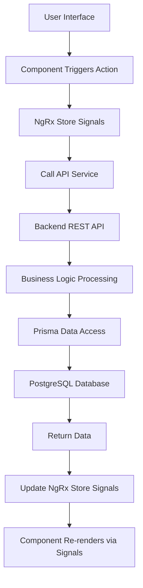
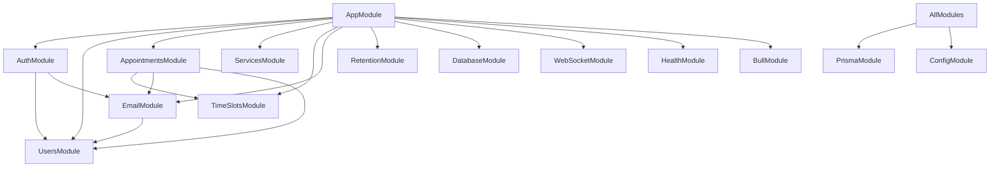

# Booking System - System Architecture Design Document (SAD) - Angular + NestJS Refactored Version

## Document Information
- **Document Version**: 2.5.1
- **Created Date**: 2026-04-14
- **Last Updated**: 2026-05-12
- **Contract Version**: contract.yaml v1.7.5
- **Applicable Versions**: angular-booking-frontend v1.0.0, nestjs-booking-backend v1.0.0
- **Document Status**: Baselined
- **Author**: System Architecture Analysis Tool
- **Refactored Tech Stack**: Angular v21+ + NestJS v11+

## 1. System Overview

### 1.1 System Positioning
The Booking System is a modern appointment management platform designed around CRM principles, providing complete user authentication, service management, appointment scheduling, real-time notifications, and system administration features.

### 1.2 Core Value Proposition
- **For Customers**: Convenient online booking experience, real-time availability queries, smart notification reminders
- **For Administrators**: Complete appointment management view, user management, service configuration, system monitoring
- **For Developers**: Modular architecture, comprehensive API documentation, full test coverage

### 1.3 System Boundaries
- **Included Scope**: User authentication, service management, appointment scheduling, notification system, system administration
- **Excluded Scope**: Payment gateway, third-party calendar integration, multi-language support, mobile APP
- **Integration Boundaries**: Supports WebSocket real-time notifications, SMTP email service, Redis caching

## 2. Logical Architecture Design

### 2.1 Overall Logical Architecture Diagram
```
┌─────────────────────────────────────────────────────────────┐
│                    Presentation Layer                      │
│  ┌───────────────────┐  ┌───────────────────┐               │
│  │  Angular Frontend  │  │    Mobile H5        │               │
│  │   (v21+)          │  │   (Responsive)    │               │
│  └───────────────────┘  └───────────────────┘               │
│            │                           │                     │
│            └─────────────┬─────────────┘                     │
│                          │                                   │
│                ┌─────────▼─────────┐                         │
│                │    API Gateway Layer  │                         │
│                │   (NestJS REST)   │                         │
│                └─────────┬─────────┘                         │
│                          │                                   │
└──────────────────────────┼───────────────────────────────────┘
                           │
┌──────────────────────────┼───────────────────────────────────┐
│                    Business Logic Layer                    │
│  ┌─────────────────────────────────────────────────────┐   │
│  │              Business Modules                        │   │
│  │  ┌─────┐ ┌─────┐ ┌─────┐ ┌─────┐ ┌─────┐ ┌─────┐   │   │
│  │  │Auth │ │User │ │Appt │ │Svc  │ │Time │ │Notif│   │   │
│  │  │Mod. │ │Mgmt │ │Mgmt │ │Mgmt │ │Slot │ │Sys  │   │   │
│  │  └─────┘ └─────┘ └─────┘ └─────┘ └─────┘ └─────┘   │   │
│  └─────────────────────────────────────────────────────┘   │
│                          │                                   │
│                ┌─────────▼─────────┐                         │
│                │  Data Access Layer  │                         │
│                │  (Prisma ORM)     │                         │
│                └─────────┬─────────┘                         │
│                          │                                   │
└──────────────────────────┼───────────────────────────────────┘
                           │
┌──────────────────────────┼───────────────────────────────────┐
│                    Data Storage Layer                     │
│  ┌─────────────────────────────────────────────────────┐   │
│  │ PostgreSQL   Redis       File Storage  Log Storage      │   │
│  │  (Primary DB) (Cache)    (Uploads)   (Log Files)      │   │
│  └─────────────────────────────────────────────────────┘   │
└─────────────────────────────────────────────────────────────┘
```

### 2.2 Backend Modular Architecture (NestJS)

#### 2.2.1 Core Business Modules
| Module Name | Module Path | Core Responsibilities | Key Components |
|---------|---------|----------|----------|
| **AuthModule** | `src/modules/auth/` | User authentication and authorization management | AuthController, AuthService, JwtStrategy |
| **UsersModule** | `src/modules/users/` | User information management | UsersController, UsersService, UserEntity |
| **AppointmentsModule** | `src/modules/appointments/` | Appointment business processing | AppointmentsController, AppointmentsService, AppointmentEntity |
| **ServicesModule** | `src/modules/services/` | Service item management | ServicesController, ServicesService, ServiceEntity |
| **TimeSlotsModule** | `src/modules/time-slots/` | Time slot management | TimeSlotsController, TimeSlotsService, TimeSlotEntity |
| **EmailModule** | `src/modules/email/` | Email notification service | EmailService, Email templates |
| **RetentionModule** | `src/modules/retention/` | Data retention policy | RetentionScheduler, RetentionService |
| **TimezoneModule** | `src/modules/timezone/` | Timezone resolution and business hours management (added in v2.6.0) | ClinicTimezoneProvider, BusinessHoursController, BusinessHoursService |
| **StatsModule** (Admin Dashboard) | `src/modules/stats/` | Admin dashboard statistics (DASH-001~004), calculated via Prisma aggregate queries | StatsController, StatsService |

#### 2.2.1.1 AdminModule Sub-module Architecture (Admin Backend)

The admin backend (Admin Dashboard) consists of the following sub-modules, uniformly mounted under the `/v1/admin` route prefix, with access controlled via JWT + RBAC:

| Sub-module | Module Path | Core Responsibilities | Status |
|--------|---------|----------|------|
| **StatsModule** | `src/modules/stats/` | Dashboard statistics cards (DASH-001~004), including appointment totals, revenue, appointment trends, service distribution, time distribution, notification list, unread message count | ✅ Implemented |
| **ReportModule** | `src/modules/reports/` | ~~Report generation and export (PDF/CSV), appointment reports, revenue reports, service statistics reports~~ — ⚠️ **Deprecated**, replaced by Analytics dashboard endpoints (AN-001 GET /v1/admin/stats + AN-002 GET /v1/admin/stats/booking-trends) | ⚠️ Deprecated (v1.6.1) |
| **UserManagementModule** | `src/modules/admin/users/` | Admin user CRUD (create/read/update/delete users, status management, role management) | ✅ Implemented |
| **ServiceManagementModule** | `src/modules/admin/services/` | Admin service CRUD (service CRUD, category management, publish/unpublish) | ✅ Implemented |
| **AppointmentManagementModule** | `src/modules/admin/appointments/` | Admin appointment CRUD (appointment management, status transitions, batch operations) | ✅ Implemented |
| **AnalyticsModule** | `src/modules/admin/analytics/` | Business analytics dashboard, trend analysis, year-over-year/month-over-month comparisons, funnel analysis, customer profiling | 🔮 Future Phase (FUTURE-PHASE) |
| **HistoryModule** | `src/modules/admin/history/` | Appointment history records and operation log queries, activity log retrospection, change audit trail | 🔮 Future Phase (FUTURE-PHASE) |
| **SettingsModule** | `src/modules/admin/settings/` | System configuration management, global parameter settings (business hours, appointment rules, notification config) | 🔮 Future Phase (FUTURE-PHASE) |

> **Note**: Modules marked with 🔮 are planned future phase features, not yet implemented. Modules marked with ⚠️ are deprecated. Existing StatsModule, UserManagementModule, ServiceManagementModule, and AppointmentManagementModule are implemented with corresponding API endpoints defined in contract.yaml v1.6.7. ReportModule (reports) was deprecated in v1.6.1, with its functionality replaced by StatsModule's composite statistics data (AN-001) and booking trends (AN-002) endpoints.

#### 2.2.2 Infrastructure Modules
| Module Name | Module Path | Core Responsibilities |
|---------|---------|----------|
| **DatabaseModule** | `src/common/database/` | Database connection and health checks |
| **WebSocketModule** | `src/common/websocket/` | Real-time communication support |
| **HealthModule** | `src/common/health/` | System health checks |
| **FileUploadModule** | `src/common/file-upload/` | File upload handling |
| **PrismaModule** | `src/modules/prisma/` | Prisma ORM service |
| **BullModule** | `src/modules/bull/` | BullMQ message queue integration |

### 2.3 Frontend Architecture Design (Angular)

#### 2.3.1 Component Architecture (Atomic Design Pattern)
```
Component Hierarchy:
┌─────────────────────────────────────────────────────┐
│                 Pages (Page Layer)                    │
│  /login, /register, /appointments, /admin/appointments      │
└─────────────────────────────────────────────────────┘
                            │
┌─────────────────────────────────────────────────────┐
│              Templates (Template Layer)                │
│  AppLayout - Main application layout                  │
└─────────────────────────────────────────────────────┘
                            │
┌─────────────────────────────────────────────────────┐
│            Organisms (Organism Component Layer)         │
│  AdminBookingList, BookingPage, LoginPage           │
└─────────────────────────────────────────────────────┘
                            │
┌─────────────────────────────────────────────────────┐
│            Molecules (Molecule Component Layer)         │
│  LoginForm, BookingForm, TimeSlotGrid, DateSelector │
└─────────────────────────────────────────────────────┘
                            │
┌─────────────────────────────────────────────────────┐
│              Atoms (Atom Component Layer)              │
│  Button, Input, Card, Modal, Dropdown, Spinner      │
└─────────────────────────────────────────────────────┘
```

**Legal Module**: The system includes an independent Legal module providing two publicly accessible static legal pages:
- `/legal/terms` — Terms of Service page
- `/legal/privacy` — Privacy Policy page
- This module requires no authentication, consists of purely presentational pages, and does not use NgRx state management.

#### 2.3.2 Frontend Tech Stack
| Technology Area | Technology Choice | Version | Selection Rationale |
|---------|---------|------|----------|
| **Frontend Framework** | Angular | v21+ | Enterprise-grade framework, complete ecosystem, native TypeScript support, standalone component mode improves development experience |
| **UI Component Library** | PrimeNG + Tailwind CSS | Latest + v4 | Rich enterprise components including all components needed for a booking system; atomic CSS for design consistency |
| **State Management** | NgRx Signals (@ngrx/signals) | Latest | NgRx team's recommended new default, signal-based state management, perfect integration with Angular Signals, provides structured state management |
| **HTTP Client** | Angular HttpClient | Built-in | Official HTTP library, interceptor support, TypeScript-friendly |
| **Form Management** | Angular Reactive Forms (Signal Forms) | Built-in | Reactive forms, complex validation support, type-safe |
| **Routing** | Angular Router | Built-in | Official routing solution, supports lazy loading, guards, preloading |
| **Testing Framework** | Jest + Angular Testing Library | Latest | Faster test execution, better development experience, snapshot testing support |

### 2.4 Data Flow Architecture

#### 2.4.1 Frontend Data Flow (Angular + NgRx Signals)


#### 2.4.2 Backend Data Flow (NestJS)
```
Request Flow:
1. HTTP Request → 2. Global Middleware (helmet/CORS) → 3. Route Dispatch → 
4. Guard Validation (JWT/Roles) → 5. Interceptor Processing → 6. Pipe Validation → 
7. Controller Handling → 8. Service Layer Business Logic → 9. Data Access Layer → 
10. Database Operation → 11. Return Response
```

## 3. Physical Architecture Design

### 3.1 Development Environment Deployment Topology
```
Development Environment (Local Development):
┌─────────────────────────────────────────────────────┐
│             Developer Local Machine                    │
│  ┌─────────────────────────────────────────────┐   │
│  │  Docker Desktop / Docker Engine             │   │
│  │  ┌─────────┐ ┌─────────┐ ┌─────────┐       │   │
│  │  │PostgreSQL│ │  Redis  │ │ Backend │       │   │
│  │  │ :5432    │ │ :6379   │ │ :3001   │       │   │
│  │  └─────────┘ └─────────┘ └─────────┘       │   │
│  │                     │                       │   │
│  │            ┌────────▼─────────┐             │   │
│  │            │   Frontend       │             │   │
│  │            │   :4200          │             │   │
│  │            └──────────────────┘             │   │
│  └─────────────────────────────────────────────┘   │
└─────────────────────────────────────────────────────┘
```

### 3.2 Production Environment Deployment Topology
```
Production Environment (Production Deployment):
┌─────────────────────────────────────────────────────┐
│             Cloud Server / Docker Host                 │
│  ┌─────────────────────────────────────────────┐   │
│  │  Docker Compose Orchestration                    │   │
│  │  ┌─────────┐ ┌─────────┐ ┌─────────┐       │   │
│  │  │PostgreSQL│ │  Redis  │ │ Backend │       │   │
│  │  │Container │ │Container│ │Container│       │   │
│  │  └─────────┘ └─────────┘ └─────────┘       │   │
│  │         │           │           │           │   │
│  │         └─────┬─────┴─────┬─────┘           │   │
│  │               │           │                 │   │
│  │        ┌──────▼──────┐ ┌──▼────────────┐   │   │
│  │        │   Volume    │ │  Frontend     │   │   │
│  │        │(Persistence)│ │  Container:80 │   │   │
│  │        └─────────────┘ └───────────────┘   │   │
│  └─────────────────────────────────────────────┘   │
└─────────────────────────────────────────────────────┘
```

### 3.3 Containerization Architecture

#### 3.3.1 Service Container Definitions
| Service Name | Base Image | Port Mapping | Data Volume | Health Check |
|---------|---------|---------|--------|----------|
| **postgres** | `postgres:16` | 5432:5432 | `booking_postgres_data` | `pg_isready` |
| **redis** | `redis:7-alpine` | 6379:6379 | `booking_redis_data` | `redis-cli ping` |
| **backend** | `nestjs-booking-backend:tag` | 3001:3001 | - | `/v1/health` |
| **frontend** | `angular-booking-frontend:tag` | 80:80 | - | Frontend page check |
| **migration** | `nestjs-booking-backend-migration:tag` | - | - | Migration command execution |

#### 3.3.2 Docker Compose Configuration
- **Development Environment**: `docker-compose.dev.yml`
- **Production Environment**: `docker-compose.prod.yml`
- **Environment Variables**: `compose/*.compose.env`
- **Application Configuration**: `env/*/backend.env`, `env/*/frontend.env`

### 3.4 Network Architecture

#### 3.4.1 Internal Network Communication
```
Internal Network (docker-compose default network):
┌─────────┐     ┌─────────┐     ┌─────────┐
│Frontend │────▶│ Backend │────▶│PostgreSQL│
│:80      │     │:3001    │     │:5432    │
└─────────┘     └─────────┘     └─────────┘
                       │
                  ┌────▼────┐
                  │  Redis  │
                  │ :6379   │
                  └─────────┘
```

#### 3.4.2 External Access Interfaces
| Service | External Port | Internal Port | Access Path | Purpose |
|------|-------------|---------|---------|------|
| **Frontend App** | 80 | 80 | `http://localhost` | User interface |
| **Backend API** | 3001 | 3001 | `http://localhost:3001/v1/*` | API endpoints |
| **Swagger Docs** | 3001 | 3001 | `http://localhost:3001/api/docs` | API documentation |
| **Health Check** | 3001 | 3001 | `http://localhost:3001/v1/health` | System health status |
| **Database** | 5432 | 5432 | `postgresql://localhost:5432` | Database management |
| **Redis** | 6379 | 6379 | `redis://localhost:6379` | Cache management |

## 4. Tech Stack Selection and Rationale

### 4.1 Backend Tech Stack Selection (NestJS Ecosystem)

| Technology Component | Version | Selection Rationale | Alternatives Evaluated |
|---------|---------|---------|-------------|
| **Node.js Runtime** | Node.js 22.x LTS | Long-term support version, high stability, excellent performance, officially supported by NestJS | Deno (immature ecosystem), Bun (insufficient production validation) |
| **Backend Framework** | NestJS v11+ | Enterprise-grade Node.js framework, TypeScript-first, modular architecture, comprehensive DI | Express (not structured enough), Fastify (relatively smaller ecosystem) |
| **ORM Tool** | Prisma 7.x | Type-safe, excellent migration tools, great DX, partial unique index support, read-write splitting | TypeORM (weaker type support), Sequelize (mediocre TS support) |
| **Database** | PostgreSQL 16 | Relational database, transaction support, JSON types, consistent with existing architecture | MySQL (fewer features), SQLite (not suitable for production) |
| **Cache System** | Redis 7.x | High performance, rich data structures, persistence support, BullMQ dependency | Memcached (fewer features), Redis Cluster (excessive complexity) |
| **Authentication** | JWT + Passport | Stateless authentication, easy horizontal scaling, official NestJS integration | Session (stateful, complex scaling), OAuth2 (overly complex) |
| **Security Headers** | helmet | Latest | Express/Connect middleware, sets HTTP security headers (CSP, HSTS, X-Frame-Options, etc.), prevents common web vulnerabilities |
| **Message Queue** | BullMQ | Latest | Redis-based distributed queue, supports priority, delay, retry, dead letter queues, official NestJS integration |

### 4.2 Frontend Tech Stack Selection (Angular Ecosystem)

| Technology Component | Version | Selection Rationale | Alternatives Evaluated |
|---------|---------|---------|-------------|
| **Frontend Framework** | Angular v21+ | Enterprise-grade framework, complete ecosystem, native TypeScript support, standalone component mode | React (not structured enough), Vue (weaker enterprise ecosystem) |
| **UI Component Library** | PrimeNG | Latest | Rich enterprise components including all components needed for a booking system (tables, calendars, form controls, etc.) | Angular Material (fewer features), NG-ZORRO (China-focused ecosystem) |
| **CSS Framework** | Tailwind CSS v4 | Atomic CSS, design consistency, high development efficiency | styled-components (runtime performance overhead), CSS Modules (limited functionality) |
| **State Management** | NgRx Signals (@ngrx/signals) | Latest | NgRx team's recommended new default, signal-based state management, perfect Angular Signals integration | Akita (relatively new), NGXS (relatively smaller ecosystem) |
| **HTTP Client** | Angular HttpClient | Built-in | Official HTTP library, interceptor support, TypeScript-friendly | Axios (requires extra integration), Fetch API (limited functionality) |
| **Form Management** | Angular Reactive Forms (Signal Forms) | Built-in | Reactive forms, complex validation support, type-safe | Template-driven Forms (relatively poorer performance) |
| **Testing Framework** | Jest + Angular Testing Library | Latest | Faster test execution, better DX, snapshot testing support | Karma + Jasmine (official but slower) |
| **E2E Testing** | Playwright | Latest | Cross-browser testing, excellent performance, consistent with existing test strategy | Cypress (mature ecosystem but relatively poorer performance) |

### 4.3 Deployment & Operations Tech Stack

| Technology Component | Version | Selection Rationale | Alternatives Evaluated |
|---------|---------|---------|-------------|
| **Container Runtime** | Docker 24.x | Industry standard, mature ecosystem, cross-platform support | Podman (compatibility issues), Containerd (too low-level) |
| **Container Orchestration** | Docker Compose v2 | Developer-friendly, simple configuration, multi-service management | Kubernetes (overly complex), Docker Swarm (smaller ecosystem) |
| **CI/CD Platform** | GitHub Actions | Tight GitHub integration, generous free tier | GitLab CI (requires self-hosting), Jenkins (complex configuration) |
| **Image Registry** | Docker Hub | Free public registry, simple CI/CD integration | GitHub Container Registry (fewer features), Private registry (higher cost) |
| **Monitoring** | Built-in health checks + Winston logging | Lightweight, meets basic needs, structured logging | Prometheus + Grafana (complex configuration), Datadog (expensive) |

### 4.4 High-Concurrency Appointment Conflict Resolution Strategy

To meet the high-concurrency demands of the booking system, the following database-layer optimization strategies are adopted for the "enhanced concurrency safety and stability" dimension:

#### 4.4.1 Atomic Occupation Mechanism
Adopts **PostgreSQL Partial Unique Index** + `slot_sequence` field design, pushing concurrent conflict detection from the application layer's `SELECT COUNT` down to the database index layer for true atomic occupation.

**Working Principle**:
- Each appointment slot maintains an available sequence number via the `slot_sequence` field (starting from 0, incrementing)
- Partial unique index constraints ensure only one appointment with a specific sequence number can exist per time slot at any given time point
- When the client attempts to insert, the database automatically detects conflicts at the index layer without manual application-layer checks

**Performance Advantages**:
- Moves concurrency control from the application layer to the database index layer
- Eliminates race conditions, ensuring atomic occupation
- Significantly reduces rollback storms caused by concurrent conflicts

#### 4.4.2 Transaction Isolation Level Downgrade Strategy
Downgrade the existing `SERIALIZABLE` isolation level to **`READ COMMITTED`**, eliminating rollback storms in high-concurrency scenarios.

**Comparison Analysis**:
| Isolation Level | Concurrency Performance | Conflict Handling | Applicable Scenarios |
|----------|----------|----------|----------|
| **SERIALIZABLE** | Low (~186 TPS) | 36.8% failure rate, 76.7% retry rate | Strong consistency requirement scenarios |
| **READ COMMITTED** | High (~1000+ TPS) | Optimistic conflict detection based on unique indexes | High-concurrency booking systems |

#### 4.4.3 Prisma Schema Implementation
```prisma
model Appointment {
  id              String   @id @default(uuid())
  userId          String
  timeSlotId      String
  appointmentDate DateTime
  slotSequence    Int      @default(0)      // Slot sequence number for atomic preemption
  durationMinutes Int      @default(30)     // Appointment duration (minutes)
  price           Decimal?                  // Price snapshot
  taxRate         Decimal?                  // Tax rate snapshot
  taxIncludedAmount Decimal?                // Tax-included total amount
  status          AppointmentStatus @default(PENDING)
  createdAt       DateTime @default(now())
  updatedAt       DateTime @updatedAt

  timeSlot        TimeSlot @relation(fields: [timeSlotId], references: [id])
  user            User     @relation(fields: [userId], references: [id])

  // Core: Partial unique index constraint - ensures uniqueness per time slot + date + sequence
  @@unique([timeSlotId, appointmentDate, slotSequence], map: "appointment_slot_occupied")
  
  // Business indexes
  @@index([userId, appointmentDate])
  @@index([timeSlotId, appointmentDate, status])
}

model TimeSlot {
  id          String   @id @default(uuid())
  startTime   DateTime
  endTime     DateTime
  capacity    Int      @default(1)          // Slot capacity (supports multi-person booking scenarios)
  currentSequence Int  @default(0)          // Currently assigned sequence number
  appointments Appointment[]
  
  // Business indexes
  @@index([startTime, endTime])
}
```

*Note: This unique index must be manually defined as a PostgreSQL partial unique index via Prisma migration files, effective only for specific statuses:*
*`CREATE UNIQUE INDEX ... WHERE status IN ('PENDING', 'CONFIRMED', 'COMPLETED');`*

#### 4.4.4 Advanced High-Concurrency Optimization Strategies
To push system throughput toward "thousands of QPS flash-sale scenario" levels, advanced optimization is performed across three dimensions—**application-layer coordination**, **infrastructure-layer scaling**, and **data-flow peak shaving**—built on top of the atomic slot occupation mechanism:

**Application-Layer Coordination**:
- Redis counter soft limiting: Leverage Redis single-threaded nature to build real-time remaining capacity cache
- Frontend random preferSeq hashing (hotspot sharding): Evolve `slot_sequence` from a simple serial number to physical bucketing
- Frontend Optimistic UI updates: Immediately mark as "processing" on the frontend after user click

**Infrastructure-Layer Scaling**:
- PgBouncer connection pool optimization: Deploy PgBouncer (transaction pool mode) in front of PostgreSQL to reuse database connections
- PostgreSQL read-write split architecture: Configure primary-replica replication using `@prisma/extension-read-replicas`
- PostgreSQL covering index optimization: Create covering partial indexes to avoid heap lookups

**Data-Flow Peak Shaving**:
- BullMQ asynchronous message processing: Send Redis Stream / BullMQ messages after transaction commit, consumed by independent Workers
- Near-real-time appointment statistics updates: Use Redis HyperLogLog for real-time counting, flushed to database every minute

**Expected Optimization Results**:
| Optimization Layer | Specific Measures | Throughput Improvement | Implementation Phase |
|----------|----------|------------|----------|
| **Frontend Layer** | 1. Submit button debounce<br>2. Random preferSeq hashing<br>3. Optimistic UI updates | +20% | Phase 1 (Immediate) |
| **Gateway/Business Layer** | 1. Redis capacity soft limiting<br>2. Business-layer slot round-robin retry | +50% | Phase 1 (Immediate) |
| **Data Layer** | 1. PgBouncer connection pool<br>2. Read-write split architecture<br>3. Covering index optimization | +400% | Phase 2 (Within 1 month) |
| **Async Processing** | 1. BullMQ message queue<br>2. Near-real-time statistics updates | +100% | Phase 3 (Within 2 months) |

## 5. Inter-Module Dependencies

### 5.1 Backend Module Dependency Graph (NestJS)


### 5.2 Frontend-Backend Dependencies
| Frontend Module (Angular) | Dependent Backend API (NestJS) | Data Flow Direction | Update Frequency |
|-------------------|-----------------------|---------|---------|
| **User Authentication** | `/v1/auth/*` | Bidirectional, high frequency | On user login |
| **Appointment Management** | `/v1/appointments/*` | Frontend→Backend, medium frequency | On appointment operations |
| **Service Management** | `/v1/services/*` | Frontend→Backend, low frequency | On service configuration |
| **Time Slot Query** | `/v1/time-slots/*` | Frontend→Backend, high frequency | On page load |
| **User Management** | `/v1/users/*` | Bidirectional, medium frequency | On user operations |
| **System Management** | `/v1/system/*` | Frontend→Backend, low frequency | On system configuration |

### 5.3 External Service Dependencies
| External Service | Dependency Level | Failure Handling Strategy | Monitoring Metrics |
|---------|---------|-------------|---------|
| **PostgreSQL Database** | Critical dependency | Block application startup on health check failure | Connection count, query latency, error rate |
| **Redis Cache** | Important dependency | Degrade to direct database queries | Memory usage, hit rate, latency |
| **SMTP Email Service** | Non-critical dependency | Async queue retry, local logging | Send success rate, queue length |
| **Docker Hub** | Deployment dependency | Use locally cached images, manual intervention | Image pull success rate, latency |

## 6. Scalability Design

### 6.1 Horizontal Scaling Strategy
| Service Component | Scaling Unit | Scaling Method | Data Consistency |
|---------|---------|---------|-----------|
| **Frontend Service** | Stateless container | Increase replica count, load balancing | No synchronization needed |
| **Backend API Service** | Stateless container | Increase replica count, load balancing | Sessions require external storage |
| **Database Service** | Primary-replica replication | Read-write split, replica scaling | Async replication delay |
| **Redis Cache** | Redis Cluster | Sharded cluster, add nodes | Client-side sharding or proxy |


**Architecture Constraint**: Scheduled task modules such as `RetentionScheduler` must rely on an external coordinator (Redis) to implement distributed locks, ensuring mutually exclusive execution under multi-instance deployment.

### 6.2 Vertical Scaling Strategy
| Resource Type | Scaling Method | Monitoring Metric | Scaling Threshold |
|---------|---------|---------|---------|
| **CPU Resources** | Increase CPU limits | CPU usage > 70% sustained for 5 minutes | Container config update |
| **Memory Resources** | Increase memory limits | Memory usage > 80% sustained for 5 minutes | Container config update |
| **Storage Resources** | Increase data volume size | Disk usage > 85% | Volume expansion |
| **Network Bandwidth** | Increase network limits | Network IO > 100MB/s sustained for 3 minutes | Host config update |

### 6.3 Microservice Evolution Path
Current architecture is modular monolith, which can evolve into:
1. **Phase 1**: Database read-write split
2. **Phase 2**: Authentication service independent deployment
3. **Phase 3**: Appointment service independent deployment
4. **Phase 4**: Notification service independent deployment
5. **Phase 5**: Full microservice architecture

## 7. Compatibility Design

### 7.1 API Version Compatibility
- **Current version**: v1 API (`/v1/*`)
- **Version strategy**: URI path versioning
- **Backward compatibility**: At least one previous API version retained
- **Deprecation strategy**: 6-month advance notice with migration guide

### 7.2 Database Compatibility
- **Migration tool**: Prisma Migrate
- **Rollback strategy**: Each migration is reversible
- **Compatibility guarantee**: Application version N compatible with database version N-1
- **Data migration**: Separate migration scripts and validation

### 7.3 Browser Compatibility
| Browser | Minimum Version | Test Status | Fallback Strategy |
|--------|---------|---------|---------|
| **Chrome** | 90+ | ✅ Fully supported | - |
| **Firefox** | 88+ | ✅ Fully supported | - |
| **Safari** | 14+ | ✅ Fully supported | - |
| **Edge** | 90+ | ✅ Fully supported | - |

## 8. Architecture Decision Records

### 8.1 Key Architecture Decisions
| Decision ID | Decision | Rationale | Impact Scope |
|---------|---------|---------|---------|
| ADR-001 | Choose Angular over Next.js | Enterprise-grade framework, complete ecosystem, native TypeScript support, standalone component pattern | Frontend development experience and architecture |
| ADR-002 | Choose NestJS over Express | Enterprise-grade Node.js framework, modular architecture, TypeScript-first | Entire backend development experience |
| ADR-003 | Choose Prisma over TypeORM | Better TypeScript support, mature migration tools, read-write split support | Data access layer and development workflow |
| ADR-004 | Choose Docker Compose over Kubernetes | Simplified deployment, reduced operational complexity | Production deployment strategy |
| ADR-005 | Choose JWT over Session authentication | Stateless, easy horizontal scaling | Authentication and session management |
| ADR-006 | Choose NgRx Signals over Redux | Signal-based state management, seamless Angular Signals integration, cleaner API | Frontend state management architecture |
| ADR-007 | Choose PostgreSQL partial unique index for atomic slot occupation | Performance optimization in high-concurrency scenarios, eliminates race conditions | Appointment conflict handling performance |

### 8.2 Technical Debt Identification
| Technical Debt Item | Severity | Resolution Plan | Impact Scope |
|-----------|---------|---------|---------|
| API versioning not implemented | Medium | Planned for v2 release | API compatibility |
| Distributed cache not implemented | Low | Current single Redis instance sufficient | Cache layer scalability |
| Frontend performance monitoring missing | Low | Planned Sentry integration | User experience monitoring |
| Insufficient database backup automation | Medium | Planned scheduled backup addition | Data security |

## 9. Architecture Verification and Review

### 9.1 Architecture Review Criteria
| Review Dimension | Assessment Criteria | Current Status | Improvement Suggestions |
|---------|---------|---------|---------|
| **Maintainability** | Clear code structure, comprehensive documentation | ✅ Excellent | Continuous maintenance |
| **Scalability** | Supports horizontal scaling, module decoupling | ✅ Good | Microservice evolution preparation |
| **Reliability** | Fault recovery, data consistency | ✅ Good | Add monitoring alerts |
| **Performance** | Response time, resource utilization | ✅ Good | Performance testing optimization |
| **Security** | Authentication/authorization, data protection | ✅ Good | Regular security audits |

### 9.2 Architecture Verification Methods
1. **Code review**: Module interface definitions, clear dependency relationships
2. **Integration testing**: Normal inter-module communication, correct data flow
3. **Deployment verification**: Successful containerized deployment, health checks passing
4. **Performance testing**: Baseline performance tests, stress test validation
5. **Security scanning**: Dependency vulnerability scanning, code security auditing

## 10. Security Architecture Adaptation

### 10.1 Security Control Point Mapping
| Security Requirement | Tech Stack Implementation | Document Reference |
|----------|----------------|----------|
| **Authentication Security** | JWT + Passport strategy, Access Token + Refresh Token dual-token | Security Architecture Design Document Section 3.1 |
| **Authorization Security** | NestJS Guards (GUARD), Role-Based Access Control (RBAC) | Security Architecture Design Document Section 3.2 |
| **Input Security** | class-validator DTO validation, Prisma parameterized queries | Security Architecture Design Document Section 4.1 |
| **Output Security** | Response interceptors, sensitive data masking | Security Architecture Design Document Section 4.2 |
| **Communication Security** | HTTPS enforcement, CORS configuration, CSRF tokens, helmet security headers (CSP, HSTS, X-Frame-Options, etc.) | Security Architecture Design Document Section 5.1 |
| **Session Security** | JWT stateless sessions, Redis blacklist management | Security Architecture Design Document Section 5.2 |
| **Audit Logging** | Winston logging system, structured log recording | Security Architecture Design Document Section 6.1 |

## 11. Test Strategy Adaptation

### 11.1 Test Level Mapping
| Test Type | Tech Stack Solution | Coverage Target | Adaptation Reference |
|----------|------------|------------|----------|
| **Unit Testing** | Jest + Angular Testing Library (Frontend)<br>Jest + NestJS testing tools (Backend) | ≥70% | Test Strategy and Plan Document Section 4.1 |
| **Integration Testing** | Supertest + Testcontainers (Backend)<br>Angular TestBed (Frontend) | ≥80% | Test Strategy and Plan Document Section 4.2 |
| **End-to-End Testing** | Playwright (Full-stack) | ≥90% business flow coverage | Test Strategy and Plan Document Section 5.2 |
| **Performance Testing** | k6 (Backend API)<br>Lighthouse (Frontend performance) | P95 < 500ms | Test Strategy and Plan Document Section 4.3 |

## 12. Deployment Architecture Adaptation

### 12.1 Environment Configuration
| Environment | Deployment Solution | Configuration Management | Adaptation Reference |
|------|----------|----------|----------|
| **Development Environment** | Docker Compose local orchestration | Environment variable file (`.env.dev`) | See Operations & Deployment Design Document §3 Development Environment Deployment |
| **Test Environment** | GitHub Actions automated deployment | GitHub Environments + Secrets | See Operations & Deployment Design Document §3 CI/CD Pipeline |
| **Production Environment** | Docker Compose production orchestration | Environment variable file (`.env.prod`) + Secrets | See Operations & Deployment Design Document §3 Production Environment Deployment |

### 12.2 Deployment Process
1. **Image Build**: GitHub Actions builds Docker images, tag strategy follows immutable tag principles
2. **Image Verification**: Verify image health checks pass, API documentation accessible
3. **Database Migration**: Independent migration service, ensuring data consistency
4. **Service Deployment**: Docker Compose starts all services
5. **Health Check**: Verify health status of all services

## 13. Suggested Project Structure

```
angular_booking_system/
├── booking-frontend/          # Angular frontend application
│   ├── src/
│   │   ├── app/
│   │   │   ├── core/         # Core module (auth, interceptors, guards)
│   │   │   ├── modules/      # Feature modules (appointments, services, users)
│   │   │   ├── shared/       # Shared components, services, utilities
│   │   │   └── layouts/      # Layout components
│   │   ├── assets/           # Static resources
│   │   └── environments/     # Environment configuration
│   ├── angular.json          # Angular configuration
│   └── package.json
│
├── booking-backend/           # NestJS backend application
│   ├── src/
│   │   ├── modules/          # Business modules (same as frontend)
│   │   ├── common/           # Common modules (database, config, filters)
│   │   ├── prisma/           # Prisma configuration and data models
│   │   └── main.ts           # Application entry point
│   ├── prisma/schema.prisma  # Database model definitions
│   └── package.json
│
└── booking-deploy/            # Deployment configuration
    ├── compose/              # Docker Compose files
    ├── env/                  # Environment variable files
    ├── scripts/              # Deployment scripts
    └── README.md             # Deployment documentation
```

## 14. Risk Assessment and Mitigation

| Risk | Impact | Mitigation Measures |
|------|------|----------|
| **Angular learning curve** | Team may need time to adapt to Angular framework | Provide training resources, adopt gradual migration, implement core features first |
| **State management complexity** | Complex appointment state may be difficult to manage | Adopt NgRx Signals for structured state management, use Store pattern to separate business logic, provide developer tools debugging support |
| **Frontend-backend separation communication** | API interface definitions and version management | Use OpenAPI/Swagger to standardize interfaces, establish interface contract testing |
| **Security configuration oversights** | Complex security configuration prone to omissions (e.g., helmet security headers, CSP policies) | Establish security configuration checklist, automated security scanning, use helmet defaults as baseline, progressively refine CSP policies |
| **Deployment complexity** | Multi-service containerized deployment with complex operations | Comprehensive deployment documentation, automated deployment scripts, monitoring alerts |
| **New component integration complexity** | BullMQ, PgBouncer, read-write split, and other new components increase system complexity | Phased implementation, core first then extensions; detailed technical documentation and deployment guides; establish component health checks and rollback mechanisms |

## 15. Key Non-Functional Requirements (NFR) Supplement

To ensure system reliability and data consistency under multi-instance deployment, this refactoring defines the following architecture-level constraints:

| NFR-ID | Requirement Name | Description | Acceptance Criteria |
| :--- | :--- | :--- | :--- |
| **NFR-01** | **Scheduled Task Mutual Exclusion** | All scheduled tasks must support mutually exclusive execution in distributed environments. | Start 3 backend instances, observe scheduled task logs; only one instance executes at any given time. |
| **NFR-02** | **Appointment Concurrency Safety** | Appointment creation must rely on database partial unique indexes for atomic slot occupation, preventing overselling. Timeout scenarios (overtimeMinutes) are validated at application layer to prevent overlap with adjacent time slot appointments. | Under concurrent stress testing, valid appointments ≤ time slot capacity. Overtime extensions do not exceed adjacent time slot boundaries. |
| **NFR-03** | **Stateless Services** | Backend service instances must not store sessions or cache state in local memory. | Any instance crash does not affect other instances processing requests. |

## 16. Suggested Implementation Roadmap

1. **Phase 1 (2-3 weeks)**: Environment Setup and Foundation Architecture
   - Initialize Angular + NestJS project structure
   - Configure Docker development environment
   - Implement basic authentication module (JWT)
   - Set up CI/CD pipeline

2. **Phase 2 (3-4 weeks)**: Core Feature Implementation
   - User management module
   - Service management module
   - Time slot management module
   - Basic appointment workflow

3. **Phase 3 (2-3 weeks)**: Advanced Features and Optimization
   - Notification system integration
   - Data retention policy
   - Performance optimization
   - Security hardening

4. **Phase 4 (1-2 weeks)**: Testing and Deployment
   - Comprehensive test coverage
   - Production environment deployment
   - Monitoring and alerting setup
   - Documentation finalization

## 17. Appendix

### 17.1 Reference Architecture Documents
- [Angular Official Architecture Guide](https://angular.dev/guide/architecture)
- [NestJS Official Architecture Guide](https://docs.nestjs.com/)
- [Prisma Data Model Design](https://www.prisma.io/docs)
- [Docker Production Best Practices](https://docs.docker.com/develop/develop-images/dockerfile_best-practices/)

### 17.2 Key Configuration File Locations
| Configuration File | Path | Purpose |
|---------|------|------|
| Backend main module | `booking-backend/src/app.module.ts` | Module registration and configuration |
| Frontend Angular configuration | `booking-frontend/angular.json` | Frontend build configuration |
| Docker Compose dev configuration | `booking-deploy/compose/docker-compose.dev.yml` | Development environment orchestration |
| Docker Compose production configuration | `booking-deploy/compose/docker-compose.prod.yml` | Production environment orchestration |
| Database Schema | `booking-backend/prisma/schema.prisma` | Data model definitions |


---

**Document Approval Record**
- **Architect**: System Analysis Tool
- **Technical Lead**: To be designated
- **Project Manager**: To be designated
- **Approval Date**: 2026-04-14

**Document Change Record**
| Version | Change Content | Changed By | Date |
|------|---------|--------|------|
| 2.4.0 | Added Appointment model fields (durationMinutes/price/taxRate/taxIncludedAmount); NFR-02 supplemented concurrency safety description | @Architect | 2026-05-11 |
| 2.6.0 | Removed BookingGroup model and bookingGroupId field; changed to overtime-only extension mechanism; added overtime-overlap application layer validation | @Architect | 2026-05-11 |
| 2.3.0 | Removed ScheduleModule submodule (Staff model removed, SCH-001 endpoint removed), AdminModule submodule count 9→8 | @Architect | 2026-05-06 |
| 2.2.0 | Added §2.2.1.1 AdminModule Submodule Architecture section, fully defining 9 admin backend submodules (including Schedule, Analytics, History, Settings future-phase modules) | @Architect | 2026-05-05 |
| 2.1.0 | Added StatsModule (Admin Dashboard) core business module, supporting DASH-001~004 statistics endpoints | @Architect | 2026-05-04 |
| 2.0.0 | Angular + NestJS refactored version created, comprehensive tech stack update, maintaining business module alignment | System Architecture Analysis Tool | 2026-04-14 |
| 1.0.0 | Initial version created (Next.js + NestJS) | System Analysis Tool | 2026-04-13 |