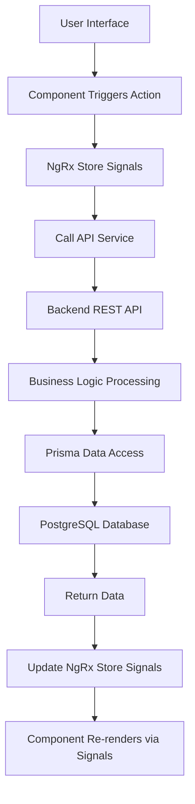

# Booking System - System Architecture Design Document (SAD) - Angular + NestJS Refactored Version

## Document Information
- **Document Version**: 2.5.1
- **Created Date**: 2026-04-14
- **Last Updated**: 2026-05-12
- **Contract Version**: contract.yaml v1.7.5
- **Applicable Version**: angular-booking-frontend v1.0.0, nestjs-booking-backend v1.0.0
- **Document Status**: Baselined
- **Author**: System Architecture Analysis Tool
- **Refactored Tech Stack**: Angular v21+ + NestJS v11+

## 1. System Overview

### 1.1 System Positioning
The booking system is a modern booking management platform designed based on CRM concepts, providing complete user authentication, service management, appointment scheduling, real-time notifications, and system administration functions.

### 1.2 Core Value Proposition
- **For Customers**: Convenient online booking experience, real-time availability query, intelligent notification reminders
- **For Administrators**: Complete appointment management view, user management, service configuration, system monitoring
- **For Developers**: Modular architecture, comprehensive API documentation, comprehensive test coverage

### 1.3 System Boundaries
- **Included Scope**: User authentication, service management, appointment scheduling, notification system, system administration
- **Excluded Scope**: Payment gateway, third-party calendar integration, multi-language support, mobile app
- **Integration Boundaries**: WebSocket real-time notification support, SMTP email service, Redis caching

## 2. Logical Architecture Design

### 2.1 Overall Logical Architecture Diagram
```
┌─────────────────────────────────────────────────────────────┐
│                   Presentation Layer                         │
│  ┌───────────────────┐  ┌───────────────────┐               │
│  │   Angular Frontend│  │    Mobile H5       │               │
│  │   (v21+)          │  │   (Responsive)    │               │
│  └───────────────────┘  └───────────────────┘               │
│            │                           │                     │
│            └─────────────┬─────────────┘                     │
│                          │                                   │
│                ┌─────────▼─────────┐                         │
│                │   API Gateway Layer │                         │
│                │   (NestJS REST)   │                         │
│                └─────────┬─────────┘                         │
│                          │                                   │
└──────────────────────────┼───────────────────────────────────┘
                           │
┌──────────────────────────┼───────────────────────────────────┐
│                Business Logic Layer                           │
│  ┌─────────────────────────────────────────────────────┐   │
│  │           Business Modules                           │   │
│  │  ┌─────┐ ┌─────┐ ┌─────┐ ┌─────┐ ┌─────┐ ┌─────┐   │   │
│  │  │Auth │ │User │ │Appt │ │Svc  │ │Time │ │Notif│   │   │
│  │  │Module│ │Mgmt │ │Mgmt │ │Mgmt │ │Slot │ │Sys  │   │   │
│  │  └─────┘ └─────┘ └─────┘ └─────┘ └─────┘ └─────┘   │   │
│  └─────────────────────────────────────────────────────┘   │
│                          │                                   │
│                ┌─────────▼─────────┐                         │
│                │  Data Access Layer  │                         │
│                │  (Prisma ORM)     │                         │
│                └─────────┬─────────┘                         │
│                          │                                   │
└──────────────────────────┼───────────────────────────────────┘
                           │
┌──────────────────────────┼───────────────────────────────────┐
│                Data Storage Layer                             │
│  ┌─────────────────────────────────────────────────────┐   │
│  │ PostgreSQL   Redis       File Storage   Log Storage   │   │
│  │  (Primary DB)(Cache)    (Uploads)      (Log Files)    │   │
│  └─────────────────────────────────────────────────────┘   │
└─────────────────────────────────────────────────────────────┘
```

### 2.2 Backend Modular Architecture (NestJS)

#### 2.2.1 Core Business Modules
| Module Name | Module Path | Core Responsibility | Key Components |
|---------|---------|----------|---------|
| **AuthModule** | `src/modules/auth/` | User authentication and authorization management | AuthController, AuthService, JwtStrategy |
| **UsersModule** | `src/modules/users/` | User information management | UsersController, UsersService, UserEntity |
| **AppointmentsModule** | `src/modules/appointments/` | Appointment business processing | AppointmentsController, AppointmentsService, AppointmentEntity |
| **ServicesModule** | `src/modules/services/` | Service item management | ServicesController, ServicesService, ServiceEntity |
| **TimeSlotsModule** | `src/modules/time-slots/` | Time slot management | TimeSlotsController, TimeSlotsService, TimeSlotEntity |
| **EmailModule** | `src/modules/email/` | Email notification service | EmailService, Email templates |
| **RetentionModule** | `src/modules/retention/` | Data retention policy | RetentionScheduler, RetentionService |
| **TimezoneModule** | `src/modules/timezone/` | Timezone resolution and business hours management (newly added in v2.6.0) | ClinicTimezoneProvider, BusinessHoursController, BusinessHoursService |
| **StatsModule** (Admin Dashboard) | `src/modules/stats/` | Admin dashboard statistics (DASH-001~004), computed via Prisma aggregate queries | StatsController, StatsService |

#### 2.2.1.1 AdminModule Submodule Architecture (Admin Backend)

The Admin Dashboard is composed of the following submodules, uniformly mounted under the `/v1/admin` route prefix, with access controlled via JWT + RBAC:

| Submodule | Module Path | Core Responsibility | Status |
|--------|---------|----------|------|
| **StatsModule** | `src/modules/stats/` | Dashboard statistics cards (DASH-001~004), including total appointments, revenue, appointment trends, service distribution, time distribution, notification list, unread message count | ✅ Implemented |
| **ReportModule** | `src/modules/reports/` | ~~Report generation and export (PDF/CSV), appointment reports, revenue reports, service statistics reports~~ — ⚠️ **Deprecated**, replaced by Analytics dashboard endpoints (AN-001 GET /v1/admin/stats + AN-002 GET /v1/admin/stats/booking-trends) | ⚠️ Deprecated (v1.6.1) |
| **UserManagementModule** | `src/modules/admin/users/` | Admin user CRUD (create, read, update, delete users, status management, role management) | ✅ Implemented |
| **ServiceManagementModule** | `src/modules/admin/services/` | Admin service CRUD (service CRUD, category management, publish/unpublish) | ✅ Implemented |
| **AppointmentManagementModule** | `src/modules/admin/appointments/` | Admin appointment CRUD (appointment management, status transitions, batch operations) | ✅ Implemented |
| **AnalyticsModule** | `src/modules/admin/analytics/` | Business analytics dashboard, trend analysis, YoY/MoM comparison, funnel analysis, customer profiling | 🔮 Future Phase (FUTURE-PHASE) |
| **HistoryModule** | `src/modules/admin/history/` | Appointment history and operation log query, activity log traceability, change audit trail | 🔮 Future Phase (FUTURE-PHASE) |
| **SettingsModule** | `src/modules/admin/settings/` | System configuration management, global parameter settings (business hours, booking rules, notification configuration) | 🔮 Future Phase (FUTURE-PHASE) |

> **Note**: Modules marked 🔮 are planned future-phase features not yet implemented. Modules marked ⚠️ are deprecated. Existing StatsModule, UserManagementModule, ServiceManagementModule, and AppointmentManagementModule have been implemented with corresponding API endpoints defined via contract.yaml v1.6.7. ReportModule (reporting) was deprecated in v1.6.1, with its functionality replaced by StatsModule's composite statistics (AN-001) and appointment trends (AN-002) endpoints.

#### 2.2.2 Infrastructure Modules
| Module Name | Module Path | Core Responsibility |
|---------|---------|----------|
| **DatabaseModule** | `src/common/database/` | Database connection and health check |
| **WebSocketModule** | `src/common/websocket/` | Real-time communication support |
| **HealthModule** | `src/common/health/` | System health check |
| **FileUploadModule** | `src/common/file-upload/` | File upload processing |
| **PrismaModule** | `src/modules/prisma/` | Prisma ORM service |
| **BullModule** | `src/modules/bull/` | BullMQ message queue integration |

### 2.3 Frontend Architecture Design (Angular)

#### 2.3.1 Component Architecture (Atomic Design Pattern)
```
Component Hierarchy:
┌─────────────────────────────────────────────────────┐
│                 Pages (Page Layer)                   │
│  /login, /register, /appointments, /admin/appointments      │
└─────────────────────────────────────────────────────┘
                            │
┌─────────────────────────────────────────────────────┐
│              Templates (Template Layer)              │
│  AppLayout - Application Main Layout                │
└─────────────────────────────────────────────────────┘
                            │
┌─────────────────────────────────────────────────────┐
│            Organisms (Organism Component Layer)      │
│  AdminBookingList, BookingPage, LoginPage           │
└─────────────────────────────────────────────────────┘
                            │
┌─────────────────────────────────────────────────────┐
│            Molecules (Molecule Component Layer)      │
│  LoginForm, BookingForm, TimeSlotGrid, DateSelector │
└─────────────────────────────────────────────────────┘
                            │
┌─────────────────────────────────────────────────────┐
│              Atoms (Atom Component Layer)            │
│  Button, Input, Card, Modal, Dropdown, Spinner      │
└─────────────────────────────────────────────────────┘
```

**Legal Module**: The system includes a separate Legal module providing two publicly accessible static legal pages:
- `/legal/terms` — Terms of Service page
- `/legal/privacy` — Privacy Policy page
- This module requires no authentication, is purely display-oriented, and does not use NgRx state management.

#### 2.3.2 Frontend Tech Stack
| Technology Area | Technology Selection | Version | Selection Rationale |
|---------|---------|------|---------|
| **Frontend Framework** | Angular | v21+ | Enterprise-grade framework, complete ecosystem, native TypeScript support, standalone component mode improves development experience |
| **UI Component Library** | PrimeNG + Tailwind CSS | Latest + v4 | Rich enterprise components covering all components needed for a booking system; atomic CSS, design consistency |
| **State Management** | NgRx Signals (@ngrx/signals) | Latest | New default recommended by NgRx team, signal-based state management, perfect integration with Angular Signals, provides structured state management |
| **HTTP Client** | Angular HttpClient | Built-in | Official HTTP library, interceptor support, TypeScript-friendly |
| **Form Management** | Angular Reactive Forms (Signal Forms) | Built-in | Reactive forms, complex validation support, type-safe |
| **Route Management** | Angular Router | Built-in | Official routing solution, supports lazy loading, guards, preloading |
| **Testing Framework** | Jest + Angular Testing Library | Latest | Faster test speed, better development experience, snapshot testing support |

### 2.4 Data Flow Architecture

#### 2.4.1 Frontend Data Flow (Angular + NgRx Signals)


#### 2.4.2 Backend Data Flow (NestJS)
```
Request Flow:
1. HTTP Request → 2. Global Middleware (helmet/CORS) → 3. Route Distribution → 
4. Guard Verification (JWT/Roles) → 5. Interceptor Processing → 6. Pipe Validation → 
7. Controller Processing → 8. Service Layer Business Logic → 9. Data Access Layer → 
10. Database Operations → 11. Return Response
```

## 3. Physical Architecture Design

### 3.1 Development Environment Deployment Topology
```
Development Environment (Local Development):
┌─────────────────────────────────────────────────────┐
│            Developer Local Machine                   │
│  ┌─────────────────────────────────────────────┐   │
│  │  Docker Desktop / Docker Engine             │   │
│  │  ┌─────────┐ ┌─────────┐ ┌─────────┐       │   │
│  │  │PostgreSQL│ │  Redis  │ │ Backend │       │   │
│  │  │ :5432    │ │ :6379   │ │ :3001   │       │   │
│  │  └─────────┘ └─────────┘ └─────────┘       │   │
│  │                     │                       │   │
│  │            ┌────────▼─────────┐             │   │
│  │            │   Frontend       │             │   │
│  │            │   :4200          │             │   │
│  │            └──────────────────┘             │   │
│  └─────────────────────────────────────────────┘   │
└─────────────────────────────────────────────────────┘
```

### 3.2 Production Environment Deployment Topology
```
Production Environment (Production Deployment):
┌─────────────────────────────────────────────────────┐
│          Cloud Server / Docker Host                  │
│  ┌─────────────────────────────────────────────┐   │
│  │  Docker Compose Orchestration                │   │
│  │  ┌─────────┐ ┌─────────┐ ┌─────────┐       │   │
│  │  │PostgreSQL│ │  Redis  │ │ Backend │       │   │
│  │  │Container │ │Container│ │Container│       │   │
│  │  └─────────┘ └─────────┘ └─────────┘       │   │
│  │         │           │           │           │   │
│  │         └─────┬─────┴─────┬─────┘           │   │
│  │               │           │                 │   │
│  │        ┌──────▼──────┐ ┌──▼────────────┐   │   │
│  │        │   Volume    │ │  Frontend     │   │   │
│  │        │ (Data Persist)│ │  Container :80│   │   │
│  │        └─────────────┘ └───────────────┘   │   │
│  └─────────────────────────────────────────────┘   │
└─────────────────────────────────────────────────────┘
```

### 3.3 Containerization Architecture

#### 3.3.1 Service Container Definitions
| Service Name | Base Image | Port Mapping | Data Volume | Health Check |
|---------|---------|---------|--------|---------|
| **postgres** | `postgres:16` | 5432:5432 | `booking_postgres_data` | `pg_isready` |
| **redis** | `redis:7-alpine` | 6379:6379 | `booking_redis_data` | `redis-cli ping` |
| **backend** | `nestjs-booking-backend:tag` | 3001:3001 | - | `/v1/health` |
| **frontend** | `angular-booking-frontend:tag` | 80:80 | - | Frontend page check |
| **migration** | `nestjs-booking-backend-migration:tag` | - | - | Migration command execution |

#### 3.3.2 Docker Compose Configuration
- **Development Environment**: `docker-compose.dev.yml`
- **Production Environment**: `docker-compose.prod.yml`
- **Environment Variables**: `compose/*.compose.env`
- **Application Configuration**: `env/*/backend.env`, `env/*/frontend.env`

### 3.4 Network Architecture

#### 3.4.1 Internal Network Communication
```
Internal Network (docker-compose default network):
┌─────────┐     ┌─────────┐     ┌─────────┐
│Frontend │────▶│ Backend │────▶│PostgreSQL│
│:80      │     │:3001    │     │:5432    │
└─────────┘     └─────────┘     └─────────┘
                       │
                  ┌────▼────┐
                  │  Redis  │
                  │ :6379   │
                  └─────────┘
```

#### 3.4.2 External Access Interfaces
| Service | External Access Port | Internal Port | Access Path | Purpose |
|------|-------------|---------|---------|------|
| **Frontend App** | 80 | 80 | `http://localhost` | User interface |
| **Backend API** | 3001 | 3001 | `http://localhost:3001/v1/*` | API endpoints |
| **Swagger Documentation** | 3001 | 3001 | `http://localhost:3001/api/docs` | API documentation |
| **Health Check** | 3001 | 3001 | `http://localhost:3001/v1/health` | System health status |
| **Database** | 5432 | 5432 | `postgresql://localhost:5432` | Database administration |
| **Redis** | 6379 | 6379 | `redis://localhost:6379` | Cache management |

## 4. Tech Stack Selection and Rationale

### 4.1 Backend Tech Stack Selection (NestJS Ecosystem)

| Technology Component | Selected Version | Selection Rationale | Alternative Evaluation |
|---------|---------|---------|-------------|
| **Node.js Runtime** | Node.js 22.x LTS | Long-term support version, high stability, excellent performance, official NestJS support | Deno (immature ecosystem), Bun (insufficient production validation) |
| **Backend Framework** | NestJS v11+ | Enterprise-grade Node.js framework, TypeScript-first, modular architecture, comprehensive dependency injection | Express (insufficiently structured), Fastify (relatively smaller ecosystem) |
| **ORM Tool** | Prisma 7.x | Type-safe, mature migration tooling, excellent developer experience, partial unique index support, read/write separation support | TypeORM (weaker type support), Sequelize (average TS support) |
| **Database** | PostgreSQL 16 | Relational database, transaction support, JSON type, consistent with existing architecture | MySQL (relatively fewer features), SQLite (unsuitable for production) |
| **Cache System** | Redis 7.x | High performance, rich data structures, persistence support, required by BullMQ | Memcached (fewer features), Redis Cluster (excessive complexity) |
| **Authentication Scheme** | JWT + Passport | Stateless authentication, easy horizontal scaling, official NestJS integration | Session (stateful, complex scaling), OAuth2 (excessively complex) |
| **Security Header Management** | helmet | Latest | Express/Connect middleware, sets HTTP security headers (CSP, HSTS, X-Frame-Options, etc.), protects against common web vulnerabilities |
| **Message Queue** | BullMQ | Latest | Redis-based distributed queue, supports priority, delay, retry, dead letter queue, official NestJS integration |

### 4.2 Frontend Tech Stack Selection (Angular Ecosystem)

| Technology Component | Selected Version | Selection Rationale | Alternative Evaluation |
|---------|---------|---------|-------------|
| **Frontend Framework** | Angular v21+ | Enterprise-grade framework, complete ecosystem, native TypeScript support, standalone component mode | React (insufficiently structured), Vue (relatively weaker enterprise ecosystem) |
| **UI Component Library** | PrimeNG | Latest | Rich enterprise components covering all components needed for a booking system (tables, calendars, form controls, etc.) | Angular Material (relatively fewer features), NG-ZORRO (domestic ecosystem) |
| **CSS Framework** | Tailwind CSS v4 | Atomic CSS, design consistency, high development efficiency | styled-components (runtime performance overhead), CSS Modules (limited features) |
| **State Management** | NgRx Signals (@ngrx/signals) | Latest | New default recommended by NgRx team, signal-based state management, perfect integration with Angular Signals | Akita (relatively new), NGXS (relatively smaller ecosystem) |
| **HTTP Client** | Angular HttpClient | Built-in | Official HTTP library, interceptor support, TypeScript-friendly | Axios (requires additional integration), Fetch API (limited features) |
| **Form Management** | Angular Reactive Forms (Signal Forms) | Built-in | Reactive forms, complex validation support, type-safe | Template-driven Forms (relatively worse performance) |
| **Testing Framework** | Jest + Angular Testing Library | Latest | Faster test speed, better development experience, snapshot testing support | Karma + Jasmine (official but slower) |
| **E2E Testing** | Playwright | Latest | Cross-browser testing, excellent performance, consistent with existing test strategy | Cypress (mature ecosystem but relatively worse performance) |

### 4.3 Deployment and Operations Tech Stack

| Technology Component | Selected Version | Selection Rationale | Alternative Evaluation |
|---------|---------|---------|-------------|
| **Container Runtime** | Docker 24.x | Industry standard, mature ecosystem, cross-platform support | Podman (compatibility issues), Containerd (too low-level) |
| **Container Orchestration** | Docker Compose v2 | Developer-friendly, simple configuration, multi-service management | Kubernetes (excessively complex), Docker Swarm (smaller ecosystem) |
| **CI/CD Platform** | GitHub Actions | Tight GitHub integration, sufficient free quota | GitLab CI (requires self-hosting), Jenkins (complex configuration) |
| **Image Registry** | Docker Hub | Free public repositories, simple CI/CD integration | GitHub Container Registry (relatively fewer features), private registry (higher cost) |
| **Monitoring Solution** | Built-in health checks + Winston logging | Lightweight, meets basic needs, structured log recording | Prometheus + Grafana (complex configuration), Datadog (high cost) |

### 4.4 High-Concurrency Appointment Conflict Handling Strategy

To meet the high-concurrency requirements of the booking system, addressing the "enhanced concurrency safety and stability" dimension, the following database-layer optimization strategies are adopted:

#### 4.4.1 Atomic Preemption Mechanism
Adopts **PostgreSQL Partial Unique Index** + `slot_sequence` field design, moving concurrency conflict detection from application-layer `SELECT COUNT` down to the database index layer, achieving true atomic preemption.

**Working Principle**:
- Each appointment slot maintains an available sequence number (starting from 0, incrementing) via the `slot_sequence` field
- A partial unique index constraint ensures each time slot at the same time point can only have one appointment of a specific sequence number
- When a client attempts an insert, the database automatically detects conflicts at the index layer, eliminating the need for application-layer manual checking

**Performance Advantages**:
- Shifts concurrency control from the application layer to the database index layer
- Eliminates race conditions, ensuring atomicity of preemption
- Significantly reduces rollback storms caused by concurrency conflicts

#### 4.4.2 Transaction Isolation Level Downgrade Strategy
Downgrades the existing `SERIALIZABLE` isolation level to **`READ COMMITTED`**, eliminating rollback storms in high-concurrency scenarios.

**Comparative Analysis**:
| Isolation Level | Concurrency Performance | Conflict Handling | Applicable Scenario |
|----------|----------|----------|----------|
| **SERIALIZABLE** | Low (~186 TPS) | 36.8% failure rate, 76.7% retry rate | Strong consistency requirement scenarios |
| **READ COMMITTED** | High (~1000+ TPS) | Optimistic conflict detection based on unique indexes | High-concurrency booking systems |

#### 4.4.3 Prisma Schema Specific Implementation
```prisma
model Appointment {
  id              String   @id @default(uuid())
  userId          String
  timeSlotId      String
  appointmentDate DateTime
  slotSequence    Int      @default(0)      // Slot sequence number for atomic preemption
  durationMinutes Int      @default(30)     // Appointment duration (minutes)
  price           Decimal?                  // Price snapshot
  taxRate         Decimal?                  // Tax rate snapshot
  taxIncludedAmount Decimal?                // Tax-inclusive total
  status          AppointmentStatus @default(PENDING)
  createdAt       DateTime @default(now())
  updatedAt       DateTime @updatedAt

  timeSlot        TimeSlot @relation(fields: [timeSlotId], references: [id])
  user            User     @relation(fields: [userId], references: [id])

  // Core: Partial unique index constraint - ensures uniqueness per time slot + date + sequence number
  @@unique([timeSlotId, appointmentDate, slotSequence], map: "appointment_slot_occupied")
  
  // Business indexes
  @@index([userId, appointmentDate])
  @@index([timeSlotId, appointmentDate, status])
}

model TimeSlot {
  id          String   @id @default(uuid())
  startTime   DateTime
  endTime     DateTime
  capacity    Int      @default(1)          // Slot capacity (supports multi-person booking scenarios)
  currentSequence Int  @default(0)          // Currently allocated sequence number
  appointments Appointment[]
  
  // Business indexes
  @@index([startTime, endTime])
}
```

*Note: This unique index must be manually defined as a PostgreSQL partial unique index via Prisma migration file, only effective for specific statuses:*
*`CREATE UNIQUE INDEX ... WHERE status IN ('PENDING', 'CONFIRMED', 'COMPLETED');`*

#### 4.4.4 Advanced High-Concurrency Optimization Strategy
To push system throughput to the "thousands of QPS flash sale scenario" level, building upon the atomic preemption mechanism, advanced optimizations are performed across three dimensions: **application-layer collaboration**, **infrastructure-layer scaling**, and **data flow peak shaving**:

**Application-Layer Collaboration**:
- Redis counter soft limiting: Utilize Redis's single-threaded nature to establish real-time remaining capacity cache
- Frontend random preferSeq hashing (hotspot sharding): Evolve `slot_sequence` from a simple sequence number to a physical bucket shard
- Frontend optimistic UI updates: Immediately mark as "processing" on the frontend upon user click

**Infrastructure-Layer Scaling**:
- PgBouncer connection pool optimization: Deploy PgBouncer in front of PostgreSQL (transaction pooling mode), reuse database connections
- PostgreSQL read/write separation architecture: Configure primary-replica replication, use `@prisma/extension-read-replicas`
- PostgreSQL covering index optimization: Create covering partial indexes to avoid table lookups

**Data Flow Peak Shaving**:
- BullMQ asynchronous message processing: Send Redis Stream / BullMQ messages after transaction commit, consumed by independent Workers
- Near-real-time appointment statistics updates: Use Redis HyperLogLog for real-time counting, flush to database every minute

**Expected Optimization Effects**:
| Optimization Layer | Specific Measures | Throughput Improvement | Implementation Phase |
|----------|----------|------------|----------|
| **Frontend Layer** | 1. Submit button debounce<br>2. Random preferSeq hashing<br>3. Optimistic UI updates | +20% | Phase 1 (Immediate) |
| **Gateway/Business Layer** | 1. Redis capacity soft limiting<br>2. Business-layer slot polling retry | +50% | Phase 1 (Immediate) |
| **Data Layer** | 1. PgBouncer connection pool<br>2. Read/write separation architecture<br>3. Covering index optimization | +400% | Phase 2 (Within 1 month) |
| **Asynchronous Processing** | 1. BullMQ message queue<br>2. Near-real-time stats updates | +100% | Phase 3 (Within 2 months) |

## 5. Inter-Module Dependencies

### 5.1 Backend Module Dependency Graph (NestJS)
```mermaid
graph TD
    AppModule --> AuthModule
    AppModule --> UsersModule
    AppModule --> AppointmentsModule
    AppModule --> ServicesModule
    AppModule --> TimeSlotsModule
    AppModule --> EmailModule
    AppModule --> RetentionModule
    AppModule --> DatabaseModule
    AppModule --> WebSocketModule
    AppModule --> HealthModule
    AppModule --> BullModule
    
AppointmentsModule --> TimeSlotsModule

    AppointmentsModule --> EmailModule

    AppointmentsModule --> UsersModule
    
    AuthModule --> UsersModule
    AuthModule --> EmailModule
    
    EmailModule --> UsersModule
    
    All Modules --> PrismaModule
    All Modules --> ConfigModule
```

### 5.2 Frontend-Backend Dependencies
| Frontend Module (Angular) | Dependent Backend API (NestJS) | Data Flow Direction | Update Frequency |
|-------------------|-----------------------|---------|---------|
| **User Auth** | `/v1/auth/*` | Bidirectional, high frequency | During user login |
| **Appointment Management** | `/v1/appointments/*` | Frontend→Backend, medium frequency | During appointment operations |
| **Service Management** | `/v1/services/*` | Frontend→Backend, low frequency | During service configuration |
| **Time Slot Query** | `/v1/time-slots/*` | Frontend→Backend, high frequency | During page load |
| **User Management** | `/v1/users/*` | Bidirectional, medium frequency | During user operations |
| **System Administration** | `/v1/system/*` | Frontend→Backend, low frequency | During system configuration |

### 5.3 External Service Dependencies
| External Service | Dependency Level | Failure Handling Strategy | Monitoring Metrics |
|---------|---------|-------------|---------|
| **PostgreSQL Database** | Critical dependency | Prevent application startup on health check failure | Connection count, query latency, error rate |
| **Redis Cache** | Important dependency | Degrade to direct database query | Memory usage, hit rate, latency |
| **SMTP Email Service** | Non-critical dependency | Async queue retry, local log recording | Send success rate, queue length |
| **Docker Hub** | Deployment dependency | Use locally cached images, manual intervention | Image pull success rate, latency |

## 6. Scalability Design

### 6.1 Horizontal Scaling Strategy
| Service Component | Scaling Unit | Scaling Method | Data Consistency |
|---------|---------|---------|-----------|
| **Frontend Service** | Stateless container | Increase replicas, load balancing | No synchronization needed |
| **Backend API Service** | Stateless container | Increase replicas, load balancing | Session requires external storage |
| **Database Service** | Primary-replica replication | Read/write separation, scale replicas | Async replication latency |
| **Redis Cache** | Redis Cluster | Sharded cluster, add nodes | Client-side sharding or proxy |


**Architecture Constraint**: Scheduled task modules like `RetentionScheduler` must rely on an external coordinator (Redis) to implement distributed locks, ensuring mutually exclusive execution under multi-instance deployment.

### 6.2 Vertical Scaling Strategy
| Resource Type | Scaling Method | Monitoring Metric | Scaling Threshold |
|---------|---------|---------|---------|
| **CPU Resources** | Increase CPU limit | CPU usage > 70% sustained for 5 minutes | Container configuration update |
| **Memory Resources** | Increase memory limit | Memory usage > 80% sustained for 5 minutes | Container configuration update |
| **Storage Resources** | Increase data volume size | Disk usage > 85% | Data volume expansion |
| **Network Bandwidth** | Increase network limit | Network IO > 100MB/s sustained for 3 minutes | Host configuration update |

### 6.3 Microservices Evolution Path
Currently a monolith with modular architecture, evolvable to:
1. **Phase 1**: Database read/write separation
2. **Phase 2**: Independent deployment of authentication service
3. **Phase 3**: Independent deployment of appointment service
4. **Phase 4**: Independent deployment of notification service
5. **Phase 5**: Full microservices architecture

## 7. Compatibility Design

### 7.1 API Version Compatibility
- **Current Version**: v1 API (`/v1/*`)
- **Versioning Strategy**: URI path versioning
- **Backward Compatibility**: Retain at least one previous API version
- **Deprecation Policy**: 6 months advance notice, provide migration guide

### 7.2 Database Compatibility
- **Migration Tool**: Prisma Migrate
- **Rollback Strategy**: Each migration is reversible
- **Compatibility Guarantee**: Application version N compatible with database version N-1
- **Data Migration**: Separate migration scripts and validation

### 7.3 Browser Compatibility
| Browser | Minimum Version | Test Status | Degradation Strategy |
|--------|---------|---------|---------|
| **Chrome** | 90+ | ✅ Fully supported | - |
| **Firefox** | 88+ | ✅ Fully supported | - |
| **Safari** | 14+ | ✅ Fully supported | - |
| **Edge** | 90+ | ✅ Fully supported | - |

## 8. Architecture Decision Records

### 8.1 Key Architecture Decisions
| Decision Number | Decision Content | Decision Rationale | Impact Scope |
|---------|---------|---------|---------|
| ADR-001 | Choose Angular over Next.js | Enterprise-grade framework, complete ecosystem, native TypeScript support, standalone component mode | Frontend development experience and architecture |
| ADR-002 | Choose NestJS over Express | Enterprise-grade Node.js framework, modular architecture, TypeScript-first | Entire backend development experience |
| ADR-003 | Choose Prisma over TypeORM | Better TypeScript support, mature migration tooling, read/write separation support | Data access layer and development workflow |
| ADR-004 | Choose Docker Compose over Kubernetes | Simplified deployment, reduced operational complexity | Production deployment solution |
| ADR-005 | Choose JWT over Session authentication | Stateless, easy horizontal scaling | Authentication and session management |
| ADR-006 | Choose NgRx Signals over Redux | Signal-based state management, perfect integration with Angular Signals, cleaner API | Frontend state management architecture |
| ADR-007 | Choose PostgreSQL partial unique indexes for atomic preemption | Performance optimization in high-concurrency scenarios, eliminates race conditions | Appointment conflict handling performance |

### 8.2 Technical Debt Identification
| Technical Debt Item | Severity | Resolution Plan | Impact Scope |
|-----------|---------|---------|---------|
| API versioning not implemented | Medium | Planned for v2 addition | API compatibility |
| Distributed caching not implemented | Low | Single Redis instance sufficient currently | Cache layer scalability |
| Frontend performance monitoring missing | Low | Planned Sentry integration | User experience monitoring |
| Database backup automation insufficient | Medium | Planned scheduled backup addition | Data security |

## 9. Architecture Verification and Review

### 9.1 Architecture Review Standards
| Review Dimension | Evaluation Criteria | Current Status | Improvement Suggestions |
|---------|---------|---------|---------|
| **Maintainability** | Clear code structure, comprehensive documentation | ✅ Excellent | Continuous maintenance |
| **Scalability** | Supports horizontal scaling, module decoupling | ✅ Good | Prepare for microservices evolution |
| **Reliability** | Failure recovery, data consistency | ✅ Good | Increase monitoring and alerting |
| **Performance** | Response time, resource utilization | ✅ Good | Performance testing optimization |
| **Security** | Authentication/authorization, data protection | ✅ Good | Regular security audits |

### 9.2 Architecture Verification Methods
1. **Code Review**: Module interface definitions, clear dependency relationships
2. **Integration Testing**: Normal inter-module communication, correct data flow
3. **Deployment Verification**: Successful containerized deployment, passing service health checks
4. **Performance Testing**: Baseline performance testing, stress testing validation
5. **Security Scanning**: Dependency vulnerability scanning, code security auditing

## 10. Security Architecture Adaptation

### 10.1 Security Control Point Mapping
| Security Requirement | Tech Stack Implementation | Document Reference |
|----------|----------------|----------|
| **Authentication Security** | JWT + Passport strategy, Access Token + Refresh Token dual-token | Security Architecture Design Document §3.1 |
| **Authorization Security** | NestJS guards (GUARD), Role-Based Access Control (RBAC) | Security Architecture Design Document §3.2 |
| **Input Security** | class-validator DTO validation, Prisma parameterized queries | Security Architecture Design Document §4.1 |
| **Output Security** | Response interceptor, sensitive data masking | Security Architecture Design Document §4.2 |
| **Communication Security** | HTTPS enforcement, CORS configuration, CSRF tokens, helmet security headers (CSP, HSTS, X-Frame-Options, etc.) | Security Architecture Design Document §5.1 |
| **Session Security** | JWT stateless sessions, Redis blacklist management | Security Architecture Design Document §5.2 |
| **Audit Logging** | Winston logging system, structured log recording | Security Architecture Design Document §6.1 |

## 11. Test Strategy Adaptation

### 11.1 Test Level Mapping
| Test Type | Tech Stack Solution | Coverage Target | Adaptation Requirements |
|----------|------------|------------|----------|
| **Unit Testing** | Jest + Angular Testing Library (Frontend)<br>Jest + NestJS testing tools (Backend) | ≥70% | Test Strategy and Plan Document §4.1 |
| **Integration Testing** | Supertest + Testcontainers (Backend)<br>Angular TestBed (Frontend) | ≥80% | Test Strategy and Plan Document §4.2 |
| **End-to-End Testing** | Playwright (Full-stack) | ≥90% business process coverage | Test Strategy and Plan Document §5.2 |
| **Performance Testing** | k6 (Backend API)<br>Lighthouse (Frontend Performance) | P95 < 500ms | Test Strategy and Plan Document §4.3 |

## 12. Deployment Architecture Adaptation

### 12.1 Environment Configuration
| Environment | Deployment Solution | Configuration Management | Adaptation Requirements |
|------|----------|----------|----------|
| **Development Environment** | Docker Compose local orchestration | Environment variable files (`.env.dev`) | See Operations and Deployment Design Document §3 Development Environment Deployment |
| **Testing Environment** | GitHub Actions automated deployment | GitHub Environments + Secrets | See Operations and Deployment Design Document §3 CI/CD Pipeline |
| **Production Environment** | Docker Compose production orchestration | Environment variable files (`.env.prod`) + Secrets | See Operations and Deployment Design Document §3 Production Environment Deployment |

### 12.2 Deployment Process
1. **Image Build**: GitHub Actions builds Docker images, tagging strategy follows immutable tag principles
2. **Image Verification**: Verify image health checks pass, API documentation accessible
3. **Database Migration**: Independent migration service, ensure data consistency
4. **Service Deployment**: Docker Compose starts all services
5. **Health Check**: Verify all services' health status

## 13. Project Structure Recommendations

```
angular_booking_system/
├── booking-frontend/          # Angular frontend application
│   ├── src/
│   │   ├── app/
│   │   │   ├── core/         # Core module (auth, interceptors, guards)
│   │   │   ├── modules/      # Feature modules (appointments, services, users)
│   │   │   ├── shared/       # Shared components, services, utilities
│   │   │   └── layouts/      # Layout components
│   │   ├── assets/           # Static assets
│   │   └── environments/     # Environment configuration
│   ├── angular.json          # Angular configuration
│   └── package.json
│
├── booking-backend/           # NestJS backend application
│   ├── src/
│   │   ├── modules/          # Business modules (matching frontend)
│   │   ├── common/           # Common modules (database, config, filters)
│   │   ├── prisma/           # Prisma configuration and data models
│   │   └── main.ts           # Application entry point
│   ├── prisma/schema.prisma  # Database model definitions
│   └── package.json
│
└── booking-deploy/            # Deployment configuration
    ├── compose/              # Docker Compose files
    ├── env/                  # Environment variable files
    ├── scripts/              # Deployment scripts
    └── README.md             # Deployment documentation
```

## 14. Risk Assessment and Mitigation

| Risk | Impact | Mitigation Measures |
|------|------|----------|
| **Angular Learning Curve** | Team may need time to adapt to the Angular framework | Provide training resources, adopt incremental migration, implement core features first |
| **State Management Complexity** | Complex appointment states may be hard to manage | Adopt NgRx Signals for structured state management, use Store pattern to separate business logic, provide developer tool debugging support |
| **Frontend-Backend Separation Communication** | API interface definition and version management | Use OpenAPI/Swagger specification for interfaces, establish interface contract testing |
| **Security Configuration Omissions** | Security measure configuration is complex and prone to omissions (e.g., helmet security headers, CSP policies, etc.) | Establish security configuration checklist, automated security scanning, use helmet default configuration as baseline, gradually refine CSP policies |
| **Deployment Complexity** | Multi-service containerized deployment operations are complex | Comprehensive deployment documentation, automated deployment scripts, monitoring and alerting |
| **New Component Integration Complexity** | BullMQ, PgBouncer, read/write separation and other new components increase system complexity | Phased implementation, core first then extensions; detailed technical documentation and deployment guides; establish component health checks and rollback mechanisms |

## 15. Key Non-Functional Requirements (NFR) Supplement

To ensure system reliability and data consistency under multi-instance deployment, this refactoring explicitly defines the following architecture-level constraints:

| NFR-ID | Requirement Name | Description | Acceptance Criteria |
| :--- | :--- | :--- | :--- |
| **NFR-01** | **Scheduled Task Mutual Exclusion** | All scheduled tasks must support mutually exclusive execution in a distributed environment. | Start 3 backend instances, observe scheduled task logs, only one instance executes at any given time. |
| **NFR-02** | **Appointment Concurrency Safety** | Appointment creation must rely on database partial unique indexes for atomic preemption, preventing overselling. Timeout scenarios (overtimeMinutes) are validated at the application layer to ensure no overlap with adjacent time slot appointments. | Under concurrent stress testing, valid appointments ≤ time slot capacity. Overtime extension does not exceed adjacent time slot boundaries. |
| **NFR-03** | **Stateless Service** | Backend service instances must not store session or cache state in local memory. | Failure of any instance does not affect other instances' ability to handle requests. |

## 16. Implementation Roadmap Recommendations

1. **Phase 1 (2-3 weeks)**: Environment Setup and Foundation Architecture
   - Initialize Angular + NestJS project structure
   - Configure Docker development environment
   - Implement basic authentication module (JWT)
   - Set up CI/CD pipeline

2. **Phase 2 (3-4 weeks)**: Core Feature Implementation
   - User management module
   - Service management module
   - Time slot management module
   - Basic appointment flow

3. **Phase 3 (2-3 weeks)**: Advanced Features and Optimization
   - Notification system integration
   - Data retention policy
   - Performance optimization
   - Security hardening

4. **Phase 4 (1-2 weeks)**: Testing and Deployment
   - Comprehensive test coverage
   - Production environment deployment
   - Monitoring and alerting setup
   - Documentation completion

## 17. Appendix

### 17.1 Reference Architecture Documents
- [Angular Official Architecture Guide](https://angular.dev/guide/architecture)
- [NestJS Official Architecture Guide](https://docs.nestjs.com/)
- [Prisma Data Model Design](https://www.prisma.io/docs)
- [Docker Production Best Practices](https://docs.docker.com/develop/develop-images/dockerfile_best-practices/)

### 17.2 Key Configuration File Locations
| Configuration File | Path | Purpose |
|---------|------|------|
| Backend Main Module | `booking-backend/src/app.module.ts` | Module registration and configuration |
| Frontend Angular Config | `booking-frontend/angular.json` | Frontend build configuration |
| Docker Compose Dev Config | `booking-deploy/compose/docker-compose.dev.yml` | Development environment orchestration |
| Docker Compose Prod Config | `booking-deploy/compose/docker-compose.prod.yml` | Production environment orchestration |
| Database Schema | `booking-backend/prisma/schema.prisma` | Data model definitions |


---

**Document Approval Record**
- **Architect**: System Analysis Tool
- **Tech Lead**: To be assigned
- **Project Manager**: To be assigned
- **Approval Date**: 2026-04-14

**Document Change History**
| Version | Change Content | Changed By | Date |
|------|---------|--------|------|
| 2.4.0 | Added Appointment model fields (durationMinutes/price/taxRate/taxIncludedAmount); Added concurrency safety explanation to NFR-02 | @Architect | 2026-05-11 |
| 2.6.0 | Removed BookingGroup model and bookingGroupId field; Changed to overtime-only extension mechanism; Added overtime-overlap application-layer validation | @Architect | 2026-05-11 |
| 2.3.0 | Removed ScheduleModule submodule (Staff model already removed, SCH-001 endpoint removed), AdminModule submodule count 9→8 | @Architect | 2026-05-06 |
| 2.2.0 | Added §2.2.1.1 AdminModule submodule architecture section, fully defined 9 admin backend submodules (including Schedule, Analytics, History, Settings as future-phase modules) | @Architect | 2026-05-05 |
| 2.1.0 | Added StatsModule (Admin Dashboard) core business module, supporting DASH-001~004 statistics endpoints | @Architect | 2026-05-04 |
| 2.0.0 | Angular + NestJS refactored version created, full tech stack update, maintaining business module alignment | System Architecture Analysis Tool | 2026-04-14 |
| 1.0.0 | Initial version created (Next.js + NestJS) | System Analysis Tool | 2026-04-13 |