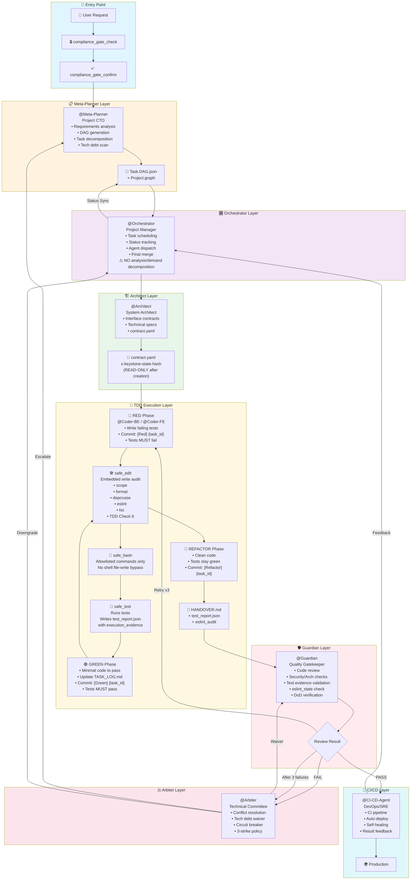
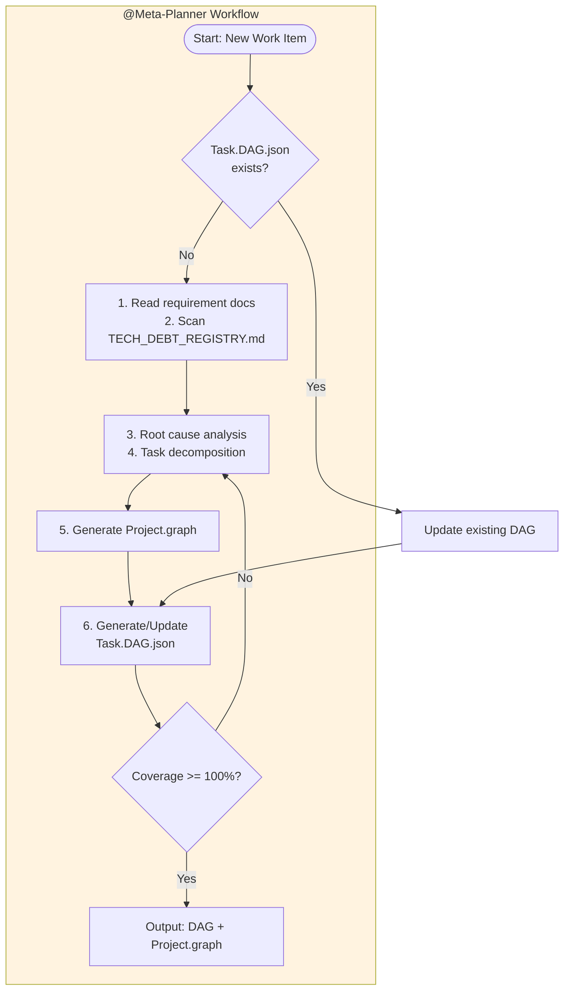
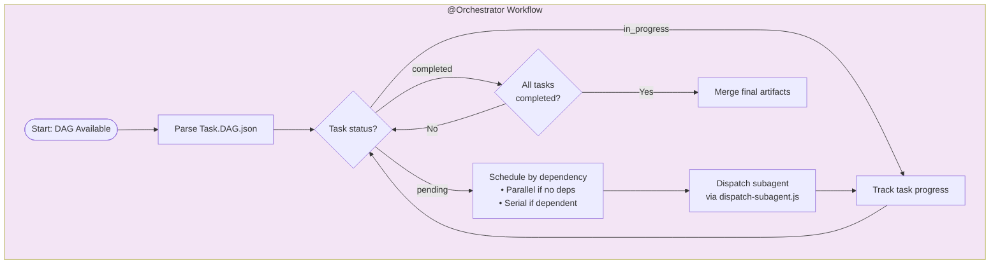
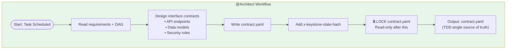
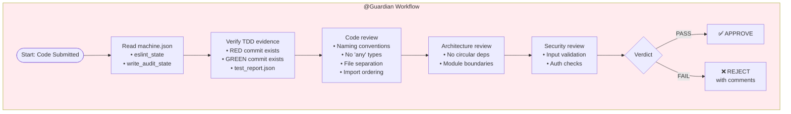
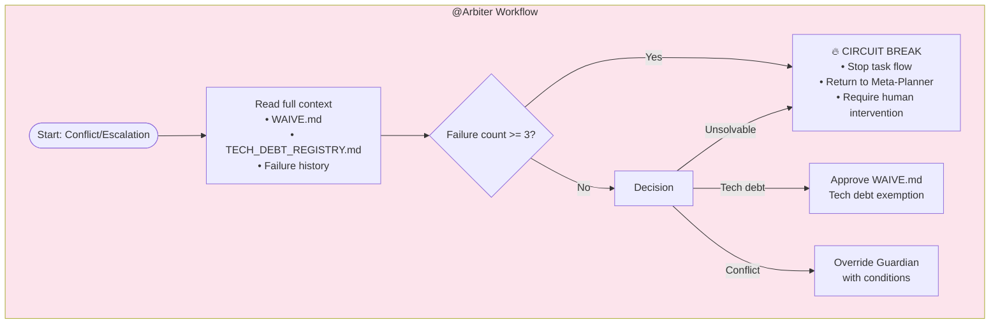
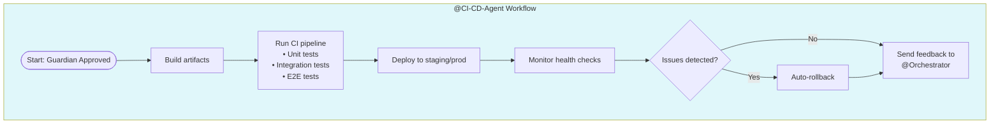
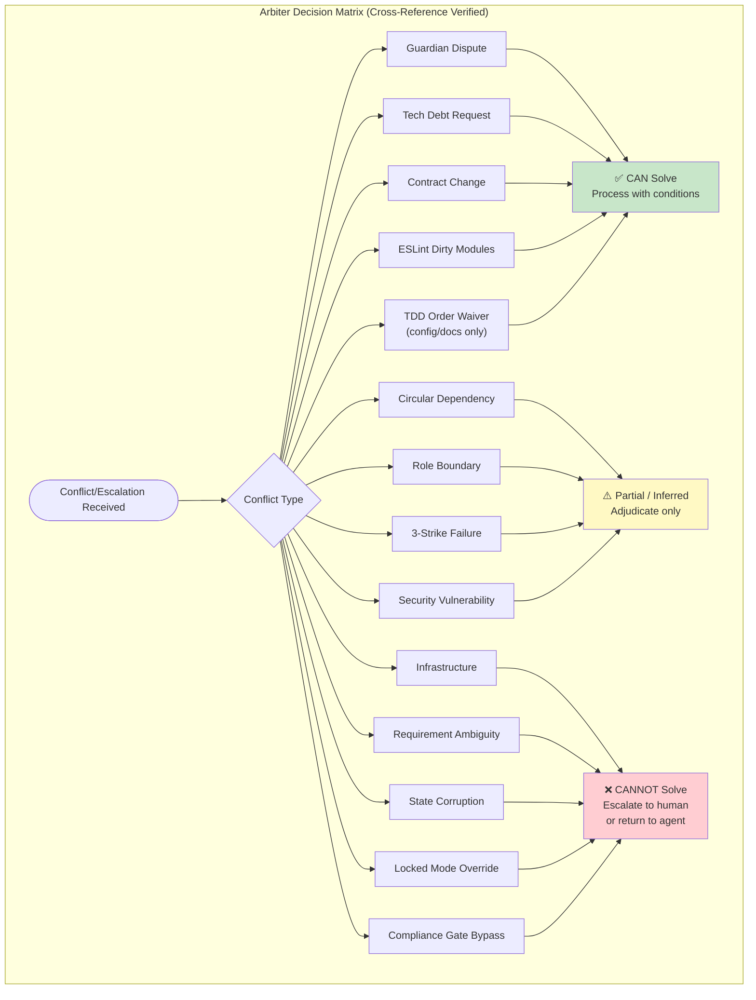

# OpenCode Framework Workflow Diagrams

## Overview

This document provides comprehensive visual workflow diagrams for the OpenCode multi-agent framework, including agent behaviors, permission matrices, enforcement gates, safe-tool paths, and chicken-and-egg scenario mappings.

**Hardening Evaluation Update (2026-05-27)**: The workflow reflects the HARDEN-CONSTRAINT-DESIGN re-evaluation findings: writes should flow through `safe_edit` with 6 checks, shell execution should flow through allowlisted `safe_bash`, test evidence should flow through `safe_test`, and plugin hooks remain supplemental until hook propagation and identity handling are empirically verified.

---

## 1. Main Workflow Diagram



### Main Workflow Legend

| Symbol | Meaning |
|--------|---------|
| 🔒 | Compliance Gate (P0 mandatory) |
| ⚠️ | Orchestrator restriction marker |
| 📄 | Artifact file |
| 🔐 | Read-only locked artifact |
| 🔄 | TDD cycle iteration |
| 🛠️ | Safe write path |
| 🧰 | Safe shell path |
| 🧪 | Test evidence path |

---

## 2. Detailed Agent Behavior Sections

### 2.1 @Meta-Planner



**Permissions:**
- ✅ Can: Read all requirement documents, generate DAG, update Project.graph, scan tech debt
- ❌ Cannot: Write business code, modify contract.yaml, execute tests, deploy

**Chicken-and-Egg Markers:**
- 🐣 CEE-1: Meta-Planner needs Orchestrator to schedule, but Orchestrator needs Meta-Planner's DAG
- 🐣 CEE-2: Tech debt scan depends on completed tasks, but tasks need Meta-Planner to exist

#### CEE-1 Detailed Explanation

**The Paradox:** Orchestrator's first action for any work item is to check `Task.DAG.json` (`orchestrator.md:44-45`). If no DAG exists, it must dispatch @Meta-Planner. But Meta-Planner is a sub-agent that cannot self-launch — it requires someone to call `dispatch-subagent.js Meta-Planner "..."`. So: Orchestrator can't schedule without a DAG, and Meta-Planner can't generate a DAG without being scheduled.

**Why It Looks Circular:**
```
Orchestrator: "I need a DAG to dispatch anyone."
              → (no DAG exists)
              "I must dispatch Meta-Planner."
              → (but dispatching IS scheduling)
              "I'm scheduling Meta-Planner... without a DAG."
              → (contradiction with own rule)
```

**Resolution — Bootstrap Exception:** The framework resolves this with an explicit **pre-DAG bootstrap escape hatch** documented in three places:

1. **AGENTS.md §P0 全域入口规则** (line 20-21): Declares Meta-Planner as the universal entry point for all work items, creating a declarative override of the Orchestrator's DAG-first rule.
2. **Orchestrator's P0 Initial Triage** (`orchestrator.md:43-48`): Hardcodes a bypass — when no DAG exists, Orchestrator dispatches Meta-Planner via `dispatch-subagent.js` as a bootstrap action, not a DAG-driven schedule.
3. **dispatch-subagent.js** (lines 51-52): Sets `FRAMEWORK_TASK_ID = ""` (empty, no task yet) and `FRAMEWORK_DISPATCH_CONTEXT = "orchestrated"`, signaling the pre-execution gate that this is a framework-internal bootstrap, not regular task execution. The subagent-preamble.md (line 37) recognizes this and skips user confirmation.

**Actual Bootstrap Sequence:**
```
User: "Build feature X"
  → Orchestrator: checks Task.DAG.json → NOT FOUND
  → Orchestrator: runs dispatch-subagent.js Meta-Planner "Build feature X"
  → Meta-Planner: executes P0 sequence → generates Task.DAG.json
  → Orchestrator: re-reads Task.DAG.json → FOUND → normal scheduling resumes
```

**Classification:** Designed feature (bootstrap exception), not a true deadlock. Analogous to an OS bootloader — the kernel can't load itself, so a minimal pre-kernel program exists solely to load it.

---

#### CEE-2 Detailed Explanation

**The Paradox:** Meta-Planner has a mandatory pre-audit obligation (`meta-planner.md:88`): scan `TECH_DEBT_REGISTRY.md`, filter items with status `OPEN` and repayment deadline ≤ 7 days away, and generate repayment tasks in the DAG. But tech debt items are **created by task execution** — specifically when @Arbiter approves a `WAIVE.md` (AGENTS.md §Protocol 10, line 137). So the registry only gets populated after tasks complete, but Meta-Planner must scan it before generating tasks.

**Two Dimensions:**

- **Dimension A — Cold Start:** On a new project, `TECH_DEBT_REGISTRY.md` is empty. The scan finds nothing. The debt items that will eventually exist are created during execution — the registry only populates after @Arbiter approves waivers.
- **Dimension B — Feedback Loop:** When @Arbiter approves a WAIVE.md, an entry is registered. But that entry is only picked up when Meta-Planner next runs a DAG generation cycle. If no new work item arrives, the debt sits in the registry with no one to convert it into a repayment task — even as its deadline approaches.

**Concrete Evidence:** The actual `TECH_DEBT_REGISTRY.md` shows this cycle:
- TECH-001 (status: **repaid**): Was converted to task T-TECHDEBT-001 and completed.
- TECH-002 (status: **approved**, deadline 2026-06-30): Still waiting — no task generated yet. Will only trigger when a DAG cycle runs within 7 days of the deadline.

**Resolution — Event-Driven Scanning:** Meta-Planner scans `TECH_DEBT_REGISTRY.md` **every time** it generates or updates a DAG (`meta-planner.md:88`, AGENTS.md:156). If the project is actively developed, the scan runs frequently enough to catch approaching deadlines. Due items get P0 priority (`meta-planner.md:99`), forcing Orchestrator to schedule them first.

**What Remains Unresolved:** No proactive timer/cron triggers Meta-Planner when deadlines approach. On a dormant project, deadlines can pass silently. A robust fix would require a pre-commit hook check against `TECH_DEBT_REGISTRY.md` deadlines or an external scheduler.

**Classification:** Temporal coupling weakness (eventually correct under active development), not a hard deadlock.

---

### 2.2 @Orchestrator



**Permissions:**
- ✅ Can: Read DAG, schedule tasks, dispatch agents, track status, merge outputs
- ❌ **CRITICAL**: Cannot analyze requirements, decompose tasks, modify DAG definitions, produce analysis docs

**Chicken-and-Egg Markers:**
- 🐣 CEE-3: Orchestrator needs Meta-Planner for DAG, but Meta-Planner needs system to exist
- 🐣 CEE-4: Orchestrator dispatches Coder, but Coder output needs Orchestrator to merge

#### CEE-3 Detailed Explanation

**The Paradox:** This is a variant of CEE-1 viewed from the opposite direction. Orchestrator cannot function without a DAG (its core responsibility is "parse Task.DAG.json and schedule" — `orchestrator.md:50`). Meta-Planner generates DAGs but cannot self-launch. The system itself must already be running for Meta-Planner to be dispatched. So the system needs Meta-Planner's output to operate, but needs to be operating to invoke Meta-Planner.

**Resolution — Standalone Dispatch Script:** The bootstrap mechanism `dispatch-subagent.js` is a **standalone Node.js script** that requires no DAG, no running framework, and no prior state to operate. It reads three files:
1. `.opencode/project.config.json` — project configuration
2. `.opencode/agents/<agent_type>.md` — agent skills and MCP tools
3. `.opencode/subagent-preamble.md` — P0 protocol template

It generates a wrapped prompt and outputs it to `.task_temp/_dispatch/<timestamp>.md` (lines 413-424). This script is the **cold-start mechanism**: the very first dispatch of Meta-Planner uses this script, not a pre-existing DAG. The script sets `FRAMEWORK_TASK_ID = ""` and `FRAMEWORK_DISPATCH_CONTEXT = "orchestrated"` (lines 51-52), signaling downstream gates that this is a bootstrap call.

**Classification:** Designed feature. The dispatch script acts as the framework's "genesis block" — it creates the first DAG from which all subsequent scheduling flows.

---

#### CEE-4 Detailed Explanation

**The Paradox:** Orchestrator dispatches @Coder-BE/@Coder-FE to produce implementation code. Coders output artifacts (code, tests, reports). Orchestrator's responsibility #4 is to "merge the final artifacts of each sub-agent" (`orchestrator.md:52-53`). But the Orchestrator can only merge what Coders have produced, and Coders can only know what to produce based on Orchestrator's dispatch instructions. If the Orchestrator's dispatch prompt is incomplete, the Coder's output will be incomplete, and the Orchestrator's merge will fail.

**Resolution — Standardized Handover Contract:** The framework defines a **fixed set of output artifacts** that every Coder must produce, regardless of the specific task:

| Artifact | Path | Purpose |
|----------|------|---------|
| HANDOVER.md | `.task_temp/{taskId}/HANDOVER.md` | Core changes, key assumptions, potential pitfalls, testing reminders |
| TASK_LOG.md | `.task_temp/{taskId}/TASK_LOG.md` | Working memory scratchpad (modification plan, new methods, return types) |
| test_report.json | `.task_temp/{taskId}/test_report.json` | Test execution report with `execution_evidence` field |

These are declared in both `coder-be.md:57-58` and `coder-fe.md:55-56`. The Orchestrator reads these standardized artifacts for merge — it does not need to understand the implementation details, only the structured handover. The HANDOVER.md is specifically designed to "lower information loss in serial handoff stages" (AGENTS.md §Protocol 11, line 138).

**Classification:** Operational protocol (standardized contract), not a deadlock. The fixed artifact schema decouples dispatch instructions from merge logic.

---

### 2.3 @Architect



**Permissions:**
- ✅ Can: Design architecture, write contract.yaml, define technical specs
- ❌ Cannot: Write implementation code, modify contracts after lock, execute tests

**Chicken-and-Egg Markers:**
- 🐣 CEE-5: contract.yaml locks after creation, but changes need Arbiter
- 🐣 CEE-6: Architects design depends on requirements, but requirements may need implementation feedback

#### CEE-5 Detailed Explanation

**The Paradox:** Architect creates `contract.yaml` and locks it as read-only (`architect.md:30-31`). After locking, any modification requires @Arbiter approval (`architect.md:37,60`). But Arbiter is explicitly prohibited from "over-reaching authority to modify architectural contracts" (`arbiter.md:35`). So: Architect can't change the contract without Arbiter, and Arbiter can't write the contract itself. If the contract is wrong, who fixes it?

**Resolution — Dual-Key Modification Protocol:** The contract uses a **dual-key** system:
1. **Architect retains write permission** but cannot exercise it unilaterally after lock (`architect.md:37`: "updates require @Arbiter approval. Initial creation and approved updates are permitted").
2. **Arbiter approves or rejects** change requests but does not write the contract. Arbiter reviews the proposed change against the full conflict context (review opinions, developer rebuttal — `arbiter.md:37-40`).
3. **The modification flow**: Architect proposes change → Arbiter reviews and approves via WAIVE.md or OVERRIDE.md → Architect applies the approved change → New `x-keystone-state-hash` computed → Updated `machine.json` included in same commit.

This is analogous to a two-person rule for a safe: one person has the key (Architect — write access), the other has the combination (Arbiter — approval authority). Neither can open it alone.

**Classification:** Designed feature (dual-key governance). Not a deadlock — the protocol is sequential, not circular.

---

#### CEE-6 Detailed Explanation

**The Paradox:** Architect's input contract is `Project.graph` from Meta-Planner + requirement context (`architect.md:41-44`). Architect designs interfaces based on these requirements. But during implementation, Coders may discover that the requirements are ambiguous, incomplete, or technically infeasible — feedback that should flow back to the requirements and potentially change the contract. However, the contract is locked after creation, and the flow is strictly unidirectional.

**Resolution — Retry-Time Feedback Loop:** The initial design flow is strictly unidirectional: user requirements → Meta-Planner produces `Project.graph` → Architect produces `contract.yaml` → locked. Implementation feedback is handled by the **Circuit-Breaker Retry Policy** (`orchestrator.md:113-146`):

| Failure Count | Action |
|---------------|--------|
| 1-2 | Original Agent retries or Meta-Planner decomposes finer tasks |
| 3 | Arbiter circuit-break + **Expert Switch**: @Architect re-examines the relevant section of `contract.yaml` |
| 4 | Arbiter second circuit-break + human standby with full failure context |

At failure count 3, the Orchestrator calls @Architect to re-examine the contract (`orchestrator.md:125`). This creates a feedback loop at **retry time**, not at initial design time — preserving the contract-first principle while allowing corrections when implementation reveals design flaws.

**Classification:** Operational friction (managed via circuit-breaker). The unidirectional initial flow prevents analysis paralysis; the retry feedback loop catches design errors after they manifest.

---

### 2.4 @Coder-BE / @Coder-FE

```mermaid
flowchart TB
    subgraph CD["@Coder-BE / @Coder-FE Workflow"]
        CD_START(["Start: Contract Ready"])
        READ_CONTRACT["Read contract.yaml"]
        RED["🔴 RED Phase<br/>• Write failing tests via safe_edit<br/>• Commit: [Red] {task_id}<br/>• Execute: tests FAIL"]
        TASK_LOG["Update TASK_LOG.md<br/>(Work memory scratchpad)"]
        GREEN["🟢 GREEN Phase<br/>• Minimal implementation via safe_edit<br/>• Tests PASS via safe_test<br/>• Commit: [Green] {task_id}"]
        REFACTOR["🔵 REFACTOR Phase<br/>• Clean code via safe_edit<br/>• Tests still PASS<br/>• Commit: [Refactor] {task_id}"]
        AUDIT["safe_edit audit<br/>+ safe_bash allowlist<br/>+ safe_test evidence"]
        HANDOVER["Write HANDOVER.md<br/>+ test_report.json"]
        COMPLETE["compliance_gate_complete"]
    end

    CD_START --> READ_CONTRACT
    READ_CONTRACT --> RED
    RED --> TASK_LOG
    TASK_LOG --> GREEN
    GREEN --> REFACTOR
    REFACTOR --> AUDIT
    AUDIT --> HANDOVER
    HANDOVER --> COMPLETE

    style CD fill:#fff8e1
```



**Permissions:**
- ✅ Can: Write implementation code and tests through `safe_edit`, run approved local commands through `safe_bash`, generate test evidence through `safe_test`, update TASK_LOG.md
- ❌ Cannot: Modify contract.yaml, skip TDD phases, commit without tests, bypass Guardian, write files through raw shell redirection

**Chicken-and-Egg Markers:**
- 🐣 CEE-7: Coder needs contract.yaml, but contract needs Architect who needs requirements
- 🐣 CEE-8: Tests need implementation to test, but TDD says tests first
- 🐣 CEE-9: TASK_LOG.md tracks work, but tracking needs work to exist

#### CEE-7 Detailed Explanation

**The Paradox:** Coders declare `contract.yaml` as their input contract (`coder-be.md:48-49`, `coder-fe.md:46-47`: "contract.yaml — output from @Architect, read-only"). Architect's input contract is `Project.graph` from Meta-Planner (`architect.md:41-44`). Meta-Planner's input is natural-language user requirements (`meta-planner.md:38-39`). This creates a dependency chain: Coder → contract.yaml → Architect → Project.graph → Meta-Planner → requirements. If any link in the chain is missing or incomplete, the Coder cannot start. But requirements are often refined by implementation discoveries, creating a feedback need that the chain doesn't natively support.

**Resolution — Strict Pipeline with Retry Feedback:** The AGENTS.md standard execution flow (lines 153-165) enforces a **strict topological ordering**:
```
Step 0: Check DAG existence
Step 1: Meta-Planner → Project.graph + Task.DAG.json
Step 2: Architect → contract.yaml (locked, TDD single source of truth)
Step 3: TDD-RED → Coder writes failing tests against contract
Step 4: TDD-GREEN → Coder writes minimal implementation
```

Each agent's input contract is the previous agent's output artifact. The chain is unidirectional at creation time. If the contract proves inadequate during TDD (e.g., tests reveal missing endpoints or incorrect data types), the Circuit-Breaker's "Expert Switch" (`orchestrator.md:125`) calls @Architect to re-examine the contract at failure count 3. This preserves the pipeline's integrity while providing a correction mechanism.

**Classification:** Designed feature (strict pipeline). The dependency chain is intentional — it prevents Coders from working against ambiguous or evolving specifications.

---

#### CEE-8 Detailed Explanation

**The Paradox:** TDD mandates "tests first" (AGENTS.md §TDD 强制铁律, line 93: "测试绝对先行：无测试用例，禁止编写任何业务代码"). But tests are designed to verify implementation behavior. How can you write a test for code that doesn't exist yet? The test needs to import modules, call functions, and assert return values — all of which require the implementation to be present.

**Resolution — Contract-Driven RED Phase:** The Orchestrator enforces TDD by splitting each coding task into at least 2 serial sub-tasks (`orchestrator.md:72-84`):

**Sub-task A (RED phase):**
> "Write only failing test cases; do not write any business implementation code."
> Commit tagged `[Red] {task_id}`. Output: `red_report.json` with `exit_code ≠ 0`.

**Sub-task B (GREEN phase):**
> "Based on the tests from sub-task A, write the minimal implementation code to make all tests pass."
> Commit tagged `[Green] {task_id}`. Output: `green_report.json` with `exit_code = 0`, coverage ≥ 70%.

The key insight: RED-phase tests are written **against the contract** (`contract.yaml`), not against existing implementation. The Coder creates stub modules (empty functions, placeholder classes) that the tests can import, then writes assertions based on the contract's specified behavior. The tests fail because the stubs return placeholder values, not because the modules are missing. The GREEN phase then replaces stubs with real implementations that satisfy the assertions.

The pre-commit hook (Layer 2.5, lines 123-140) enforces this by blocking commits where implementation files are staged without test files and no `[Red]/[Green]/[Refactor]` tag is present.

**Classification:** Designed feature (TDD methodology). The paradox is resolved by the contract serving as the test specification — tests verify contract compliance, not implementation details.

---

#### CEE-9 Detailed Explanation

**The Paradox:** `TASK_LOG.md` is described as a "working memory scratchpad" that must be updated **before** writing code (AGENTS.md §Protocol 8, line 135; `coder-be.md:109-111`). But a log typically records what has been done, not what will be done. If the log tracks work, how can it be written before the work exists?

**Resolution — Forward-Looking Plan, Not Retrospective Record:** TASK_LOG.md is explicitly a **planning artifact**, not a retrospective log. The requirement states it must contain:
> "修改计划、新增方法、返回类型等关键信息" (modification plan, new methods, return types — AGENTS.md line 135)

The purpose is to **prevent context drift during long serial output** — when an LLM agent generates code over many turns, it can lose track of its original plan. By writing the plan first (what methods will be added, what return types, what files will change), the agent has a stable reference to consult mid-implementation.

**Lifecycle:**
1. **Before coding**: Write planned changes to TASK_LOG.md (forward-looking)
2. **During coding**: Consult TASK_LOG.md to stay on track
3. **After coding**: TASK_LOG.md naturally becomes a record of what was planned (and implicitly, what was done)

The file is stored at `.task_temp/{taskId}/TASK_LOG.md` and is not committed to Git (`.gitignore`), so it serves purely as an in-session working memory.

**Classification:** Semantic misunderstanding (naming vs. purpose). The "log" in TASK_LOG.md refers to a working journal, not a retrospective record. The paradox dissolves once you understand it as a planning tool.

---

### 2.5 @Guardian



**Permissions:**
- ✅ Can: Read all code, read machine.json, approve/reject, request changes
- ❌ Cannot: Write code, modify tests, bypass Arbiter on conflicts

**Chicken-and-Egg Markers:**
- 🐣 CEE-10: Guardian needs code to review, but code needs Guardian approval
- 🐣 CEE-11: machine.json needs Guardian verification, but Guardian reads machine.json

#### CEE-10 Detailed Explanation

**The Paradox:** Guardian's input contract requires "code change diff" and "test_report.json" (`guardian.md:40-43`). But code cannot be merged until Guardian approves it. So Coders must produce code for Guardian to review, but the code they produce isn't "finished" until Guardian says so. If Guardian rejects, the code goes back to Coder, who produces new code, which Guardian must review again — creating a potential infinite loop.

**Resolution — Two-Stage Gate Model:** The framework uses two distinct gates at different stages:

**Stage 1 — Write-Time Audit (during coding):**
Every file write triggers `run_write_check` in `code-quality-gate.js` (or its successor `code-quality-lib.js`). This runs 6 checks: scope, format, deps, eslint, tsc, TDD order. It acts as the **gate that permits code to exist** — if a write fails scope check, the Coder must revert immediately (`subagent-preamble.md:88-102`).

**Stage 2 — Post-Write Review (after coding):**
Guardian reads the completed diff, `contract.yaml`, `test_report.json`, and `machine.json` state. Guardian's review is a **second-layer gate that permits code to be merged** — it checks code quality, architecture, security, and test evidence (DoD).

The two stages are sequential, not circular: Stage 1 runs during every file write; Stage 2 runs once after all writes are complete and `compliance_gate_complete` has been called. The Coder produces code that passes Stage 1; Guardian then reviews it through Stage 2. If Stage 2 rejects, the code goes back to Stage 1 for fixes — but this is a retry loop, not a deadlock, because the 3-strike circuit breaker (`orchestrator.md:145`) terminates the cycle after 3 consecutive failures.

**Classification:** Designed feature (two-stage gate). Write-time audit and post-write review are distinct concerns operating at distinct times.

---

#### CEE-11 Detailed Explanation

**The Paradox:** Guardian's Layer A auto-gate reads `machine.json` to verify ESLint state, type-check state, dependency state, and TDD enforcement state (`guardian.md:61-72`). But `machine.json` is itself updated by the Write-Time Audit (`code-quality-gate.js` → `updateStates` function, lines 396-504). So Guardian verifies state that was written by the same process that produced the code Guardian is reviewing. If the audit process is buggy or compromised, Guardian would be verifying corrupted state.

**Resolution — Temporal Ordering with Separate Actors:** The cycle is broken by **who writes** vs. **who reads** `machine.json`:

1. **Coder writes files** → `run_write_check` (in `code-quality-gate.js`/`code-quality-lib.js`) updates `machine.json` with audit results (`updateStates` function: ESLint state, type-check state, dependency state, TDD violations, write-audit history).
2. **Guardian reads `machine.json`** as a **consumer** of already-written state. Guardian does not write to `machine.json` — it only reads the state that the Coder's write-time audit produced.

The temporal ordering is:
```
Coder writes file → run_write_check updates machine.json → Guardian reads machine.json
```

Guardian trusts `machine.json` because:
- The state updates are performed by framework-level scripts (`code-quality-gate.js`, `code-quality-lib.js`), not by the Coder agent directly.
- The pre-commit hook (Layer 2, `keystone-validate.js`) independently verifies contract hashes and state integrity at commit time.
- The `framework-enforcer.ts` plugin monitors `machine.json` for tampering via `file.edited` hooks.

**Classification:** Designed feature (temporal separation). The "who writes" (framework audit scripts during coding) vs. "who reads" (Guardian during review) separation prevents circular verification.

---

### 2.6 @Arbiter



**Permissions:**
- ✅ Can: Read all docs, approve waivers, override Guardian, circuit break
- ❌ Cannot: Write code, modify contracts directly, bypass compliance gates

**Chicken-and-Egg Markers:**
- 🐣 CEE-13: Arbiter needs conflict history, but history needs Arbiter to resolve

#### CEE-13 Detailed Explanation

**The Paradox:** Arbiter's input contract requires "conflict context (review opinions, developer rebuttal)" and "failure logs, violation items" (`arbiter.md:37-40`). But this conflict history is accumulated *by the process that Arbiter governs*. Guardian produces review reports, Coders produce code diffs and test reports, Orchestrator tracks failure counts. Arbiter needs this accumulated history to make a decision, but the history only exists because these agents were operating under Arbiter's governance framework. If no Arbiter has ever ruled, there is no precedent to guide the first ruling.

**Resolution — Orchestrator Accumulates, Arbiter Reads:** The conflict history is **not maintained by Arbiter** but by two independent accumulators:

1. **Orchestrator's Failure Counter** (`orchestrator.md:140-146`, Retry Decision Matrix):
   - Failure 1: Log failure reason to TASK_LOG.md
   - Failure 2: Degraded retry via Meta-Planner, update DAG granularity
   - Failure 3: Trigger Arbiter circuit-break, attach full context

2. **TASK_LOG.md** (per-task working memory): Records failure reasons, retry attempts, and accumulated context across all retries.

When the failure count reaches 3 (AGENTS.md §Protocol 7, line 134: "连续3次未通过审查/测试，自动触发@Arbiter介入"), Orchestrator triggers Arbiter with the **accumulated context package**:
- @Guardian review report (all violations)
- @Coder code diff
- @Coder test report (including `execution_evidence`)
- HANDOVER.md handover summary
- Failure reason chain from TASK_LOG.md

Arbiter does not need its own prior history to make the first decision — it reads the **externally accumulated** context. For subsequent decisions, Arbiter's rulings are recorded in WAIVE.md and TECH_DEBT_REGISTRY.md, creating precedent for future reference.

**Classification:** Designed feature (external accumulator). The separation between "who accumulates history" (Orchestrator + TASK_LOG.md) and "who reads history" (Arbiter) prevents the bootstrap paradox. Arbiter's first decision requires no prior Arbiter history — only the accumulated failure context from the execution pipeline.

---

### 2.7 @CI-CD-Agent



**Permissions:**
- ✅ Can: Execute CI/CD pipelines, deploy, monitor, rollback, send feedback
- ❌ Cannot: Modify code, approve changes, bypass Guardian

**Chicken-and-Egg Markers:**
- 🐣 CEE-12: CI-CD-Agent needs approved code, but approval needs CI to pass

#### CEE-12 Detailed Explanation

**The Paradox:** CI-CD-Agent deploys code to staging/production (`ci-cd-agent.md:42`). Guardian approves code for merge (`guardian.md:34`). In many real-world CI/CD workflows, CI must pass before code can be approved (tests validate quality). But in this framework, Guardian must approve before CI-CD-Agent deploys. If Guardian needs CI results to approve, and CI needs Guardian approval to run, neither can start.

**Resolution — Sequential Pipeline with No CI-in-Approval Dependency:** The framework explicitly orders these as **sequential, non-dependent steps**:

1. **Guardian approves first** — based on code review, architecture, security, and test evidence from `test_report.json` (which Coders produce during the TDD cycle, not during CI). Guardian's Layer A checks `machine.json` state (ESLint, type-check, deps, TDD enforcement); Layer B checks `test_report.json` evidence. Neither layer requires CI pipeline results.
2. **Git Hook validates** — pre-commit hook (Layer 0: gate armed, Layer 2: keystone hash) runs at commit time, before CI.
3. **Code merges** — after Guardian approval and hook validation.
4. **CI-CD-Agent deploys** — on already-merged code. CI-CD-Agent's input contract explicitly requires "Code merge results" (`ci-cd-agent.md:54-58`), meaning CI/CD only triggers *after* Guardian approval and Git merge.

The AGENTS.md execution flow (lines 159-165) confirms:
```
Step 3-4: TDD RED/GREEN (Coder produces test_report.json)
Step 5: Handover (HANDOVER.md + test_report.json)
Step 6: compliance_gate_complete
Step 7: Guardian review (uses test_report.json, NOT CI results)
Step 8: Git Hook validation
Step 9: CI-CD-Agent deployment
```

CI participates in post-deployment validation (monitoring, health checks, auto-rollback — `ci-cd-agent.md:43-45`), but **not** in the approval decision. The test evidence that Guardian relies on comes from the Coder's TDD cycle (`safe_test` → `test_report.json`), not from the CI pipeline.

**Classification:** Designed feature (sequential pipeline). The apparent paradox assumes CI and approval are mutually dependent; the framework breaks this by making CI a post-approval concern and using TDD-cycle test evidence for approval instead.

---

## 3. Chicken-and-Egg Scenario Overlay

The following scenarios are marked on the main workflow diagram above with 🐣 markers. Here is the detailed mapping:

| ID | Scenario | Location on Workflow | Agents Involved | Type | Resolution Summary |
|----|----------|---------------------|-----------------|------|--------------------|
| CEE-1 | Meta-Planner needs Orchestrator to exist, Orchestrator needs Meta-Planner's DAG | Between Entry and Meta-Planner Layer | Meta-Planner ↔ Orchestrator | Designed Feature | Bootstrap exception: Orchestrator dispatches Meta-Planner without DAG as pre-DAG bootstrap action |
| CEE-2 | Tech debt scan needs completed tasks, tasks need Meta-Planner | Meta-Planner Layer | Meta-Planner | Temporal Coupling | Event-driven scanning on each DAG cycle; dormant projects may miss deadlines |
| CEE-3 | Orchestrator needs Meta-Planner for DAG, Meta-Planner needs system | Between Meta-Planner and Orchestrator | Orchestrator ↔ Meta-Planner | Designed Feature | `dispatch-subagent.js` is standalone cold-start mechanism requiring no DAG |
| CEE-4 | Orchestrator dispatches Coder, Coder output needs Orchestrator to merge | TDD Layer ↔ Orchestrator Layer | Orchestrator ↔ Coder | Operational Protocol | Fixed artifact schema (HANDOVER.md, TASK_LOG.md, test_report.json) decouples dispatch from merge |
| CEE-5 | contract.yaml locks after creation, changes need Arbiter | Architect Layer | Architect ↔ Arbiter | Designed Feature | Dual-key governance: Architect writes, Arbiter approves; neither acts alone |
| CEE-6 | Architect design depends on requirements, requirements may need implementation | Architect Layer | Architect ↔ Meta-Planner | Operational Friction | Unidirectional initial flow; feedback via circuit-breaker Expert Switch at failure count 3 |
| CEE-7 | Coder needs contract.yaml, contract needs Architect who needs requirements | Architect → TDD Layer | Coder ↔ Architect | Designed Feature | Strict topological pipeline: Requirements → Meta-Planner → Architect → Coder |
| CEE-8 | Tests need implementation to test, but TDD says tests first | TDD Layer (RED Phase) | Coder | Designed Feature | RED tests written against contract (not implementation) using stub modules |
| CEE-9 | TASK_LOG.md tracks work, but tracking needs work to exist | TDD Layer (GREEN Phase) | Coder | Semantic | Forward-looking planning artifact to prevent context drift, not retrospective log |
| CEE-10 | Guardian needs code to review, but code needs Guardian approval | TDD → Guardian Layer | Guardian ↔ Coder | Designed Feature | Two-stage gate: write-time audit (during coding) + post-write review (after coding) |
| CEE-11 | machine.json needs Guardian verification, but Guardian reads machine.json | Guardian Layer | Guardian | Designed Feature | Temporal separation: framework scripts write machine.json during coding, Guardian reads during review |
| CEE-12 | CI-CD-Agent needs approved code, but approval needs CI to pass | Guardian → CI Layer | CI-CD-Agent ↔ Guardian | Designed Feature | Guardian uses TDD-cycle test evidence (not CI results); CI is post-approval |
| CEE-13 | Arbiter needs conflict history, but history needs Arbiter to resolve | Arbiter Layer | Arbiter | Designed Feature | Orchestrator accumulates failure context; Arbiter reads external accumulator |
| CEE-14 | TDD RED needs contract, but contract may need TDD feedback | Architect → TDD Layer | Architect ↔ Coder | Designed Feature | Contract is single source of truth; Expert Switch at failure count 3 re-examines contract |
| CEE-15 | compliance_gate_check needs task description, but task needs gate to start | Entry Point | All | Designed Feature | Gate creates session (not requires one); task description is metadata, not prerequisite |
| CEE-16 | Orchestrator schedules Guardian, but Guardian needs to verify scheduling | Orchestrator ↔ Guardian | Orchestrator ↔ Guardian | Non-Issue | Guardian verifies code quality, not scheduling decisions; concerns are separated |
| CEE-17 | CI-CD feedback to Orchestrator, but Orchestrator may have moved on | CI → Orchestrator | CI-CD-Agent ↔ Orchestrator | Operational Protocol | Feedback persisted in deployment_status.json + incident_report.md; read on demand |
| CEE-18 | Meta-Planner scans tech debt, but tech debt needs Arbiter to waive | Meta-Planner ↔ Arbiter | Meta-Planner ↔ Arbiter | Designed Feature | TECH_DEBT_REGISTRY.md as asynchronous ledger: Arbiter writes, Meta-Planner reads |
| CEE-19 | Coder writes tests, but tests need Guardian to verify they're not bogus | TDD → Guardian | Coder ↔ Guardian | Designed Feature | Guardian Layer B: bogus test detection (empty assertions, excessive mocking via ESLint rules) |
| CEE-20 | Keystone hash validates contract, but contract changes need new hash | Architect Layer | Architect | Designed Feature | Hash strips own header before computing; Architect atomically updates hash + machine.json |
| CEE-21 | Pre-commit hook checks gate state, but gate state needs commits to exist | Entry → TDD | All | Designed Feature | Gate armed before code changes (Steps 5+7); hook checks armed session, not completed commit |
| CEE-22 | Context7 query needs skill loading, but skill loading needs Context7 | Entry | All | Non-Issue | context7-first is a static skill file read from disk; Context7 called as first action after loading |
| CEE-23 | Write-audit needs file changes, but changes need write-audit to track | TDD Layer | Coder | Designed Feature | Sequential: write first (safe-edit.ts), audit immediately after (run_write_check) |
| CEE-24 | `safe_edit` needs audit logic, but `code-quality-gate.js` is an MCP server | TDD Layer | Coder ↔ Tooling | Designed Feature | Shared `code-quality-lib.js` pure-function library imported by both MCP server and safe_edit |
| CEE-25 | Native edit is denied, but shell can still write files | TDD Layer | Coder | Designed Feature | `safe_bash` allowlist (npm run, npx jest, etc.) blocks arbitrary shell file writes |
| CEE-26 | TDD Check 6 enforces spec-before-source, but RED tests intentionally fail | TDD Layer | Coder | Designed Feature | RED-phase exemption in runEslintAudit when business code doesn't exist yet; test files always allowed |
| CEE-27 | Concurrent rollback can restore the wrong content | TDD Layer | Coder ↔ Tooling | Designed Feature | realpathSync at entry + unique backup paths (ts+pid+agent+task) + mkdir mutex locking |
| CEE-28 | Plugin gate needs agent identity, but hook context may omit task metadata | Guardian/Plugin Layer | Guardian ↔ Coder | Operational Friction | dispatch-subagent.js sets FRAMEWORK_AGENT/TASK_ID env vars; framework-enforcer.ts reads them |
| CEE-29 | Write compliance passes, but delivery evidence is still missing | TDD → Guardian | Coder ↔ Guardian | Designed Feature | Layer A (write audit) and Layer B (test evidence) are independent gates; Guardian validates DoD |

### Detailed Resolution Explanations

Each CEE scenario has a full explanation with code evidence in the agent-specific sections above (Sections 2.1–2.7). The following provides supplementary detail for scenarios CEE-14 through CEE-29 that span multiple agents.

**CEE-14** — Contract is the "TDD唯一依据" (sole TDD basis, AGENTS.md:157). RED-phase tests reference contract-defined interfaces. If TDD reveals contract gaps, the Orchestrator's Expert Switch (`orchestrator.md:125`) calls @Architect to re-examine at failure count 3. No bidirectional feedback loop exists at design time — corrections happen at retry time.

**CEE-15** — `compliance_gate_check` (`compliance-gate.js:566`) creates a new session with `gate_status: "checked"`. The `taskDescription` parameter is stored as metadata but does not gate execution. The actual blocking is at `compliance_gate_confirm` (Step 7) which arms the gate. In orchestrated mode (`FRAMEWORK_DISPATCH_CONTEXT=orchestrated`), user confirmation is skipped (`subagent-preamble.md:37`).

**CEE-16** — Guardian's verification scope (`guardian.md:31,55-80`) is explicitly limited to: code quality, security, architectural constraints, test evidence (DoD), ESLint state, type-check state, dependency state, and TDD enforcement. It never verifies the Orchestrator's scheduling decisions — only the output quality of the agents the Orchestrator scheduled.

**CEE-17** — CI-CD-Agent outputs `deployment_status.json` and `incident_report.md` (`ci-cd-agent.md:45,62-64`) as persistent artifacts. Orchestrator reads these on demand via its circuit-breaker retry policy (`orchestrator.md:113-146`) — it does not need to be "waiting" for feedback.

**CEE-18** — `TECH_DEBT_REGISTRY.md` serves as an asynchronous ledger. Arbiter approves waivers and appends entries (`arbiter.md:47-57`). Meta-Planner reads the registry during DAG generation (`meta-planner.md:88-102`) and converts OPEN items with near-term repayment dates into P0 tasks. No synchronous coordination required.

**CEE-19** — Guardian's Layer B (`guardian.md:55-59`) explicitly checks: `execution_evidence` exists, `output_summary` contains real test output (not placeholders), coverage ≥ 70%, no bogus tests (empty assertions, getter-only tests, excessive mocking). ESLint rules `no-empty-assertions` and `no-any-in-spec` provide automated bogus-test detection.

**CEE-20** — `keystone-validate.js:126-144` computes hash by stripping the `x-keystone-state-hash` header line before hashing remaining content (`lines.slice(1)`). Architect's pre-commit workflow computes fresh hash and atomically includes updated `machine.json` in same commit (`architect.md:55-58`). Hash is never self-referential.

**CEE-21** — Pre-commit hook Layer 0 (`hooks/pre-commit:64-80`) checks for *armed* gate sessions (`active_sessions.length > 0`), not completed commits. Gate is armed during planning phase (Steps 5+7 of subagent-preamble.md), before any file changes. `gate-state.json` tracks sessions independently of git history.

**CEE-22** — `context7-first/SKILL.md` is a static Markdown file read from disk — it does not need Context7 to load. Once loaded, the skill instructs the agent to call Context7 as its first action (`SKILL.md:18-22`). `subagent-preamble.md:23-29` loads skills first (Step 3), then calls Context7 (Step 4). Sequential, not circular.

**CEE-23** — `subagent-preamble.md:84-104` (Step 8b) specifies: after EACH successful Write/Edit → call `run_write_check`. `safe-edit.ts:188-400` performs atomic write, then audit runs as post-condition. `write_audit_log.json` is appended after each successful write. The audit is sequential (write → audit), not circular.

**CEE-24** — `code-quality-gate.js:28-34` imports `code-quality-lib.js` as shared library. The lib (`code-quality-lib.js:3-10`) provides 10 pure check functions (`runScopeCheck`, `runPrettierCheck`, `runDepCruiserCheck`, `runEslintAudit`, `runTscCheck`, `runTddOrderCheck`, `runTddSpecCheck`, `safeBash`, `runAllChecks`, `runFullScan`) with no MCP dependency. Either can be imported independently.

**CEE-25** — `permission-isolation.ts:30-39` enforces `edit: deny` per agent. `code-quality-lib.js:941-947` defines `DEFAULT_ALLOWLIST`: only `npm run *`, `npx jest *`, `npx tsc *`, `npx eslint *`, `node * --help`. `safeBash()` (lines 967-996) checks commands against allowlist via `matchGlob`. Both protections must be bypassed simultaneously for shell-write bypass.

**CEE-26** — `code-quality-lib.js:353-368` (CI-EMBED-007): `runEslintAudit` has `opts.phase === "red"` exemption that passes when business code file doesn't exist yet. `runTddOrderCheck` (lines 576-584): test files are always allowed and recorded (`state.testWritten = true`); subsequent implementation files require prior test. RED-phase exemptions apply only to test files; source writes stay strict.

**CEE-27** — `safe-edit.ts:216-221` (Phase 0): `fs.realpathSync` resolves symlinks before any stat. Lines 153-165: backup paths use `${base}.${ts}.${pid}.${agent}.${task}.safe_backup` — unique per invocation. Lines 79-116: `mkdir`-based mutex locking with exponential backoff. Lines 244-246: atomic backup via `writeFileSync` + `renameSync`.

**CEE-28** — `dispatch-subagent.js:51,55` sets `FRAMEWORK_TASK_ID` and `FRAMEWORK_AGENT` env vars before dispatch. Line 92 propagates all env vars to child processes. `framework-enforcer.ts:532-533` reads these from `process.env`. Note: hook propagation and intermittent failure behavior (BUG #5894/#1706) remain unverified empirically — the plugin gate is supplemental until confirmed.

**CEE-29** — `safe-test.ts:205-215` validates `execution_evidence` field exists and is non-empty in `test_report.json`. `guardian.md:55-57` immediately returns FAIL if evidence is missing or placeholder. Layer A (write-time audit via machine.json) and Layer B (test execution evidence) are independent gates — passing Layer A does not imply Layer B completion.

---

## 4. Agent Permission Matrix

| Agent | Read DAG | Write DAG | Read Contract | Write Contract | Read Code | Native Edit | safe_edit | safe_bash | safe_test | Deploy | Approve Changes | Override Guardian |
|-------|----------|-----------|---------------|----------------|-----------|-------------|-----------|-----------|-----------|--------|-----------------|-------------------|
| @Meta-Planner | ✅ | ✅ | ✅ | ❌ | ✅ | Scoped | Scoped | Limited | ❌ | ❌ | ❌ | ❌ |
| @Orchestrator | ✅ | ❌ | ✅ | ❌ | ✅ | ❌ | ❌ | Limited | ❌ | ❌ | ❌ | ❌ |
| @Architect | ✅ | ❌ | ✅ | ✅ (before lock) | ✅ | Scoped | Scoped | Limited | ❌ | ❌ | ❌ | ❌ |
| @Coder-BE | ✅ | ❌ | ✅ (read-only) | ❌ | ✅ | ❌ | ✅ | ✅ | ✅ | ❌ | ❌ | ❌ |
| @Coder-FE | ✅ | ❌ | ✅ (read-only) | ❌ | ✅ | ❌ | ✅ | ✅ | ✅ | ❌ | ❌ | ❌ |
| @Guardian | ✅ | ❌ | ✅ | ❌ | ✅ | ❌ | ❌ | Limited | ✅ | ❌ | ✅ | ❌ |
| @Arbiter | ✅ | ❌ | ✅ | ❌ | ✅ | Scoped | Scoped | Limited | ❌ | ❌ | ✅ | ✅ |
| @CI-CD-Agent | ✅ | ❌ | ✅ | ❌ | ✅ | ❌ | ❌ | ✅ | ✅ | ✅ | ❌ | ❌ |

### Key Permission Rules

1. **@Orchestrator**: Strictly scheduling only. Cannot modify DAG, cannot analyze, cannot write code.
2. **contract.yaml**: Written once by @Architect, then read-only. Changes require @Arbiter waiver.
3. **TDD Authority**: Only @Coder-BE/@Coder-FE can write implementation code and tests, and those writes must flow through `safe_edit`.
4. **Shell Authority**: `safe_bash` is allowlist-based. File-content writes, redirects, copies, and moves are not a substitute for `safe_edit`.
5. **Evidence Authority**: `safe_test` is the preferred path for generating `test_report.json.execution_evidence`.
6. **Approval Authority**: Only @Guardian and @Arbiter can approve changes.
7. **Override Authority**: Only @Arbiter can override @Guardian decisions.
8. **Deploy Authority**: Only @CI-CD-Agent can deploy to production.

---

## 5. Enforcement Gate Locations

| Gate ID | Gate Name | Location in Workflow | Blocking Level | Related Scenarios | Description |
|---------|-----------|---------------------|----------------|-------------------|-------------|
| G1 | compliance_gate_check | Entry Point (before any work) | P0 - ABSOLUTE | CEE-15 | Mandatory pre-flight check. No gate armed = no work allowed. |
| G2 | compliance_gate_confirm | After plan presentation | P0 - ABSOLUTE | CEE-15 | User confirmation required before proceeding. |
| G3 | contract.yaml keystone hash | After Architect writes contract | P0 - STRICT | CEE-20 | Hash must match. Pre-commit hook enforces this. |
| G4 | TDD RED phase validation | TDD Layer - RED | P0 - STRICT | CEE-8 | Tests must FAIL before implementation. |
| G5 | TDD GREEN phase validation | TDD Layer - GREEN | P0 - STRICT | CEE-8 | Only minimal code allowed. No over-engineering. |
| G6 | eslint_audit | After REFACTOR | P1 - STRICT | CEE-19, CEE-26 | TIER1 mock, CAT1.1, CAT1.0 checks with RED-phase test exemptions only where allowed. |
| G7 | safe_edit embedded write audit | Every source/test write | P0 - STRICT | CEE-23, CEE-24, CEE-26, CEE-27 | 6 checks: scope, format, deps, eslint, tsc, TDD order enforcement. |
| G8 | code_quality_gate.full_scan | Before completion | P1 - STRICT | CEE-23 | tsc full + depcruise full + prettier full. |
| G9 | compliance_gate_complete | End of Coder workflow | P0 - ABSOLUTE | CEE-10 | Closes gate session. Triggers ESLint full scan. |
| G10 | Guardian review | After gate complete | P1 - STRICT | CEE-10, CEE-11 | Code review + architecture + security + test evidence. |
| G11 | Pre-commit hook | Git commit time | P0 - STRICT | CEE-21 | Checks gate armed, keystone hash, TDD order. |
| G12 | Arbiter 3-strike circuit | After 3 Guardian failures | P0 - ABSOLUTE | CEE-13 | Breaks task flow, escalates to Meta-Planner or human. |
| G13 | safe_bash allowlist | Every shell command from constrained agents | P0 - STRICT | CEE-25 | Allows known-safe commands only; blocks shell file-write bypasses. |
| G14 | safe_test evidence gate | Test execution before handover | P1 - STRICT | CEE-29 | Produces and validates `test_report.json.execution_evidence`. |

### Gate Flow Sequence

```
G1 (check) → G2 (confirm) → [Work Execution] → G4/G5 (TDD) → G7 (safe_edit) → 
G13 (safe_bash when shell is needed) → G14 (safe_test) → G6 (eslint) → 
G9 (complete) → G8 (full scan) → G10 (Guardian) → 
[G11 pre-commit on every commit] → [G12 if 3 failures]
```

---

## 6. Arbiter Solvability Summary

### ✅ Arbiter CAN Solve

1. **Guardian Review Disputes**
   - When @Guardian rejects code that @Coder believes is correct
   - Arbiter reviews context and can override Guardian with conditions

2. **Tech Debt Exemptions**
   - Approves WAIVE.md entries for temporary technical debt
   - Requires documented rationale and repayment plan
   - Updates TECH_DEBT_REGISTRY.md

3. **Contract Change Requests**
   - When implementation reveals contract.yaml needs updates
   - Arbiter can approve contract modifications (with new keystone hash)

4. **Circular Dependency Conflicts** *(Partial — adjudication only)*
   - Arbiter can adjudicate conflicts between agents over circular workflow dependencies
   - Can authorize temporary workarounds or bootstrap exceptions via WAIVE.md
   - **Cannot** fix DAG structure or rewrite Task.DAG.json — that is @Meta-Planner's domain (`chicken-egg-scenarios.md` Arbiter Matrix: Category 5.x = ⚠️ Partial)

5. **Role Boundary Disputes** *(inferred, not explicit in arbiter.md)*
   - Arbiter's declared responsibilities (`arbiter.md:24-29`) cover code-review conflicts and tech-debt waivers
   - Role boundaries are primarily defined by AGENTS.md and enforced by `framework-enforcer.ts` and `permission-isolation.ts`
   - Arbiter can adjudicate when agents disagree on scope, but enforcement is automated by the framework, not manually by Arbiter

6. **3-Strike Failure Recovery** *(Arbiter triggers, Orchestrator executes)*
   - After 3 consecutive Guardian/test failures, Arbiter issues a circuit-break ruling (`AGENTS.md` §Protocol 7, line 134)
   - Arbiter's role: adjudicate the conflict, output ruling (WAIVE.md or OVERRIDE.md)
   - **Orchestrator** (not Arbiter) executes the retry strategy (`orchestrator.md:113-146`):
     - Degraded Retry: call @Meta-Planner for finer-grained task decomposition
     - Expert Switch: call @Architect to re-examine contract.yaml
     - Human Standby: escalate to project lead with full failure context

### ❌ Arbiter CANNOT Solve

1. **Compliance Gate Bypasses**
   - Cannot override `compliance_gate_check` or `compliance_gate_confirm` — these are P0 mandatory lifecycle operations
   - Cannot bypass pre-commit hooks (Layer 0: gate armed, Layer 2: keystone hash)
   - **Nuance**: Arbiter CAN waive TDD order for pure config/documentation changes via WAIVE.md (`chicken-egg-scenarios.md` Category 4.x: ✅ Yes, "WAIVE.md → bypass TDD order"). But cannot eliminate the TDD RED→GREEN→REFACTOR methodology for actual code changes.

2. **Machine.json State Corruption**
   - If machine.json is corrupted, Arbiter cannot fix it
   - Requires manual intervention or state-machine-reset.sh

3. **Infrastructure Failures**
   - CI/CD pipeline failures (network, Docker, etc.)
   - These are @CI-CD-Agent's domain, escalated to human SRE

4. **Requirement Ambiguity**
   - Cannot clarify vague requirements
   - Must send back to @Meta-Planner for requirements refinement

5. **Security Vulnerabilities** *(inferred from "non-compliant code" constraint)*
   - `arbiter.md:34` prohibits "releasing non-compliant code without valid technical justification" — security vulnerabilities are inherently non-compliant
   - Security review is @Guardian's explicit responsibility (`guardian.md:3`: "security vulnerability... review")
   - Arbiter has no explicit security-waiver authority in `arbiter.md`; this is an inferred constraint, not a documented one

6. **Locked Mode Overrides**
   - In `enforcement_mode = "locked"`, `allow_waivers: false` (`project.config.json:101`) — Arbiter cannot approve any waivers
   - Recovery requires `state-machine-reset.sh --force` (not `--unlock`, which does not exist — flagged as UNVERIFIED in cross-reference audit)
   - Pre-staged governance tokens for locked mode are documented in `chicken-egg-scenarios.md` §1.2 but not yet implemented in the reset script

7. **ESLint Dirty Modules** *(Arbiter CAN waive — corrected)*
   - `compliance_gate_complete` returns `failed` when `dirty_modules` exist (`compliance-gate.js:823-859`)
   - However, Arbiter **CAN** waive dirty modules via WAIVE.md with documented tech debt (`compliance-gate.js:857`: "obtain @Arbiter waivers"; `chicken-egg-scenarios.md` §4.3: "Arbiter can waive dirty modules with documented tech debt")
   - Without an Arbiter waiver, Coder must fix violations and re-run `compliance_gate_complete`
   - This was originally listed as "CANNOT Solve" but is corrected here based on cross-reference verification

### Arbiter Decision Flowchart



---

## Appendix: Agent Role Quick Reference

| # | Agent | Layer | Core Responsibility | Key Output |
|---|-------|-------|-------------------|------------|
| 1 | @Meta-Planner | Meta | Demand analysis, DAG planning | Task.DAG.json, Project.graph |
| 2 | @Orchestrator | Orchestration | Task scheduling, status tracking | Scheduling reports |
| 3 | @Architect | Execution | Interface contracts, tech specs | contract.yaml |
| 4 | @Coder-BE | Execution | Backend implementation | *.service.ts, *.controller.ts |
| 5 | @Coder-FE | Execution | Frontend implementation | *.component.ts, *.html, *.scss |
| 6 | @Guardian | Validation | Code review, quality gates | Review reports |
| 7 | @Arbiter | Validation | Conflict resolution, tech debt | WAIVE.md, rulings |
| 8 | @CI-CD-Agent | Operation | Deployment, monitoring, self-healing | Deployment status |

---

*Document generated for OpenCode Framework v3.0*
*References: AGENTS.md, common-project.md, skill-invocation-standard.md, dag-generation-standard.md, enforcement-modes-standard.md*
